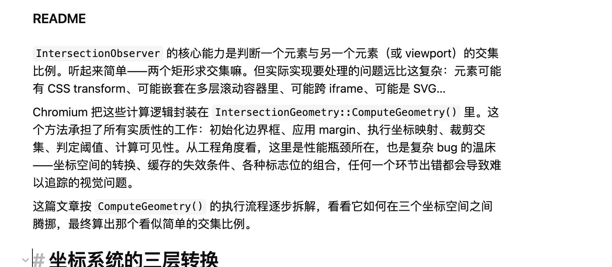

`IntersectionObserver` 的核心能力是判断一个元素与另一个元素（或 viewport）的交集比例。听起来简单——两个矩形求交集嘛。但实际实现要处理的问题远比这复杂：元素可能有 CSS transform、可能嵌套在多层滚动容器里、可能跨 iframe、可能是 SVG…
Chromium 把这些计算逻辑封装在 `IntersectionGeometry::ComputeGeometry()` 里。这个方法承担了所有实质性的工作：初始化边界框、应用 margin、执行坐标映射、裁剪交集、判定阈值、计算可见性。从工程角度看，这里是性能瓶颈所在，也是复杂 bug 的温床——坐标空间的转换、缓存的失效条件、各种标志位的组合，任何一个环节出错都会导致难以追踪的视觉问题。
这篇文章按 `ComputeGeometry()` 的执行流程逐步拆解，看看它如何在三个坐标空间之间腾挪，最终算出那个看似简单的交集比例。

# 坐标系统的三层转换
整个流程涉及三个坐标空间：
- abc
- def
- 还是忽闪忽闪
    - 是刘老师刘老师老师
代码在这三个空间之间不断转换，搞混任何一个都会导致计算错误。`ComputeGeometry` 通过严格的分步转换来管理这个复杂度。
# 缓存决策
```cpp
bool pre_margin_target_rect_is_empty;
if (ShouldUseCachedRects()) {
    target_rect_ = cached_rects->local_target_rect;
    pre_margin_target_rect_is_empty =
        cached_rects->pre_margin_target_rect_is_empty;
    
    unclipped_intersection_rect_ =
        cached_rects->unscrolled_unclipped_intersection_rect;
} else {
    target_rect_ = InitializeTargetRect(target, flags_);
    pre_margin_target_rect_is_empty = target_rect_.IsEmpty();
    ApplyMargin(target_rect_, target_margin, root_geometry.zoom,
                root_geometry.pre_margin_local_root_rect.size());
    
    unclipped_intersection_rect_ = target_rect_;
}
```
缓存生效需要三个条件：缓存数据有效、root 和 target 之间没有中间 scroll container、当前帧计算模式是"仅滚动和可见性"。
为什么要检查中间 scroll container？如果路径中有可滚动的中间元素，这些元素的滚动会改变 target 相对于 root 的位置，缓存的矩形就失效了。但如果只有 root 本身可滚动，滚动只改变 root 的 clip 范围，不改变 target 与 root 的相对位置。
`pre_margin_target_rect_is_empty` 这个标志值得注意。target 可能本身就是 empty，也可能因为 margin 变成 empty。后续计算交集比例时需要区分这两种情况——即使 target 矩形经过变换变成非空，如果原始 pre-margin 状态是 empty，阈值计算也要反映这一点。
滚动时，框架会检查累积滚动量是否超过 `ComputeMinScrollDeltaToUpdate()` 返回的最小值，没超过就跳过完整的交集重计算。这个优化在频繁滚动的页面上效果显著。
# 不同元素类型的边界框计算
```cpp
gfx::RectF InitializeTargetRect(const LayoutObject* target, unsigned flags) {
  if (flags & IntersectionGeometry::kForFrameViewportIntersection) {
    return gfx::RectF(To<LayoutEmbeddedContent>(target)->ReplacedContentRect());
  }
  if (target->IsSVGChild()) {
    return target->DecoratedBoundingBox();
  }
  if (auto* layout_box = DynamicTo<LayoutBox>(target)) {
    return GetBoxBounds(layout_box,
                        flags & IntersectionGeometry::kUseOverflowClipEdge);
  }
  if (auto* layout_inline = DynamicTo<LayoutInline>(target)) {
    return layout_inline->LocalBoundingBoxRectF();
  }
  return gfx::RectF(To<LayoutText>(target)->PhysicalLinesBoundingBox());
}
```

