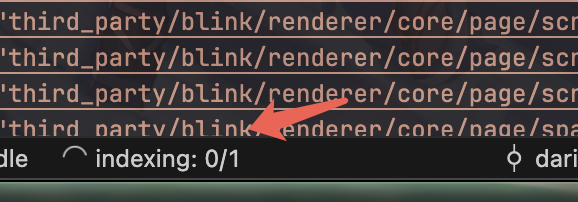
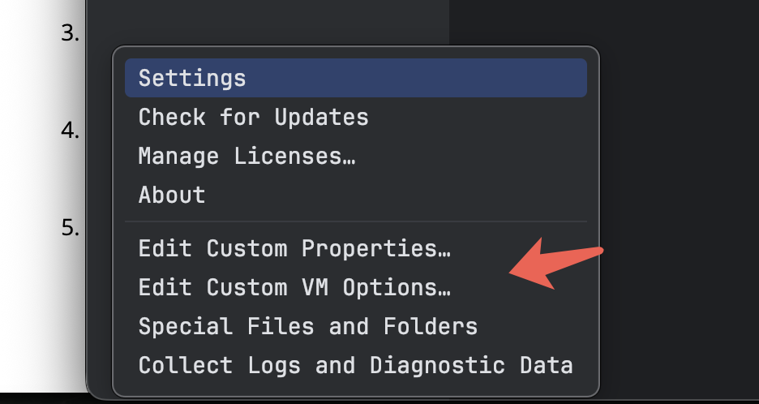
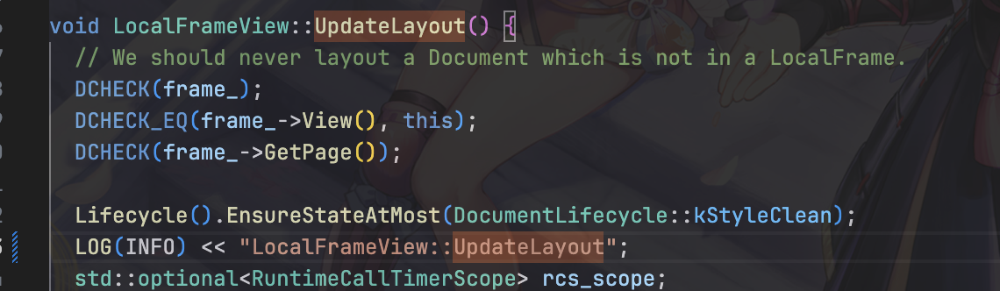

# 源码下载
## 安装 depot_tools

首先克隆 `depot_tools` 仓库:
```bash
git clone https://chromium.googlesource.com/chromium/tools/depot_tools.git
```

然后将 `depot_tools` 添加到 PATH 环境变量(建议添加到 `~/.bash_profile` 或 `~/.zshrc`):

```bash
export PATH="$PATH:/path/to/depot_tools"
```
注意:必须使用绝对路径。

## 创建工作目录

创建一个用于存放源码的目录并进入:

```bash
mkdir chromium && cd chromium
```
## 下载源码

使用 `fetch` 工具下载源码及其依赖:
```bash
caffeinate fetch chromium
```

- `caffeinate` 是可选的,可防止下载过程中系统休眠
- 这个过程可能需要 30 分钟到数小时,取决于网络速度
**加速下载**(可选):

如果不需要完整的 Git 历史记录,可以使用:
```bash
fetch --no-history chromium
```
稍后如果需要完整历史,可以运行:
```bash
git fetch --unshallow
```

下载完成后，chromium目录下会有如下文件
```
├── .gclient
└── src
```
`src`目录存储了chromium的源代码
## 下载chromium的clangd编译器
* 修改`.gclient` 文件为：
```

solutions = [
  {
    "name": "src",
    "url": "https://chromium.googlesource.com/chromium/src.git",
    "managed": False,
    "custom_deps": {},
    "custom_vars": {
        "checkout_clangd": True, # 签出chromium自己实现的clangd
    },
  },
]
```

* 同步代码
```shell
gclient sync -D
```
## 进入src目录

src目录作为项目根目录，后续无特殊说明，所有的操作都在`src`目录下完成

```bash
cd src
```


## 代码同步

* 创建`default` 分支， default分支作为后续最新代码的默认分支，类似master分支，checkout分支都从`default` 分支中
```shell
git new-branch default
```
* 基于`default` 分支创建新分支
```shell
git new-branch --upstream default <branch_name>
```

* 同步最新代码， 在哪个分支执行都行
```shell
git rebase-update && gclient sync -D
```


# 编译chromium

## 安装ccache
[ccache](https://ccache.dev/) 是一个编译器缓存，它会加快二次编译的速度，尤其是在分支之间切换时
```
brew install ccache
```

## 设置构建配置

使用 GN 创建构建目录:
```bash
gn gen out/Default
```

- `Default` 可以替换为其他名称
- 默认会创建 debug component build
## 配置构建参数

编辑 `out/Default/args.gn` 文件来优化构建:
**Release 构建**(更快的链接速度):
```gn
is_debug = false
```
**组件构建**(更快的增量编译):
```gn
is_component_build = true
```
**禁用调试符号**(更快的构建和链接):
```gn
symbol_level = 0
```

我使用的配置参数
```
is_debug = true
is_component_build = true
ffmpeg_branding="Chrome"
is_component_ffmpeg = true
proprietary_codecs=true
cc_wrapper = "ccache" # ccache加快构建速度
enable_precompiled_headers = false # 修复M系列芯片内存暴涨的问题
```

## 编译 Chromium
使用 `autoninja` 编译:
```bash
autoninja -C out/Default chrome
```
`autoninja` 会自动优化编译参数，这个过程大概持续4-5个小时。
## 运行 Chromium
编译完成后运行:
```bash
out/Default/Chromium.app/Contents/MacOS/Chromium
```


# 集成开发环境搭建
## vscode
### 打开chromium/src目录
```
cd /path/to/chromium/src
code .
```

### 生成vscode配置
```
mkdir .vscode
cp tools/vscode/*.json .vscode/
cp tools/vscode/cpp.code-snippets .vscode/
```
### 安装必要插件
1. 输入`command` + `shift` + `p`,  在打开的命令面板中输入"显示推荐的拓展(Show Recommended Extensions)"， 回车
2. 在打开extensions面板中，安装所有推荐的推展

### 修改项目的clangd的路径
编辑.vscode/settings.json，修改clangd的路径为chromium源码中的clangd路径

```
"clangd.path": "${workspaceFolder}/third_party/llvm-build/Release+Asserts/bin/clangd",
```

### 生成compile_commands.json

```shell
tools/clang/scripts/generate_compdb.py -p out/Default > compile_commands.json
```

生成compile_commands.json之后，随便打开一个c++文件，例如`local_frame_view.cc`，然后他就会在后台开始索引，这大概需要4-5个小时， 但是这时候已经可以在代码里面点击跳转了



## clion

### 增加clion的内存分配
1. 在clion的启动对话框的左下角，点击齿轮图标，然后点击`Edit Custom VM Options`

2. 在打开的文本对话框中，添加
```
-Xss2m
-Xms1g
-Xmx31g
```
3. 关闭对话框，然后在启动对话框的左下角，点击齿轮图标，然后点击`Edit Custom Properties`
4. 在打开的对话框中输入
```shell
idea.max.intellisense.filesize=12500
```

### 打开chromium目录
**注意是打开`chromium`目录，不是打开`chromium/src目录`**

### 创建CMakeLists
在chromium目录下创建CMakeLists.txt文件，添加如下内容
```
cmake_minimum_required(VERSION 3.10)
project(chromium)

set(CMAKE_CXX_STANDARD 14)

include_directories(${CMAKE_CURRENT_SOURCE_DIR}/src)
include_directories(${CMAKE_CURRENT_SOURCE_DIR}/src/out/Default/gen)
include_directories(${CMAKE_CURRENT_SOURCE_DIR}/src/third_party/protobuf/src)
include_directories(${CMAKE_CURRENT_SOURCE_DIR}/src/third_party/googletest/src/googletest/include)
include_directories(${CMAKE_CURRENT_SOURCE_DIR}/src/third_party/googletest/src/googlemock/include)
include_directories(${CMAKE_CURRENT_SOURCE_DIR}/src/third_party/abseil-cpp)

# The following file used is irrelevant, it's only to improve CLion
# performance. Leaving at least 1 file is required in order for CLion
# to provide code completion, navigation, etc.
add_executable(chromium src/components/omnibox/browser/document_provider.cc)

```

## xcode
自强: https://chromium.googlesource.com/chromium/src/+/main/docs/mac_build_instructions.md


# 调试chromium

## 万能的日志调试

1. chromium可以使用`LOG(INFO)`来打印日志到控制台中
```cpp
LOG(INFO) << "这是一行日志"
```


2. 添加完日志之后，重新编译，运行, 打开kg.qq.com
```
autoninja -C out/Default chrome
out/Default/Chromium.app/Contents/MacOS/Chromium https://kg.qq.com
```

## 断点调试
### vscode
#### 创建 .lldbinit
在用户目录下创建.lldbinit文件
```
code ~/.lldbinit
```
然后在文件中添加

```
script sys.path[:0] = ['your_chromium_path/src/tools/lldb']
script import lldbinit
```

### 配置调试选项

在.vscode/launch.json添加
```json
    {
      "name": "Chrome Debug",
      "type": "lldb", // "cppdbg" for GDB/LLDB, "cppvsdbg" for Windows Visual Studio debugger
      "request": "launch",
      "program": "${workspaceFolder}/out/Default/Chromium.app/Contents/MacOS/Chromium",
      "args": [
        "--single-process", // 一定要单进程启动

      ], // Optional command line args
      // "preLaunchTask": "8-build_chrome_debug",
      "cwd": "${workspaceFolder}/out/Default/",
      "env": {
        "CHROMIUM_LLDBINIT_SOURCED": "1"
      },
      "osx": {
        "initCommands": [
          "command source ${env:HOME}/.lldbinit"

        ]
      },
    },

```

然后就可以愉快的断点调试了


