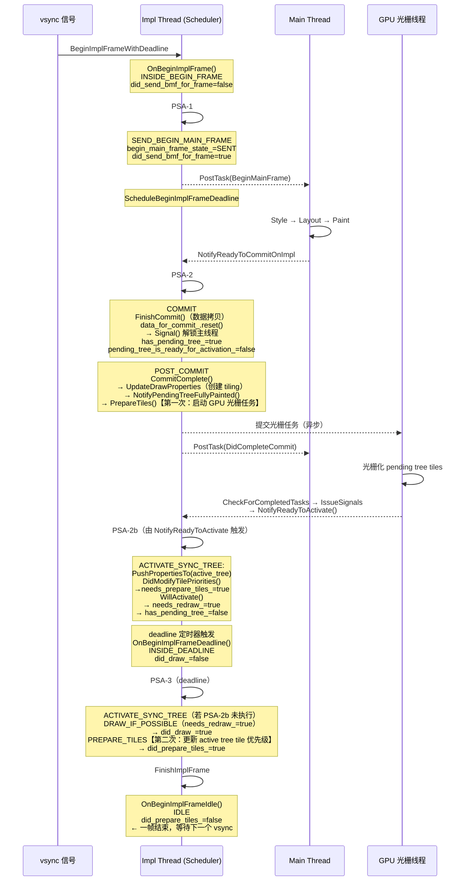

# 概述

`Scheduler` 是 Chromium 合成器线程（Impl Thread）的核心调度器，负责协调一帧内所有合成器动作的执行顺序：发送 BeginMainFrame、Commit、Activate、Draw、PrepareTiles 等。其核心入口是 `ProcessScheduledActions`，它以"事件驱动 + 状态机"的方式驱动每一帧的推进。

本文分析两个核心问题：

1. `ProcessScheduledActions` 被多处调用，如何防止重入和重复执行？
2. 一帧内，状态机的完整状态转换是怎样的？

---

# 一、防重入机制

`ProcessScheduledActions` 在整个 Scheduler 中被大量调用——`SetNeedsBeginMainFrame`、`NotifyReadyToCommit`、`NotifyReadyToActivate`、`DidReceiveCompositorFrameAck` 等任何状态变化都会调用它。这要求它必须是幂等且不可重入的。

## 两层守卫标志位

```cpp
void Scheduler::ProcessScheduledActions() {
  if (stopped_)
    return;

  // 守卫 1：防止同一帧内重复进入循环
  // 守卫 2：防止在执行某个 action 期间重入
  if (inside_process_scheduled_actions_ || inside_scheduled_action_)
    return;

  base::AutoReset<bool> mark_inside(&inside_process_scheduled_actions_, true);

  SchedulerStateMachine::Action action;
  do {
    action = state_machine_.NextAction();
    // ... 执行 action
  } while (action != SchedulerStateMachine::Action::NONE);
}
```

### 守卫 1：`inside_process_scheduled_actions_`

`base::AutoReset<bool>` 在进入时将其置为 `true`，函数退出时自动还原。

**防护场景**：在 do-while 循环执行某个 action（如 `ScheduledActionSendBeginMainFrame`）时，若 action 内部同步触发了对 `ProcessScheduledActions` 的再次调用，会被该标志位直接拦截并返回。

这是安全的，因为顶层的 do-while 循环本身就会**持续迭代**直到 `NextAction()` 返回 `NONE`，不会遗漏任何后续 action。

### 守卫 2：`inside_scheduled_action_`

每个具体 action 的执行体（`DrawIfPossible`、`DrawForced`、`BeginMainFrameNotExpectedUntil` 等）内部都会用 `AutoReset` 将 `inside_scheduled_action_` 置为 `true`：

```cpp
void Scheduler::DrawIfPossible() {
  DCHECK(!inside_scheduled_action_);
  base::AutoReset<bool> mark_inside(&inside_scheduled_action_, true);
  // ... 执行 draw，期间外部回调可能再次调用 ProcessScheduledActions
}
```

**防护场景**：Draw 执行时可能触发外部提交回调，这些回调可能调用 `ProcessScheduledActions`，同样被拦截。等 Draw 完成、`inside_scheduled_action_` 还原后，do-while 循环自然继续处理剩余 action。

## 两个守卫的分工

| 调用时机 | `inside_process_scheduled_actions_` | `inside_scheduled_action_` | 结果 |
|---|---|---|---|
| 正常外部调用 | false | false | 正常进入执行 |
| do-while 循环内重入 | **true** | false | 立即 return |
| action 执行体内重入 | true | **true** | 立即 return |
| action 完成后，do-while 继续 | true | false（已还原） | 正常迭代下一个 action |

两个标志位分开的原因：`inside_process_scheduled_actions_` 覆盖整个循环周期，`inside_scheduled_action_` 覆盖单个 action 的执行周期，两者组合才能完整防止所有重入路径。

---

# 二、一帧内的完整状态转换

## 核心状态变量

| 状态变量 | 取值范围 | 含义 |
|---|---|---|
| `begin_impl_frame_state_` | IDLE / INSIDE_BEGIN_FRAME / INSIDE_DEADLINE | 当前帧所处阶段 |
| `begin_main_frame_state_` | IDLE / SENT / READY_TO_COMMIT | 主线程 BeginMainFrame 状态 |
| `did_send_begin_main_frame_for_current_frame_` | bool | 当帧是否已发送过 BMF（每帧漏斗） |
| `has_pending_tree_` | bool | 是否存在待激活的 pending tree |
| `did_draw_` | bool | 当帧是否已执行过 Draw（每帧漏斗） |
| `needs_redraw_` | bool | 是否需要绘制 |

## 阶段一：BeginImplFrame（INSIDE_BEGIN_FRAME）

**入口**：`BeginImplFrameWithDeadline` → `BeginImplFrame` → `state_machine_.OnBeginImplFrame(args)`

`OnBeginImplFrame` 是新一帧的起点，重置所有"每帧漏斗"标志：

```cpp
begin_impl_frame_state_ = INSIDE_BEGIN_FRAME;
did_send_begin_main_frame_for_current_frame_ = false;  // 允许本帧发送 BMF
did_attempt_draw_in_last_frame_ = false;
did_commit_during_frame_ = false;
// ...
```

随即调用 **ProcessScheduledActions（第1次）**，`NextAction()` 求值：

```
ShouldSendBeginMainFrame():
  CouldSendBeginMainFrame()：needs_begin_main_frame_=true ✓，visible ✓
  did_send_begin_main_frame_for_current_frame_ = false ✓（刚重置）
  begin_main_frame_state_ == IDLE ✓
  begin_impl_frame_state_ == INSIDE_BEGIN_FRAME（非 IDLE） ✓
  → 返回 true → Action = SEND_BEGIN_MAIN_FRAME
```

执行 `SEND_BEGIN_MAIN_FRAME`：

```cpp
state_machine_.WillSendBeginMainFrame();
// 内部：begin_main_frame_state_ = SENT
//       did_send_begin_main_frame_for_current_frame_ = true  ← 漏斗关闭
//       needs_begin_main_frame_ = false

client_->ScheduledActionSendBeginMainFrame(args);
// 通过 PostTask 投递到主线程，主线程开始 Style→Layout→Paint
```

do-while 继续，`NextAction()` 再次求值：

```
ShouldSendBeginMainFrame()：did_send = true → false ✗  ← 漏斗拦截
ShouldCommit()：begin_main_frame_state_ == SENT（非 READY_TO_COMMIT） → false ✗
ShouldDraw()：begin_impl_frame_state_ == INSIDE_BEGIN_FRAME（非 INSIDE_DEADLINE） → false ✗
→ Action = NONE，循环退出
```

循环退出后，`ScheduleBeginImplFrameDeadline()` 设置 deadline 定时器（等待主线程完成或超时）。

**此刻状态快照**：

```
begin_impl_frame_state_  = INSIDE_BEGIN_FRAME
begin_main_frame_state_  = SENT
did_send_bmf_for_frame   = true
```

---

## 阶段二：主线程完成 Paint，NotifyReadyToCommit

主线程完成 Style→Layout→Paint 后，通过 `ProxyImpl::NotifyReadyToCommitOnImpl` 回到 impl 线程，最终调用：

```
Scheduler::NotifyReadyToCommit()
  → state_machine_.NotifyReadyToCommit()
    → begin_main_frame_state_ = READY_TO_COMMIT
  → ProcessScheduledActions()（第2次）
```

`NextAction()` 求值：

```
ShouldSendBeginMainFrame()：did_send = true → false ✗  ← 仍被漏斗拦截
ShouldCommit()：
  begin_main_frame_state_ == READY_TO_COMMIT ✓
  has_pending_tree_ = false ✓
  → true → Action = COMMIT
```

执行 `COMMIT`（impl 线程将主线程的 CommitState 数据拷贝到 cc layer 树）：

```cpp
client_->ScheduledActionCommit();
// 内部（ProxyImpl::ScheduledActionCommit）：
//   host_impl_->BeginCommit() / FinishCommit()  ← 实际数据拷贝
//   data_for_commit_->commit_completion_event->SetFinishTime()
//   data_for_commit_.reset()
//     ↑ 触发 ScopedCommitCompletionEvent 析构函数
//       → completion_event->Signal()  ← 主线程在此处被解锁
//       → PostTask(ProxyMain::DidCompleteCommit) 通知主线程
state_machine_.WillCommit();
// 内部：
//   has_pending_tree_ = true（创建 pending tree）
//   pending_tree_is_ready_for_activation_ = false  ← 关键：重置为 false
//   begin_main_frame_state_ = next_begin_main_frame_state_（通常为 IDLE）
//   did_commit_during_frame_ = true
state_machine_.DidCommit();
// 内部：needs_post_commit_ = true
```

do-while 继续：

```
Action = POST_COMMIT
// 执行：host_impl_->CommitComplete()
//   处理 cc 内部状态清理（stale timelines 等），与主线程解锁无关
state_machine_.DidPostCommit()：needs_post_commit_ = false
```

do-while 继续：

```
ShouldActivateSyncTree():
  has_pending_tree_ = true ✓
  pending_tree_is_ready_for_activation_ = false  ← WillCommit 中已重置
  → 始终返回 false，等待 NotifyReadyToActivate 外部回调
→ Action = NONE，本次 ProcessScheduledActions 结束
```

> **注意**：ACTIVATE_SYNC_TREE 不会在与 COMMIT 同一次 PSA 调用中发生。Commit 后 pending tree 刚创建，资源尚未准备好，`pending_tree_is_ready_for_activation_` 始终为 `false`。

**POST_COMMIT 内部触发第一次 PrepareTiles（非 scheduler action）**：

`ScheduledActionPostCommit()` → `CommitComplete()` 内部调用链：

```
CommitComplete()
  → UpdateSyncTreeAfterCommitOrImplSideInvalidation()
    → sync_tree()->UpdateDrawProperties(update_tiles=true)  ← 创建 tiling
    → NotifyPendingTreeFullyPainted()
        → PrepareTiles()  ← 第一次，为 pending tree 提交 GPU 光栅任务（异步）
            → tile_priorities_dirty_ = false
            → client_->DidPrepareTiles()
            → 返回 true（有异步任务在跑）
        （若 PrepareTiles 返回 false，即无需光栅，则同步调用 NotifyReadyToActivate）
```

这次 `PrepareTiles` 的目的是**为 pending tree 的 tiles 启动光栅化**，不经过 scheduler，`needs_prepare_tiles_` 也不会被设置。

**GPU 光栅线程异步完成后**：

```
TileManager::IssueSignals()
  → signals_.activate_tile_tasks_completed &&
    signals_.activate_gpu_work_completed
  → LayerTreeHostImpl::NotifyReadyToActivate()
    → ProxyImpl::NotifyReadyToActivate()
      → scheduler_->NotifyReadyToActivate()
        → pending_tree_is_ready_for_activation_ = true
        → ProcessScheduledActions() (PSA #2b)
```

**此刻状态快照**：

```
begin_main_frame_state_  = IDLE
has_pending_tree_        = true
pending_tree_is_ready_for_activation_ = true（由 GPU 光栅回调设置）
```

---

## 阶段三：deadline 触发（INSIDE_DEADLINE）

deadline 定时器触发 `OnBeginImplFrameDeadline()`：

```cpp
state_machine_.OnBeginImplFrameDeadline();
// begin_impl_frame_state_ = INSIDE_DEADLINE
// did_draw_ = false（重置 draw 漏斗）
```

调用 **ProcessScheduledActions（第3次，deadline）**。

若 ACTIVATE 在阶段二的 PSA #2b 中已完成，则此处直接进 Draw；若尚未激活，则先执行 ACTIVATE：

```
ShouldActivateSyncTree()（若尚未激活）：
  pending_tree_is_ready_for_activation_ = true（由 NotifyReadyToActivate 设置）
  → Action = ACTIVATE_SYNC_TREE
```

**ACTIVATE 执行时同步设置 `needs_prepare_tiles_`**：

```
ScheduledActionActivateSyncTree()
  → host_impl_->ActivateSyncTree()
    → pending_tree_->PushPropertiesTo(active_tree_)
    → active_tree_->DidBecomeActive()
    → RenewTreePriority()
    → DidModifyTilePriorities()  ← active tree tile 优先级发生变化
        → SetNeedsPrepareTilesOnImplThread()
          → scheduler_->SetNeedsPrepareTiles()
            → needs_prepare_tiles_ = true  ← 在 PSA do-while 循环中被 inside_process_scheduled_actions_ 拦截
                                              但状态位已写入，下一轮迭代即可消费
WillActivate()：
  has_pending_tree_ = false
  needs_redraw_ = true
  active_tree_needs_first_draw_ = true
```

do-while 继续：

```
ShouldDraw():
  begin_impl_frame_state_ == INSIDE_DEADLINE ✓
  needs_redraw_ = true ✓（WillActivate 设置）
  did_draw_ = false ✓
  → true → Action = DRAW_IF_POSSIBLE
```

执行 Draw，`state_machine_.DidDraw()` 设置 `did_draw_ = true`，`needs_redraw_ = false`。

do-while 继续：

```
ShouldPrepareTiles():
  begin_impl_frame_state_ == INSIDE_DEADLINE ✓
  needs_prepare_tiles_ = true（ACTIVATE 通过 DidModifyTilePriorities 设置）
  did_prepare_tiles_ = false ✓
  → Action = PREPARE_TILES  ← 第二次 PrepareTiles：更新 active tree tile 优先级

→ 最终 Action = NONE，循环退出
```

> **两次 PrepareTiles 的分工**：
> - **第一次**（POST_COMMIT 内部，非 scheduler action）：为 pending tree 的 tiles 提交 GPU 光栅任务，驱动光栅化异步流水线。
> - **第二次**（ACTIVATE 后的 scheduler PREPARE_TILES action）：pending tree 激活为 active tree 后，tile 优先级发生变化，需要重新告知 TileManager 哪些 tile 需优先光栅用于 Draw。

---

## 阶段四：FinishImplFrame（回到 IDLE）

```cpp
state_machine_.OnBeginImplFrameIdle();
// begin_impl_frame_state_ = IDLE
// did_prepare_tiles_ = false（允许下一帧再次 PrepareTiles）
// main_thread_missed_last_deadline_ ← 评估主线程是否错过 deadline
// 仅当 !BeginFrameNeeded() 时：
//   did_send_begin_main_frame_for_current_frame_ = true（关闭漏斗，防止多余 BMF）
// 正常运行路径：did_send_bmf_for_frame 保持 true（上帧 WillSendBeginMainFrame 设置），
//   但 IDLE 阶段发送 BMF 已被 ShouldSendBeginMainFrame() 中的
//   begin_impl_frame_state_ == IDLE 检查直接拦截；
//   下一帧 OnBeginImplFrame 才会将其重置为 false。
```

---

## 一帧完整时序图



**两次 PrepareTiles 的分工**：

|     | 触发方式                             | 时机                  | 目的                                                           |
| --- | -------------------------------- | ------------------- | ------------------------------------------------------------ |
| 第一次 | POST_COMMIT 内部直接调用               | Commit 完成后立即        | 为 pending tree tiles 提交 GPU 光栅任务，驱动异步光栅流水线                   |
| 第二次 | Scheduler `PREPARE_TILES` action | ACTIVATE 完成、DRAW 之后 | 更新 active tree 的 tile 优先级，让 TileManager 知道哪些 tile 需优先用于 Draw |

## 顺序问题总结（我们重点澄清的点）

1. **ACTIVATE 不会和 COMMIT 在同一次 PSA 中连着发生**
  - `WillCommit()` 会把 `pending_tree_is_ready_for_activation_` 重置为 `false`。
  - 所以即使 COMMIT 刚完成，`ShouldActivateSyncTree()` 也不成立，必须等待后续 `NotifyReadyToActivate()`。

2. **第二次 PrepareTiles 的触发源不是 Draw，而是 Activate 的副作用**
  - `ActivateSyncTree()` → `DidModifyTilePriorities()` → `SetNeedsPrepareTilesOnImplThread()`。
  - 这一步设置 `needs_prepare_tiles_=true`，随后由 scheduler 在 do-while 后续迭代里消费。

3. **“第二次 PrepareTiles 通常在 Draw 之后”是由 `NextAction()` 优先级保证，不是由 `did_draw_` 显式门控**
  - `NextAction()` 中 `ShouldDraw()` 分支优先于 `ShouldPrepareTiles()`。
  - 常规模式下两者同为 true 时，会先选 Draw；Draw 后 `needs_redraw_` 被清掉，下一轮再执行 PREPARE_TILES。

4. **存在例外：full-pipeline 模式**
  - 当 `wait_for_all_pipeline_stages_before_draw=true` 时，`ShouldPrepareTiles()` 放宽约束（可不依赖 `INSIDE_DEADLINE`），可提前执行。
  - 因而“PrepareTiles 必然晚于 Draw”并非无条件真命题。

## `BeginImplFrameWithDeadline` 与 `OnBeginImplFrameDeadline` 的关系

两者是**同一帧的起点与截止点**，由 deadline 定时器连接，而不是互相直接调用：

- 帧开始：`BeginImplFrameWithDeadline(args)`
  - 调整 `BeginFrameArgs` 与 deadline 估计，进入 `BeginImplFrame()`。
  - `BeginImplFrame()` 调 `OnBeginImplFrame()`，状态进 `INSIDE_BEGIN_FRAME`，随后跑一轮 PSA。
  - PSA 末尾调用 `ScheduleBeginImplFrameDeadline()`，注册 `begin_impl_frame_deadline_timer_`。

- 截止触发：定时器异步回调 `OnBeginImplFrameDeadline()`
  - `state_machine_.OnBeginImplFrameDeadline()` 把状态切到 `INSIDE_DEADLINE`。
  - 再跑 deadline 阶段 PSA（ACTIVATE / DRAW / PREPARE_TILES）。
  - 最后 `FinishImplFrame()`，回到 `IDLE`。

- **关键结论**：`OnBeginImplFrameDeadline()` 不会直接或间接调用 `BeginImplFrameWithDeadline()`。
  下一帧的 `BeginImplFrameWithDeadline()` 来自新的 BeginFrame（vsync）事件。

---

# 三、关键保护机制汇总

## 防重入机制

| 标志位 | 作用域 | 防护目标 |
|---|---|---|
| `inside_process_scheduled_actions_` | 整个 do-while 循环期间 | 防止 action 执行中触发的外部调用重新进入循环 |
| `inside_scheduled_action_` | 单个 action 执行体期间 | 防止 action 执行中的外部回调触发重入 |

## 每帧漏斗（per-frame funnel）

| 标志位 | 重置时机 | 触发时机 | 防护目标 |
|---|---|---|---|
| `did_send_begin_main_frame_for_current_frame_` | `OnBeginImplFrame` | `WillSendBeginMainFrame` | 每帧只发送一次 BeginMainFrame |
| `did_draw_` | `OnBeginImplFrameDeadline` | `WillDraw` | 每帧 deadline 内只 Draw 一次 |
| `did_prepare_tiles_` | `OnBeginImplFrameIdle` | `WillPrepareTiles` | 每帧只 PrepareTiles 一次 |
| `did_commit_during_frame_` | `OnBeginImplFrame` | `WillCommit` | 记录本帧是否已提交 |
| `did_invalidate_layer_tree_frame_sink_` | `OnBeginImplFrame` | Invalidate 时 | 每帧只 Invalidate 一次 |

## `begin_impl_frame_state_` 的阶段隔离

各阶段对 `begin_impl_frame_state_` 的依赖形成了天然的隔离墙：

- `ShouldDraw()`：**必须是** `INSIDE_DEADLINE`，确保 Draw 不会在帧开始时就触发
- `ShouldSendBeginMainFrame()`：**不能是** `IDLE`，确保不在帧间隙发送 BMF
- `ShouldPrepareTiles()`：常规模式要求 `INSIDE_DEADLINE`；其“晚于 Draw”主要依赖 `NextAction()` 中 Draw 优先于 PrepareTiles 的 action 排序（full-pipeline 模式存在例外）

这三层机制——防重入守卫、每帧漏斗、状态隔离——共同保证了 `ProcessScheduledActions` 无论被调用多少次，都能正确、高效地驱动合成器流水线前进。