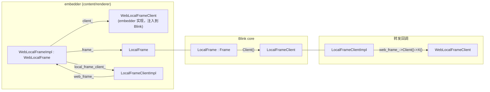
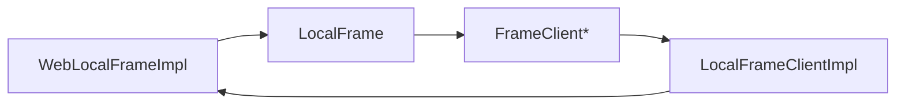
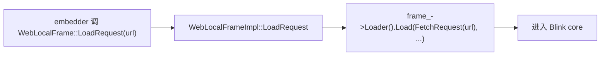
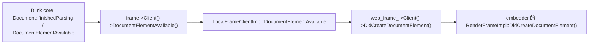

> 源码：`third_party/blink/renderer/core/frame/` 下的 `local_frame.{h,cc}`、`web_local_frame_impl.{h,cc}`、`local_frame_client_impl.{h,cc}`、`local_frame_client.h`
> 接口：`third_party/blink/public/web/` 下的 `web_local_frame.h`、`web_local_frame_client.h`

---

# 0. 这三个类解决什么问题

这是 **Blink content 层**（`//third_party/blink/renderer/core/`）与 **embedder 层**（content/renderer，通过 `//third_party/blink/public/web/` 的公共 API）之间的边界设计。三者构成一个**双向适配器**：

- **下行**（embedder → Blink）：embedder 调用 `WebLocalFrame` 接口 → `WebLocalFrameImpl` 转发到 Blink 的 `LocalFrame`。
- **上行**（Blink → embedder）：Blink 调用 `LocalFrameClient` 接口 → `LocalFrameClientImpl` 转发到 embedder 的 `WebLocalFrameClient`。



> 命名说明：老代码里有 `WebFrameImpl`，现已拆成 `WebLocalFrameImpl`（本地 frame）和 `WebRemoteFrameImpl`（跨进程 frame）。本文的「WebFrameImpl」即指 `WebLocalFrameImpl`。

---

# 1. 三个类的角色

| 类 | 层 | 角色 |
|----|----|------|
| `LocalFrame` | Blink core | Blink 内部的 frame 实现：持有 `Document`、`FrameView`、`FrameLoader` 等，是布局/渲染/JS 执行的主体。继承自 `Frame`。 |
| `WebLocalFrameImpl` | 边界（在 `core/frame/` 但实现 `public/web` 接口） | embedder 进入 Blink 的入口，实现 `WebLocalFrame` 接口；持有 `LocalFrame`、`WebLocalFrameClient`、`LocalFrameClientImpl`。是三者的枢纽。 |
| `LocalFrameClientImpl` | 边界（adapter） | 实现 Blink 的 `LocalFrameClient` 接口，把 Blink 发出的回调转发给 embedder 的 `WebLocalFrameClient`。 |
| `LocalFrameClient` | Blink core（抽象接口） | Blink 定义的接口，Blink 通过它向 embedder 通知事件（导航提交、文档创建、脚本运行时机等）。 |
| `WebLocalFrameClient` | public/web（抽象接口） | embedder 实现的接口，接收 Blink 的回调。 |

---

# 2. 继承关系

```cpp
// Blink core 内部
class LocalFrameClient : public FrameClient { ... };          // 抽象接口
class LocalFrame : public Frame { ... };                       // 持有 LocalFrameClient*

// 边界层
class WebLocalFrameImpl final
    : public GarbageCollected<WebLocalFrameImpl>,
      public WebLocalFrame { ... };                            // 实现 embedder 接口

class LocalFrameClientImpl final : public LocalFrameClient {   // 实现 Blink 接口
  Member<WebLocalFrameImpl> web_frame_;
};
```

继承链：

```
FrameClient
   └── LocalFrameClient              (Blink 定义的上行回调接口)
          └── LocalFrameClientImpl   (final，把回调转发到 embedder)

Frame
   └── LocalFrame                    (Blink core frame 实现)

WebLocalFrame                        (public/web，embedder 用的下行接口)
   └── WebLocalFrameImpl             (final，GC'd，持有 LocalFrame)
```

注意两个「final」方向相反：

- `WebLocalFrameImpl` 实现 **embedder → Blink** 的下行接口 `WebLocalFrame`。
- `LocalFrameClientImpl` 实现 **Blink → embedder** 的上行接口 `LocalFrameClient`。

两者互相持有，构成双向桥接。

---

# 3. 谁持有谁（成员字段）

## `WebLocalFrameImpl`（枢纽）

```cpp
class WebLocalFrameImpl : public GarbageCollected<WebLocalFrameImpl>, public WebLocalFrame {
  LocalFrame* frame_;                          // 指向 Blink core frame（frame_.Get()）
  WebLocalFrameClient* client_;                // embedder 客户端（非拥有，raw 指针）
  const Member<LocalFrameClientImpl> local_frame_client_;  // 拥有 adapter
  // ...find_in_page_, input_method_controller_ 等...
};
```

- `frame_`：Blink 的 `LocalFrame`，由 `WebLocalFrameImpl` 在初始化时创建（见第 4 节）。
- `client_`：embedder 注入的 `WebLocalFrameClient*`，`SetClient()` / `BindToFrame(this)` 绑定。
- `local_frame_client_`：构造 `WebLocalFrameImpl` 时立即创建的 adapter，传入 `this`。

## `LocalFrameClientImpl`（adapter）

```cpp
class LocalFrameClientImpl final : public LocalFrameClient {
  Member<WebLocalFrameImpl> web_frame_;        // 反向引用 WebLocalFrameImpl
};
```

只有一个核心字段 `web_frame_`，指回拥有它的 `WebLocalFrameImpl`。转发回调时通过 `web_frame_->Client()` 拿到 `WebLocalFrameClient`。

## `LocalFrame`（Blink core）

```cpp
class LocalFrame : public Frame {
  // Client() 由基类 Frame 持有，实际是 LocalFrameClientImpl
};

LocalFrameClient* LocalFrame::Client() const {
  return static_cast<LocalFrameClient*>(Frame::Client());
}
```

`LocalFrame` 通过基类 `Frame` 持有 `FrameClient*`，`Client()` 把它 `static_cast` 成 `LocalFrameClient*`。实际运行时这个指针指向 `LocalFrameClientImpl`（构造时传入）。

## 互相持有的环

```
WebLocalFrameImpl ──local_frame_client_──► LocalFrameClientImpl
WebLocalFrameImpl ──frame_──────────────► LocalFrame
LocalFrame ─────── (Frame 基类) ─────────► LocalFrameClient* (＝ LocalFrameClientImpl)
LocalFrameClientImpl ──web_frame_──────► WebLocalFrameImpl
```

三者形成 GC 环（都用 `Member`/`GarbageCollected`），由 oilpan 管理。

---

# 4. 创建链路

embedder 创建一个本地 frame 时，入口是 `WebLocalFrameImpl::CreateMainFrame`（或 `CreateProvisional` / `CreateLocalChild`）。链路：

## 步骤 1：构造 `WebLocalFrameImpl`，立即创建 adapter

```cpp
WebLocalFrameImpl::WebLocalFrameImpl(
    base::PassKey<WebLocalFrameImpl>, mojom::blink::TreeScopeType scope,
    WebLocalFrameClient* client, ...) {
  : client_(client),
    local_frame_client_(MakeGarbageCollected<LocalFrameClientImpl>(this)),  // ← 创建 adapter，传 this
    ...
{
  CHECK(client_);
  client_->BindToFrame(this);   // embedder 客户端绑定回这个 WebLocalFrameImpl
}
```

关键：adapter 在 `WebLocalFrameImpl` 构造时就创建，传入 `this`，建立 `LocalFrameClientImpl.web_frame_` 反向引用。

## 步骤 2：`InitializeCoreFrameInternal` 创建 Blink 的 `LocalFrame`

```cpp
void WebLocalFrameImpl::InitializeCoreFrameInternal(Page& page, FrameOwner* owner,
    WebFrame* parent, ...) {
  Frame* parent_frame = parent ? ToCoreFrame(*parent) : nullptr;
  Frame* previous_sibling_frame = ...;
  SetCoreFrame(MakeGarbageCollected<LocalFrame>(
      local_frame_client_.Get(),   // ← 把 adapter 作为 LocalFrameClient 传给 LocalFrame
      page, owner, parent_frame, previous_sibling_frame, insert_type,
      GetLocalFrameToken(), window_agent_factory, interface_registry_, ...));
  frame_->Tree().SetName(name);
  // ...
}

void WebLocalFrameImpl::SetCoreFrame(LocalFrame* frame) {
  frame_ = frame;   // ← 保存 Blink core frame
}
```

至此三方就位：

- `WebLocalFrameImpl.frame_` → `LocalFrame`
- `LocalFrame`（经 `Frame` 基类）的 `Client()` → `LocalFrameClientImpl`（即传入的 `local_frame_client_.Get()`）
- `LocalFrameClientImpl.web_frame_` → `WebLocalFrameImpl`

## 创建总流程

```
embedder: WebLocalFrameImpl::CreateMainFrame(client, ...)
  └─ new WebLocalFrameImpl(client)
       ├─ local_frame_client_ = new LocalFrameClientImpl(this)   ← adapter
       └─ client_->BindToFrame(this)
  └─ InitializeCoreFrameInternal(page, ...)
       └─ SetCoreFrame(new LocalFrame(local_frame_client_, page, ...))
            └─ frame_ = LocalFrame*
```

---

# 5. 双向通信

## 5.1 下行（embedder → Blink）

embedder 调用 `WebLocalFrame`（public/web 接口）的方法，`WebLocalFrameImpl` 实现它们，转发到 `LocalFrame` 及其子对象：

```cpp
// WebLocalFrameImpl 实现 WebLocalFrame 接口
LocalFrame* WebLocalFrameImpl::GetFrame() const { return frame_.Get(); }

// 例：embedder 请求加载 URL
void WebLocalFrameImpl::LoadRequest(const WebURLRequest& request) {
  // 转发到 LocalFrame 的 FrameLoader
  frame_->Loader().Load(request, FrameLoadType::kStandard, ...);
}
```

路径：`embedder` → `WebLocalFrame::LoadRequest` → `WebLocalFrameImpl::LoadRequest` → `frame_->Loader().Load(...)`。

## 5.2 上行（Blink → embedder）

Blink 内部发生事件时，通过 `LocalFrameClient` 接口通知；`LocalFrameClientImpl` 实现这个接口，转发到 `WebLocalFrameClient`。典型转发模式：

```cpp
void LocalFrameClientImpl::DocumentElementAvailable() {
  if (web_frame_->Client()) {                          // 拿 WebLocalFrameClient
    web_frame_->Client()->DidCreateDocumentElement();  // 调 embedder 的回调
  }
}

void LocalFrameClientImpl::RunScriptsAtDocumentReady(bool document_is_empty) {
  // ...
  if (web_frame_->Client()) {
    web_frame_->Client()->RunScriptsAtDocumentReady();
  }
}

void LocalFrameClientImpl::DidCommitDocumentReplacementNavigation(
    DocumentLoader* loader) {
  if (web_frame_->Client()) {
    web_frame_->Client()->DidCommitDocumentReplacementNavigation(loader);
  }
}
```

路径：`Blink` → `frame->Client()->DocumentElementAvailable()` → `LocalFrameClientImpl::DocumentElementAvailable` → `web_frame_->Client()->DidCreateDocumentElement()` → `embedder`。

注意几个细节：

1. **方法名常不同**：Blink 侧 `LocalFrameClient::DocumentElementAvailable` 对应 embedder 侧 `WebLocalFrameClient::DidCreateDocumentElement`。adapter 负责改名 + 参数转换（如 `DocumentLoader*` 转成 embedder 能理解的类型）。
2. **null 检查 `Client()`**：`web_frame_->Client()` 可能为 null（detached 时），每个转发都检查。
3. **参数 marshal**：Blink 内部类型（`DocumentLoader`、`KURL` 等）转成 `public/web` 的 Web 类型（`WebDocumentLoader`、`WebURL` 等）。

---

# 6. 反查：从 `LocalFrame` 找回 `WebLocalFrameImpl`

Blink core 有时需要反查到 embedder wrapper（比如 paint 时拿 widget）。`WebLocalFrameImpl::FromFrame` 提供这个能力，路径正是上行接口的反向：

```cpp
WebLocalFrameImpl* WebLocalFrameImpl::FromFrame(LocalFrame& frame) {
  LocalFrameClient* client = frame.Client();              // LocalFrame → LocalFrameClient
  if (!client || !client->IsLocalFrameClientImpl())
    return nullptr;
  return To<WebLocalFrameImpl>(client->GetWebFrame());    // LocalFrameClientImpl → WebLocalFrameImpl
}
```

三跳：

1. `LocalFrame::Client()` → `LocalFrameClient*`（实际是 `LocalFrameClientImpl`）
2. `IsLocalFrameClientImpl()` 判断 + `GetWebFrame()` → `WebLocalFrame*`
3. `To<WebLocalFrameImpl>` downcast → `WebLocalFrameImpl*`

> `IsLocalFrameClientImpl()` 是 `LocalFrameClient` 的虚方法，`LocalFrameClientImpl` 返回 true，其余返回 false。这是因为 `LocalFrameClient` 还有别的实现（如 `RemoteFrameClient`），需要区分。

---

# 7. 生命周期与 GC

三者都是 oilpan `GarbageCollected` + `Member` 互相持有，形成 GC 环：



- `WebLocalFrameImpl` 拥有 `LocalFrame`（`frame_`）和 `LocalFrameClientImpl`（`local_frame_client_`）。
- `LocalFrame`（经 `Frame`）拥有 `FrameClient*`，实际指向 `LocalFrameClientImpl`——但这个 `LocalFrameClientImpl` 是 `WebLocalFrameImpl` 创建的，所以所有权在 `WebLocalFrameImpl`。
- `LocalFrameClientImpl` 的 `web_frame_` 是非拥有反向引用（`WebLocalFrameImpl` 拥有它）。
- `client_`（`WebLocalFrameClient*`）是 raw 指针，embedder 拥有，detached 时置 null。

detach 时（frame 被移除），`WebLocalFrameImpl` 释放 `LocalFrame`，环断开，GC 回收。

---

# 8. 为什么要这样设计

1. **隔离两层**：Blink core（`//core`）不能依赖 embedder，embedder 也不能直接 `#include` Blink 内部头。`public/web` 的纯接口（`WebLocalFrame` / `WebLocalFrameClient`）是边界，`WebLocalFrameImpl` / `LocalFrameClientImpl` 是边界的实现，放在 `core/frame/` 但实现 public 接口。

2. **双向通信需要两个接口**：embedder 要驱动 Blink（下行 `WebLocalFrame`），Blink 要通知 embedder（上行 `LocalFrameClient`）。不可能用一个接口完成，所以有两个，且 `WebLocalFrameImpl` 同时持有两边的「对方」——`LocalFrame`（下行目标）和 `LocalFrameClientImpl`（上行 adapter）。

3. **adapter 而非直接转发**：Blink 和 embedder 的类型/语义不同（`DocumentLoader` vs `WebDocumentLoader`、`DocumentElementAvailable` vs `DidCreateDocumentElement`），需要 `LocalFrameClientImpl` 做参数 marshal 和改名，不能直接让 `LocalFrameClient` = `WebLocalFrameClient`。

4. **`WebLocalFrameImpl` 作枢纽**：它同时是 `WebLocalFrame` 的实现、`LocalFrame` 的拥有者、`LocalFrameClientImpl` 的创建者。三方关系集中在一处，便于管理生命周期和反查（`FromFrame`）。

5. **`FromFrame` 反查依赖 adapter**：Blink core 拿不到 `WebLocalFrameImpl`（不能 include public/web），但能拿到 `LocalFrameClient*`。通过 `IsLocalFrameClientImpl()` + `GetWebFrame()` 反查，这是上行接口的「反向利用」。

---

# 9. 一个完整往返示例

embedder 加载一个 URL 到文档可用：

**下行**：



**Blink 内部**：FrameLoader 发起加载、提交导航、创建 Document...

**上行**（文档元素可用时）：



整个往返：embedder → `WebLocalFrameImpl` → `LocalFrame` →（Blink 处理）→ `LocalFrameClient` → `LocalFrameClientImpl` → `WebLocalFrameClient` → embedder。三个类正是这条链上的两个桥接点。

---

# 附：相关文件索引

| 文件 | 内容 |
|------|------|
| `core/frame/local_frame.{h,cc}` | `LocalFrame`（Blink core frame 实现） |
| `core/frame/local_frame_client.h` | `LocalFrameClient` 抽象接口（Blink → embedder 上行） |
| `core/frame/local_frame_client_impl.{h,cc}` | `LocalFrameClientImpl`（adapter，转发到 `WebLocalFrameClient`） |
| `core/frame/web_local_frame_impl.{h,cc}` | `WebLocalFrameImpl`（embedder 入口，枢纽） |
| `public/web/web_local_frame.h` | `WebLocalFrame` 接口（embedder → Blink 下行） |
| `public/web/web_local_frame_client.h` | `WebLocalFrameClient` 接口（接收 Blink 回调） |
| `core/frame/frame.h` | `Frame` 基类（持有 `FrameClient*`） |
