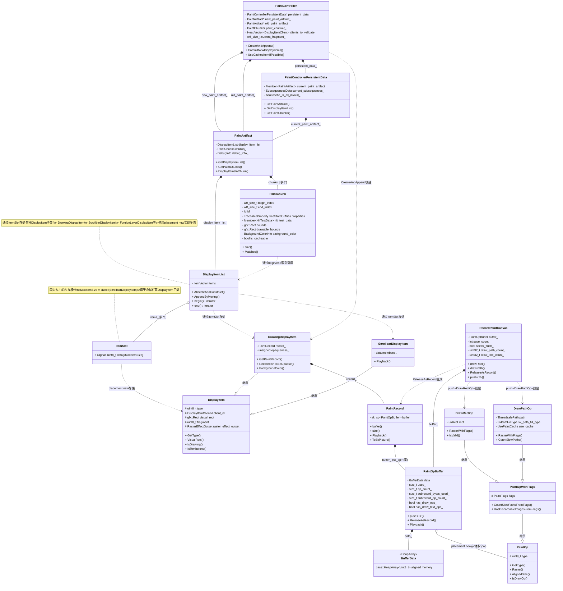

# 架构图

```mermaid
classDiagram
    class PaintController {
        - PaintControllerPersistentData* persistent_data_
        - PaintArtifact* new_paint_artifact_
        - PaintArtifact* old_paint_artifact_
        - PaintChunker paint_chunker_
        - HeapVector~DisplayItemClient~ clients_to_validate_
        - wtf_size_t current_fragment_
        + CreateAndAppend()
        + CommitNewDisplayItems()
        + UseCachedItemIfPossible()
    }

    class PaintControllerPersistentData {
        - Member~PaintArtifact~ current_paint_artifact_
        - SubsequencesData current_subsequences_
        - bool cache_is_all_invalid_
        + GetPaintArtifact()
        + GetDisplayItemList()
        + GetPaintChunks()
    }

    class PaintArtifact {
        - DisplayItemList display_item_list_
        - PaintChunks chunks_
        - DebugInfo debug_info_
        + GetDisplayItemList()
        + GetPaintChunks()
        + DisplayItemsInChunk()
    }

    class PaintChunk {
        - wtf_size_t begin_index
        - wtf_size_t end_index
        - Id id
        - TraceablePropertyTreeStateOrAlias properties
        - Member~HitTestData~ hit_test_data
        - gfx::Rect bounds
        - gfx::Rect drawable_bounds
        - BackgroundColorInfo background_color
        - bool is_cacheable
        + size()
        + Matches()
    }

    class DisplayItemList {
        - ItemVector items_
        + AllocateAndConstruct()
        + AppendByMoving()
        + begin() iterator
        + end() iterator
    }
    note for DisplayItemList "通过ItemSlot存储各种DisplayItem子类:\n- DrawingDisplayItem\n- ScrollbarDisplayItem\n- ForeignLayerDisplayItem等\n使用placement new实现多态"

    class ItemSlot {
        + alignas uint8_t data[kMaxItemSize]
    }
    note for ItemSlot "固定大小的内存槽位\nkMaxItemSize = sizeof(ScrollbarDisplayItem)\n用于存储任意DisplayItem子类"

    class DisplayItem {
        # uint8_t type
        # DisplayItemClientId client_id
        # gfx::Rect visual_rect
        # uint8_t fragment
        # RasterEffectOutset raster_effect_outset
        + GetType()
        + VisualRect()
        + IsDrawing()
        + IsTombstone()
    }

    class DrawingDisplayItem {
        - PaintRecord record_
        - unsigned opaqueness_
        + GetPaintRecord()
        + RectKnownToBeOpaque()
        + BackgroundColor()
    }

    class ScrollbarDisplayItem {
        - data members...
        + Playback()
    }


    class PaintRecord {
        - sk_sp~PaintOpBuffer~ buffer_
        + buffer()
        + size()
        + Playback()
        + ToSkPicture()
    }

    class PaintOpBuffer {
        - BufferData data_
        - size_t used_
        - size_t op_count_
        - size_t subrecord_bytes_used_
        - size_t subrecord_op_count_
        - bool has_draw_ops_
        - bool has_draw_text_ops_
        + push~T~()
        + ReleaseAsRecord()
        + Playback()
    }

    class BufferData {
        <<HeapArray>>
        base::HeapArray~uint8_t~ aligned memory
    }

    class PaintOp {
        # uint8_t type
        + GetType()
        + Raster()
        + AlignedSize()
        + IsDrawOp()
    }

    class PaintOpWithFlags {
        # PaintFlags flags
        + CountSlowPathsFromFlags()
        + HasDiscardableImagesFromFlags()
    }

    class DrawRectOp {
        - SkRect rect
        + RasterWithFlags()
        + IsValid()
    }

    class DrawPathOp {
        - ThreadsafePath path
        - SkPathFillType sk_path_fill_type
        - UsePaintCache use_cache
        + RasterWithFlags()
        + CountSlowPaths()
    }


    class RecordPaintCanvas {
        - PaintOpBuffer buffer_
        - int save_count_
        - bool needs_flush_
        - uint32_t draw_path_count_
        - uint32_t draw_line_count_
        + drawRect()
        + drawPath()
        + ReleaseAsRecord()
        + push~T~()
    }

    %% PaintController持有关系
    PaintController *-- PaintControllerPersistentData : persistent_data_
    PaintController *-- PaintArtifact : new_paint_artifact_
    PaintController *-- PaintArtifact : old_paint_artifact_
    
    %% PersistentData持有关系
    PaintControllerPersistentData *-- PaintArtifact : current_paint_artifact_

    %% PaintArtifact持有关系
    PaintArtifact *-- DisplayItemList : display_item_list_
    PaintArtifact *-- PaintChunk : chunks_[多个]

    %% PaintChunk索引引用
    PaintChunk ..> DisplayItemList : 通过begin/end索引引用

    %% DisplayItemList存储结构
    DisplayItemList o-- ItemSlot : items_[多个]
    ItemSlot ..> DisplayItem : placement new存储

    %% DisplayItem继承链 - 多种子类
    DrawingDisplayItem --|> DisplayItem : 继承
    ScrollbarDisplayItem --|> DisplayItem : 继承

    
    %% DisplayItemList可以存储所有DisplayItem子类
    DisplayItemList ..> DrawingDisplayItem : 通过ItemSlot存储
    DisplayItemList ..> ScrollbarDisplayItem : 通过ItemSlot存储


    %% DrawingDisplayItem持有PaintRecord
    DrawingDisplayItem *-- PaintRecord : record_

    %% PaintRecord持有关系
    PaintRecord *-- PaintOpBuffer : buffer_ (sk_sp共享)
    
    %% PaintOpBuffer存储结构
    PaintOpBuffer *-- BufferData : data_
    PaintOpBuffer o-- PaintOp : placement new存储多个op

    %% PaintOp继承链
    PaintOpWithFlags --|> PaintOp : 继承
    DrawRectOp --|> PaintOpWithFlags : 继承
    DrawPathOp --|> PaintOpWithFlags : 继承


    %% RecordPaintCanvas持有关系
    RecordPaintCanvas *-- PaintOpBuffer : buffer_
    
    %% 创建依赖关系
    PaintController ..> DrawingDisplayItem : CreateAndAppend创建
    RecordPaintCanvas ..> DrawRectOp : push~DrawRectOp~创建
    RecordPaintCanvas ..> DrawPathOp : push~DrawPathOp~创建
    RecordPaintCanvas ..> PaintRecord : ReleaseAsRecord生成

```

