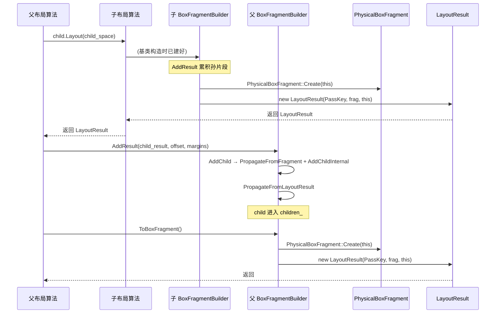

> 涉及文件：`core/layout/` 下的 `fragment_builder.{h,cc}`、`box_fragment_builder.{h,cc}`、`physical_fragment.h`、`physical_box_fragment.{h,cc}`、`physical_fragment_link.h`、`logical_fragment_link.h`、`layout_result.{h,cc}`、`layout_algorithm.h`

---

# 0. 登场角色

| 类 | 职责 | 形态 |
|----|------|------|
| `PhysicalFragment` | 一次 laid-out 的「片段」：几何 + 回指 `LayoutObject` + propagated 数据。paint/hit-test 的只读数据源 | `GarbageCollected` 基类 |
| `PhysicalBoxFragment` | box 类型片段；持有 children 数组、border/padding/baseline 等 | `final : PhysicalFragment` |
| `PhysicalLineBoxFragment` | 行盒片段 | `final : PhysicalFragment` |
| `LayoutResult` | 布局算法产物：包装一个 `PhysicalFragment` + 布局期元数据（BFC offset、break appeal、rare data 等） | `GarbageCollected final` |
| `FragmentBuilder` | 抽象的片段构建/合并器：累积 children、propagated 数据、break token、OOF 候选 | `STACK_ALLOCATED` 基类（无父类） |
| `BoxFragmentBuilder` | box 构建器：`AddResult`/`AddChild`/`ToBoxFragment` 等 box 专用逻辑 | `final : FragmentBuilder` |
| `LayoutAlgorithm<...>` | 布局算法模板基类：持有 `container_builder_`，构造并驱动 builder | 模板 |

核心数据流（一句话）：**算法用 `BoxFragmentBuilder` 累积 children → `ToBoxFragment()` 调 `PhysicalBoxFragment::Create(this)` 造片段 → 用 `LayoutResult` 包装返回 → 父算法的 builder 通过 `AddResult` 消费这个 `LayoutResult`，把片段登记进自己的 `children_`**。

---

# 1. 类继承关系

```
GarbageCollected<PhysicalFragment>
        └── PhysicalFragment                 (基类：几何 + layout_object_ + propagated_data_)
                ├── PhysicalBoxFragment       (final, type_=kFragmentBox)
                └── PhysicalLineBoxFragment   (final, type_=kFragmentLineBox)

GarbageCollected<LayoutResult>
        └── LayoutResult                     (final，包装 PhysicalFragment)

[无父类] FragmentBuilder                      (STACK_ALLOCATED，累积 children_)
        └── BoxFragmentBuilder                (final)

LayoutAlgorithm<InputNode, BoxFragmentBuilderType, BreakTokenType>   (模板)
        ├── BlockLayoutAlgorithm   : LayoutAlgorithm<BlockNode, BoxFragmentBuilder, BlockBreakToken>
        ├── FlexLayoutAlgorithm    : LayoutAlgorithm<...>
        ├── GridLayoutAlgorithm    : LayoutAlgorithm<...>
        └── ... (约 25 个算法)
```

要点：

- `PhysicalFragment` 用 1-bit `type_`（`kFragmentBox` / `kFragmentLineBox`）+ 4-bit `sub_type_`（box 时是 `BoxType`，line box 时是 `LineBoxType`）区分种类，**不是**用 C++ 虚函数分派——两个子类都 `final`，靠 `DowncastTraits` 做 `To<>`/`DynamicTo`。
- `FragmentBuilder` **没有父类**，它本身就是基类。`BoxFragmentBuilder` 是它唯一的 concrete 派生（`final`）。两者都 `STACK_ALLOCATED`——builder 永远在栈上/作为算法成员，绝不堆分配。
- `LayoutAlgorithm` 是模板，第二个模板参数是 builder 类型（绝大多数是 `BoxFragmentBuilder`）。算法**拥有**一个 `container_builder_` 成员。

---

# 2. `PhysicalFragment` 体系

## 2.1 基类 `PhysicalFragment`

```cpp
class CORE_EXPORT PhysicalFragment : public GarbageCollected<PhysicalFragment> {
  // ...
 protected:
  Member<LayoutObject> layout_object_;     // 回指产生它的 LayoutObject
  PhysicalSize size_;
  const uint8_t type_ : 1;                 // FragmentType
  const uint8_t sub_type_ : 4;             // BoxType / LineBoxType
  // ...大量 bitfield 标志...
  Member<const PropagatedData> propagated_data_;
  Member<const BreakToken> break_token_;
  Member<OofData> oof_data_;
};
```

**与 `LayoutObject` / DOM 的关系**：

```cpp
const LayoutObject* GetLayoutObject() const {
  return IsCSSBox() ? layout_object_.Get() : nullptr;   // 行盒返回 nullptr
}
Node* GetNode() const {
  return IsCSSBox() ? layout_object_->GetNode() : nullptr;
}
const ComputedStyle& Style() const {
  return layout_object_->EffectiveStyle(GetStyleVariant());
}
```

`IsCSSBox()` = 既不是行盒也不是 fragmentainer box（column box / page area）。只有 CSS box 的 fragment 才直接对应 CSS 盒树的一个节点，`GetLayoutObject()`/`GetNode()` 才返回非空。行盒是布局引擎生成的容器，`layout_object_` 存的是它的 containing block，但 `GetLayoutObject()` 历史性地返回 `nullptr`。

## 2.2 `BoxType` 枚举（box fragment 的子类型）

```cpp
enum BoxType {
  kNormalBox, kInlineBox, kColumnBox,
  kPageContainer, kPageBorderBox, kPageMargin, kPageArea,
  kAtomicInline, kFloating, kOutOfFlowPositioned, kBlockFlowRoot, kRenderedLegend,
  kMinimumFormattingContextRoot = kAtomicInline   // ≥ 此值的都是 FC root
};
```

`IsFormattingContextRoot()` 即 `GetBoxType() >= kMinimumFormattingContextRoot`。

## 2.3 `PhysicalBoxFragment`

```cpp
class CORE_EXPORT PhysicalBoxFragment final : public PhysicalFragment {
  LayoutUnit first_baseline_;
  LayoutUnit last_baseline_;
  Member<PhysicalFragmentRareData> rare_data_;   // 懒分配：border/padding/scrollbar/margin/table 几何
  InkOverflow ink_overflow_;
  HeapVector<PhysicalFragmentLink> children_;    // 子片段数组（物理 offset）
};
```

border/padding/scrollbar/margin 等非必有字段懒分配到 `rare_data_`，为零时不占空间：

```cpp
const PhysicalBoxStrut Borders() const {
  if (const auto* field = GetRareField(FieldId::kBorders)) return field->borders;
  return PhysicalBoxStrut();
}
```

children 暴露为 span：

```cpp
base::span<const PhysicalFragmentLink> Children() const {
  DCHECK(children_valid_);
  return base::span(children_);
}
```

## 2.4 `PhysicalFragmentLink`

```cpp
struct CORE_EXPORT PhysicalFragmentLink {
  DISALLOW_NEW();
  Member<const PhysicalFragment> fragment;
  PhysicalOffset offset;          // 相对父片段的物理偏移
};
```

**关键设计**：片段本身**不带位置信息**，位置存在父片段的 `PhysicalFragmentLink` 数组里。这样整个片段子树可以在不同位置复用/缓存——这是 LayoutNG 缓存机制的基础。`VectorTraits` 把它标记为 memcpy-safe、可并发 trace，以便存进 `HeapVector` 和 C-style 数组。

## 2.5 `children_` 是什么、何时填充

### Q1：`PhysicalBoxFragment::children_` 是它的子元素片段吗？

**是。** `children_` 存的就是这个 box 的**直接子片段**（child fragments）。每个条目 `PhysicalFragmentLink{fragment, offset}`：

- `fragment`：指向子片段（`const PhysicalFragment*`）。它**不一定**是 `PhysicalBoxFragment`——可以是块级子元素（box），也可以是行盒（`PhysicalLineBoxFragment`）。用 `child->IsBox()` / `IsLineBox()` 区分，`To<PhysicalBoxFragment>(*child)` 转型。
- `offset`：子片段相对父片段的**物理偏移**。

两个例外要注意：

1. **行内内容不进 `children_`**：如果一个 box 是 inline formatting context root（有 inline 子节点），它的行内子内容存进紧贴 `children_` 后面的 `FragmentItems`（柔性数组，靠 `Create` 的 `AdditionalBytes` 分配）。`children_` 里放的是**块级子片段、float、OOF** 等非行内子项。`physical_box_fragment.h` 的注释 `// fragment_items is after |children_| if they are not empty/initial.` 说的就是这个。
2. **片段自身不带位置**：`PhysicalFragment` 没有 offset 字段，位置存在父片段的 link 里，所以子树可整体复用。

### Q2：什么时候往 `children_` 里添加？

有**两套** `children_`，分两阶段：

**阶段一：构建期——往 builder 的 `children_` 逐个添加**

builder 的 `children_` 是 `HeapVector<LogicalFragmentLink, 4>`（**逻辑**坐标）。布局过程中，父算法每布局完一个子节点，就把子片段 push 进来：

```
父算法: const LayoutResult* child_result = child.Layout(child_space)
父 builder: AddResult(*child_result, offset, margins)            // 见 5.2
  └─ AddChild(fragment, offset, ...)                             // 5.3 override，处理几何（相对偏移、inflow_bounds 等）
       └─ PropagateFromFragment(child, ...)                      // 先合并 propagated 数据
       └─ AddChildInternal(&child, child_offset + relative_offset)  // 4.3，真正 push
            └─ children_.push_back(LogicalFragmentLink{*child, offset})  // 进 builder 的 children_
```

`AddChildInternal` 是**唯一**往 builder `children_` 加东西的常规入口（`ReplaceChild` 是例外，用于在简化布局里替换某个子片段）。它有两条特殊重排规则：

```cpp
if (child->IsListMarker())         
  children_.push_front(...);   // list-marker 永远最前
else if (child->IsTextControlPlaceholder() && size > 0)
  children_.insert(size - 1, ...);  // ::placeholder 插倒数第二
else                             
  children_.push_back(...);    // 其余尾插
```

**阶段二：成品期——`Create` 时一次性转换填进片段自己的 `children_`**

builder 的 `children_` 只是构建期的临时累积。当父 builder 调 `ToBoxFragment()` → `PhysicalBoxFragment::Create(this)` 时，成品片段的 `children_`（`HeapVector<PhysicalFragmentLink>`，**物理**坐标）在 `PhysicalBoxFragment` 构造函数里**一次性**从 builder 的 `children_` 转换填入，之后只读：

```cpp
// PhysicalBoxFragment 构造函数内
children_.ReserveInitialCapacity(builder->children_.size());
for (auto& child : builder->children_) {
  children_.emplace_back(
      std::move(child.fragment),
      converter.ToPhysical(child.offset, child.fragment->Size()));  // 逻辑→物理
}
```

成品 `PhysicalBoxFragment::children_` 构造后就固定了，正常路径不再修改（OOF 后处理有 `MutableChildrenForOutOfFlow` 特殊路径，那是例外）。

#### 两套 `children_` 对比

| | builder 的 `children_` | `PhysicalBoxFragment::children_` |
|---|---|---|
| 类型 | `HeapVector<LogicalFragmentLink, 4>` | `HeapVector<PhysicalFragmentLink>` |
| 坐标系 | 逻辑偏移（书写模式相关） | 物理偏移（与书写模式解耦） |
| 添加时机 | 布局过程逐个 push（`AddChildInternal`） | `Create` 触发构造函数一次性转换填入 |
| 可变性 | 可变（构建期累积） | 只读（成品，构造后固定） |
| 存储位置 | `FragmentBuilder`（栈，算法成员） | `PhysicalBoxFragment`（堆，GC 跟踪） |

一句话总结：**布局过程中，父 builder 通过 `AddResult` → `AddChild` → `AddChildInternal` 把每个子片段逐个加进自己的逻辑 `children_`；父 builder 完成时，`ToBoxFragment()` 调 `PhysicalBoxFragment::Create(this)`，`Create` 把 `builder` 传给 `PhysicalBoxFragment` 构造函数，由构造函数把这些逻辑条目一次性转成物理条目填进成品片段的 `children_`，这个数组就是这个 box 的子元素片段列表。**

---

# 3. `LayoutResult`

```cpp
class CORE_EXPORT LayoutResult final : public GarbageCollected<LayoutResult> {
 public:
  enum EStatus {
    kSuccess = 0,
    kBfcBlockOffsetResolved = 1,
    kNeedsEarlierBreak = 2,
    kOutOfFragmentainerSpace = 3,
    kNeedsLineClampRelayout = 4,
    kDisableFragmentation = 5,
    // ... 还有若干 relayout 原因
  };

 private:
  const ConstraintSpace space_;                       // 值类型，作缓存 key
  Member<const PhysicalFragment> physical_fragment_;  // 拥有片段
  Member<RareData> rare_data_;                        // 懒分配的布局期数据
  union {
    BfcOffset bfc_offset_;
    BoxStrut oof_insets_for_get_computed_style_;
  };
  LayoutUnit intrinsic_block_size_;
  Bitfields bitfields_;   // 含 4-bit status
};
```

**访问片段**：

```cpp
const PhysicalFragment& GetPhysicalFragment() const {
  DCHECK(physical_fragment_);
  DCHECK_EQ(kSuccess, Status());   // 只有成功结果才能取片段
  return *physical_fragment_;
}
```

**所有权**：`LayoutResult` 通过 traced `Member` **拥有** `PhysicalFragment`；`ConstraintSpace` 是值拷贝；`RareData` 懒分配。`LayoutResult` 不可拷贝不可移动，只能通过构造函数 / `Clone` 创建。

**与 builder 的关系**：builder 不拥有 result，而是**生产** result——把自身传进 `LayoutResult` 的构造函数，从 builder 上把字段「抽干」：

```cpp
LayoutResult::LayoutResult(const PhysicalFragment* physical_fragment,
                           FragmentBuilder* builder)
    : space_(builder->space_),
      physical_fragment_(std::move(physical_fragment)),
      // ...从 builder 抽各种 bitfield...
```

### 3.1 PassKey 模式

`LayoutResult` 的构造被 PassKey 限制，只有对应 builder 能调：

```cpp
using FragmentBuilderPassKey = base::PassKey<FragmentBuilder>;
LayoutResult(FragmentBuilderPassKey, EStatus, FragmentBuilder*);  // 非成功（abort）

using BoxFragmentBuilderPassKey = base::PassKey<BoxFragmentBuilder>;
LayoutResult(BoxFragmentBuilderPassKey, const PhysicalFragment*, BoxFragmentBuilder*);  // 成功

using LineBoxFragmentBuilderPassKey = base::PassKey<LineBoxFragmentBuilder>;
LayoutResult(LineBoxFragmentBuilderPassKey, const PhysicalFragment*, LineBoxFragmentBuilder*);  // 成功
```

编译期保证：只有 `BoxFragmentBuilder` 能造一个「带 box 片段的成功 `LayoutResult`」，只有 `LineBoxFragmentBuilder` 能造行盒的，只有 `FragmentBuilder` 能造非成功（abort/relayout）的。三个 PassKey 构造函数都委托给上面那个 public 的 delegate 构造函数。

---

# 4. `FragmentBuilder` 基类

## 4.1 关键字段

```cpp
class CORE_EXPORT FragmentBuilder {
  LayoutInputNode node_;
  const ConstraintSpace& space_;
  const ComputedStyle* style_;
  PhysicalFragment::BoxType box_type_ = PhysicalFragment::BoxType::kNormalBox;
  LogicalSize size_;

  const BreakToken* previous_break_token_ = nullptr;
  const BreakToken* break_token_ = nullptr;

  // propagated 数据（从子片段向上合并）
  GCedHeapVector<SplitAxisItem<LayoutBoxModelObject>>* sticky_descendants_ = nullptr;
  GCedHeapVector<Member<Element>>* snap_areas_ = nullptr;
  TriggerScopedNameMap* named_triggers_ = nullptr;
  const LayoutObject* scroll_start_target_ = nullptr;
  AnchorMap* anchor_map_ = nullptr;

  ChildrenVector children_;   // = HeapVector<LogicalFragmentLink, 4>
  HeapVector<LogicalFragmentLink> children_with_size_dependent_propagation_;
  FragmentItemsBuilder* items_builder_ = nullptr;   // 行内格式化上下文用

  BreakTokenVector child_break_tokens_;
  HeapVector<LogicalOofPositionedNode> oof_positioned_candidates_;
  HeapVector<LogicalOofNodeForFragmentation> oof_positioned_fragmentainer_descendants_;
  HeapVector<LogicalOofPositionedNode> oof_positioned_descendants_;

  bool has_final_size_ = false;
  // ...几十个 bool 标志...
};
```

`children_` 的类型展开是 `HeapVector<LogicalFragmentLink, 4>`（内联容量 4）。

## 4.2 `LogicalFragmentLink`（builder 侧的子片段记录）

```cpp
struct CORE_EXPORT LogicalFragmentLink {
  DISALLOW_NEW();
  Member<const PhysicalFragment> fragment;
  LogicalOffset offset;          // 逻辑偏移（构建期用逻辑坐标）
};
using LogicalFragmentLinkVector = HeapVector<LogicalFragmentLink, 4>;
using ChildrenVector = LogicalFragmentLinkVector;
```

**两套 link 的区别**：

| 结构 | 坐标系 | 存放位置 |
|------|--------|---------|
| `LogicalFragmentLink` | 逻辑偏移 | builder 的 `children_`（构建期） |
| `PhysicalFragmentLink` | 物理偏移 | `PhysicalBoxFragment::children_`（成品） |

构建期用逻辑坐标（书写模式相关），`PhysicalBoxFragment` 构造函数（由 `Create` 触发）用 `WritingModeConverter` 转成物理坐标存进片段。这样片段与书写模式解耦，可缓存复用。

## 4.3 三个核心方法

#### `PropagateFromLayoutResultAndFragment`（入口分发）

```cpp
void FragmentBuilder::PropagateFromLayoutResultAndFragment(
    const LayoutResult& child_result,
    LogicalOffset child_offset,
    LogicalOffset relative_offset,
    const OofInlineContainer<LogicalOffset>* inline_container) {
  PropagateFromLayoutResult(child_result);
  PropagateFromFragment(child_result.GetPhysicalFragment(), child_offset,
                        relative_offset, inline_container);
}
```

薄分发：先抽 result 级标志，再抽 fragment 级数据。

### `PropagateFromLayoutResult`（result 级，只有 1 个标志）

```cpp
void FragmentBuilder::PropagateFromLayoutResult(const LayoutResult& child_result) {
  has_orthogonal_fallback_size_descendant_ |=
      child_result.HasOrthogonalFallbackInlineSize() ||
      child_result.HasOrthogonalFallbackSizeDescendant();
}
```

### `PropagateFromFragment`（fragment 级，真正的合并枢纽）

```cpp
void FragmentBuilder::PropagateFromFragment(
    const PhysicalFragment& child, LogicalOffset child_offset,
    LogicalOffset relative_offset,
    const OofInlineContainer<LogicalOffset>* inline_container) {
  if (GetBoxType() == PhysicalFragment::kPageBorderBox) {
    // 页边界：page box 与文档内容之间不传播
    return;
  }

  if (child.HasAnchorsToPropagate()) {
    PropagateChildAnchors(child, child_offset + relative_offset);
    has_running_anchor_transform_animation_ |= child.HasRunningAnchorTransformAnimation();
  }

  PropagateStickyDescendants(child);
  PropagateSnapAreas(child);
  PropagateScrollInitialTarget(child);
  PropagateNamedTriggers(child);

  if (child.NeedsOOFPositionedInfoPropagation() && ...) {
    PropagateOOFPositionedInfo(child, child_offset, relative_offset, ...);
  }

  // 百分比 block-size 依赖、float descendants、adjoining object 标志...
  if (!has_descendant_that_depends_on_percentage_block_size_) {
    if (child.DependsOnPercentageBlockSize() && !child.IsOutOfFlowPositioned())
      has_descendant_that_depends_on_percentage_block_size_ = true;
    // 相对定位的百分比 top/bottom 也要标记
  }

  // break token 收集（分页时）...
}
```

它把子片段的 anchors / sticky / snap / scroll-initial-target / named triggers / OOF info / 百分比依赖 / float 标志 / break token 全部向上合并到当前 builder。page border box 是传播边界。

### `AddChildInternal`（实际登记进 `children_`）

```cpp
void FragmentBuilder::AddChildInternal(const PhysicalFragment* child,
                                       const LogicalOffset& child_offset) {
  // list-marker 永远放最前（供 SimplifiedLayoutAlgorithm 查找）
  if (child->IsListMarker()) {
    children_.push_front(LogicalFragmentLink(*child, child_offset));
    return;
  }
  // ::placeholder 插到倒数第二，让它后面跟个 block 以便早绘制
  if (child->IsTextControlPlaceholder()) {
    const wtf_size_t size = children_.size();
    if (size > 0) {
      children_.insert(size - 1, LogicalFragmentLink(*child, child_offset));
      return;
    }
  }
  children_.push_back(LogicalFragmentLink(*child, child_offset));
}
```

两个特殊重排：list marker 前插、`::placeholder` 插到倒数第二。其余尾插。

---

# 5. `BoxFragmentBuilder`

## 5.1 构造

```cpp
class CORE_EXPORT BoxFragmentBuilder final : public FragmentBuilder {
  // 主构造：算法用（带 LayoutInputNode + BlockBreakToken）
  BoxFragmentBuilder(LayoutInputNode node, const ComputedStyle* style,
                     const ConstraintSpace& space,
                     WritingDirectionMode writing_direction,
                     const BlockBreakToken* previous_break_token)
      : FragmentBuilder(node, style, space, writing_direction, previous_break_token),
        is_inline_formatting_context_(node.IsInline()) {}

  // 重载：LayoutInline 没有 LayoutInputNode 时用
  BoxFragmentBuilder(LayoutObject* layout_object, const ComputedStyle* style,
                     const ConstraintSpace& space,
                     WritingDirectionMode writing_direction)
      : FragmentBuilder(/*node=*/nullptr, style, space, writing_direction, nullptr),
        is_inline_formatting_context_(true) { layout_object_ = layout_object; }
};
```

## 5.2 `AddResult`——父 builder 消费子 LayoutResult

```cpp
void BoxFragmentBuilder::AddResult(
    const LayoutResult& child_layout_result, const LogicalOffset offset,
    std::optional<const BoxStrut> margins,
    std::optional<LogicalOffset> relative_offset,
    const OofInlineContainer<LogicalOffset>* inline_container) {
  const auto& fragment = child_layout_result.GetPhysicalFragment();

  // block-in-inline：行盒里包了块，用那个块的 result 来传播 break 信息
  const LayoutResult* result_for_propagation = &child_layout_result;
  if (!fragment.IsBox() && items_builder_) {
    if (const auto* line = DynamicTo<PhysicalLineBoxFragment>(&fragment)) {
      if (line->IsBlockInInline() && GetConstraintSpace().HasBlockFragmentation()) {
        result_for_propagation = items_builder_->GetLogicalLineItems(*line).BlockInInlineLayoutResult();
      }
      items_builder_->AddLine(*line, offset);
    }
  }

  const MarginStrut end_margin_strut = child_layout_result.EndMarginStrut();
  AddChild(fragment, offset, &end_margin_strut,
           child_layout_result.IsSelfCollapsing(), relative_offset, inline_container);

  if (margins) {
    const auto& box_fragment = To<PhysicalBoxFragment>(fragment);
    if (!margins->IsEmpty() || !box_fragment.Margins().IsZero())
      box_fragment.GetMutableForContainerLayout().SetMargins(
          margins->ConvertToPhysical(GetWritingDirection()));
  }

  if (GetConstraintSpace().HasBlockFragmentation())
    PropagateBreakInfo(*result_for_propagation, offset);
  if (GetConstraintSpace().ShouldPropagateChildBreakValues())
    PropagateChildBreakValues(*result_for_propagation);
  PropagateFromLayoutResult(*result_for_propagation);
}
```

`AddResult` 做四件事：

1. 取出子的 `PhysicalFragment`（block-in-inline 时改用内层块的 result 传播 break）。
2. 调 `AddChild`（见 5.3）把片段登记进 `children_`。
3. 把 margin 写回子 box 片段（`GetMutableForContainerLayout().SetMargins`）。
4. 传播 break 信息 / OOF / 罕见数据（`PropagateBreakInfo` / `PropagateChildBreakValues` / `PropagateFromLayoutResult`）。

## 5.3 `AddChild`——override，处理几何后再调基类

`BoxFragmentBuilder::AddChild` 是 `FragmentBuilder::AddChild` 的 override，处理：

- 计算 `relative_offset`（相对定位偏移，若调用方没给）。
- 更新 `may_have_descendant_above_block_start_`（决定片段能否在前面有 float 时复用）。
- 滚动容器时更新 `inflow_bounds_`（见下）。

### `inflow_bounds_` 的更新

`inflow_bounds_` 是 builder 累积的「所有 inflow 子片段（含 margin）的外接矩形」，最终在 `PhysicalBoxFragment::Create` 时传给 `ScrollableOverflowCalculator::Result(inflow_bounds)`，用来保证滚动容器的 scrollable overflow 至少覆盖 inflow 内容 + padding（详见 scrollable overflow 文档第 7 节）。

它**只在滚动容器**（`Node().IsScrollContainer()`）、**非 fragmentainer**（`!IsFragmentainerBoxType()`）、**非 OOF 子片段**（`!child.IsOutOfFlowPositioned()`）时才更新——因为 OOF 元素不参与正常流，不该撑大 inflow 范围。更新逻辑在 `AddChild` 里：

```cpp
if (Node().IsScrollContainer() && !IsFragmentainerBoxType() &&
    !child.IsOutOfFlowPositioned()) {
  // 算子片段的 margin（block 流用 end margin-strut 当 block-end margin）
  BoxStrut margins;
  if (child.IsCSSBox())
    margins = ComputeMarginsFor(child.Style(), child_available_size_.inline_size, ...);
  if (margin_strut) {
    MarginStrut end_margin_strut = *margin_strut;
    end_margin_strut.Append(margins.block_end, /* is_quirky */ false);
    margins.block_end = is_self_collapsing
                            ? end_margin_strut.Sum() - margin_strut->Sum()
                            : end_margin_strut.Sum();
  }

  // 子片段的 inflow 边界 = {child_offset, 子片段 size}
  LogicalFragment fragment(GetWritingDirection(), child);
  LogicalRect bounds = {child_offset, fragment.Size()};

  // 把 margin 并进边界（按滚动方向钳制负 margin）
  if (!margins.IsEmpty()) {
    const bool has_top_overflow = Node().HasTopOverflow();
    const bool has_left_overflow = Node().HasLeftOverflow();
    // 靠近滚动方向的 margin 允许负到 -size；远离方向不允许负
    // ...（钳制 margins.inline_start/inline_end/block_start/block_end）...
    bounds.offset -= {margins.inline_start, margins.block_start};
    bounds.size.inline_size += margins.InlineSum();
    bounds.size.block_size += margins.BlockSum();
  }

  // 累积：与已有 inflow_bounds_ 取并集（空片段也参与，0x0 也算）
  if (!inflow_bounds_)
    inflow_bounds_ = bounds;
  else
    inflow_bounds_->UniteEvenIfEmpty(bounds);
}
```

#### margin 折叠与层级关系（`end_margin_strut` 为什么要 append `margins.block_end`）

上面代码里 `end_margin_strut.Append(margins.block_end, ...)` 涉及 CSS margin collapsing，容易混淆。关键是分清这段代码里谁是 scroller、谁是 child，以及两个 margin 各自的层级：

- **`Node()` = 滚动容器**（scroller，当前 builder 在造的片段），是这段代码的**触发条件和消费方**——它要维护 `inflow_bounds_`。
- **`child` = 滚动容器的一个 inflow 子**。
- **`margins.block_end` = child 自身的 `margin-bottom`**（从 child 样式算，外层 margin）。
- **`margin_strut` = child 的 end margin strut**（来自 `child_layout_result.EndMarginStrut()`，是 child 布局时内部子树累积的折叠链，内层 margin）。

也就是说，**margin 折叠发生在 `child` 层面，不是 scroller 层面**。`margin_strut` 持有 child 内部最后一个 inflow 子的 end margin 折叠链，但还没包含 child 自己的 `margin-bottom`；而 CSS 规定 child 自身的 block-end margin 和它内部最后一个子的 block-end margin 是相邻的、要折叠的。所以 append 合并、`Sum()` 取折叠后的有效值，作为 child block-end 方向撑大 `inflow_bounds_` 的量。

具体例子（含 scroller）：

```html
<div id="scroller" style="overflow: auto; height: 100px">  <!-- Node()，滚动容器 -->
  <div id="child" style="margin-bottom: 30px">              <!-- child，margins.block_end = 30px -->
    <div style="margin-bottom: 50px">                        <!-- child 的最后一个 inflow 子 -->
      ...
    </div>
  </div>
</div>
```

child 布局完后：

- `margins.block_end` = **30px**（child 自己的 `margin-bottom`）
- `margin_strut`（child 的 end strut）= **50px**（child 内部子的 `margin-bottom` 折叠链）

scroller 的 builder 在 `AddChild(child, ...)` 里维护 `inflow_bounds_`，需要 child block-end 方向的有效 margin。append 合并后 `max(30, 50)` = **50px**，`Sum()` = 50px 才是正确值。如果直接用未折叠的 `margins.block_end = 30px`，`inflow_bounds_` 会少算 20px，导致 scrollable overflow 的 inflow 部分不够大，滚动到底看不到 child 内部子底部该有的 margin 空间。

> 注：滚动容器建立 BFC，但 BFC 只隔离**容器与外部**的 margin 折叠（child 的 margin 不会泄漏到 scroller 外部去和兄弟折叠）；它**不影响** child 自身 margin 与 child 内部 margin 的折叠——那是 child 内部布局的事。所以这里的折叠逻辑和普通容器一致，scroller 只是读取折叠结果来算 `inflow_bounds_`。

self-collapsing 子的 `Sum() - margin_strut->Sum()`：自折叠块的 start/end margin 会折叠在一起，它的 end strut 里已包含 start margin 部分，直接用 `Sum()` 会把 start margin 重复算进 block-end，故减去原始 strut 和，得到「纯粹由该子在 block-end 方向新增的贡献」。

要点：

1. **触发条件**：仅滚动容器 + 非 fragmentainer + 非 OOF。普通容器不维护 `inflow_bounds_`（传给 calculator 时为 `nullopt`，`Result` 直接跳过 inflow 调整）。
2. **margin 并入**：inflow 边界包含子片段的 margin（block 流用 end margin-strut 算 block-end margin，self-collapsing 特殊处理）。
3. **负 margin 按滚动方向钳制**：靠近滚动起始方向的 margin 允许负到 `-子片段尺寸`，远离方向的负 margin 钳为 0。这和 `ScrollableOverflowCalculator::AdjustOverflowForScrollOrigin` 的方向逻辑呼应——inflow 范围也只在滚动方向上扩展。
4. **`UniteEvenIfEmpty`**：即使子片段是 0x0 也会并入（注释明确「Even an empty (0x0) fragment contributes to the inflow-bounds」），保证空片段也参与外接矩形。
5. **offset 用未含相对定位的原始 `child_offset`**：注释 `// Use the original offset (*without* relative-positioning applied)`。相对定位偏移不影响 inflow 边界（相对定位是视觉移动，不改变流内位置）。

最后两条是关键调用链：

```cpp
  PropagateFromFragment(child, child_offset, *relative_offset, inline_container);
  AddChildInternal(&child, child_offset + *relative_offset);
```

即 **先传播 propagated 数据，再把 child 加进 `children_`**。

> 注意：`BoxFragmentBuilder` **不** override `AddChildInternal`——`AddChildInternal` 是 `FragmentBuilder` 的 protected 方法，只在 `fragment_builder.cc` 定义一次。

## 5.4 `ToBoxFragment`——最终化并产出 LayoutResult

```cpp
const LayoutResult* BoxFragmentBuilder::ToBoxFragment(WritingMode block_or_line_writing_mode) {
  Finalize();

  // block-in-inline 标记
  if (box_type_ == PhysicalFragment::kNormalBox && node_ && node_.IsBlockInInline())
    SetIsBlockInInline();

  // 分页最终化：必要时造 BlockBreakToken、处理 break-inside:avoid、钳制 block_size_for_fragmentation_
  if (space.HasBlockFragmentation() && node_) {
    // ...一大段分页处理...
    if (!break_token_ && (DidBreakSelf() || ShouldBreakInside()))
      break_token_ = BlockBreakToken::Create(this);
  }

  const PhysicalBoxFragment* fragment =
      PhysicalBoxFragment::Create(this, block_or_line_writing_mode);  // 造片段
  fragment->CheckType();

  return MakeGarbageCollected<LayoutResult>(
      LayoutResult::BoxFragmentBuilderPassKey(), std::move(fragment), this);  // 包装返回
}
```

三步：`Finalize()` → 分页最终化 → `PhysicalBoxFragment::Create(this)` + `LayoutResult` 包装。`MakeGarbageCollected<LayoutResult>(BoxFragmentBuilderPassKey{}, ...)` 用 PassKey 证明调用者是 `BoxFragmentBuilder`。

---

# 6. `PhysicalBoxFragment::Create`——从 builder 造片段

```cpp
const PhysicalBoxFragment* PhysicalBoxFragment::Create(
    BoxFragmentBuilder* builder, WritingMode block_or_line_writing_mode) {
  const auto writing_direction = builder->GetWritingDirection();
  const PhysicalBoxStrut borders =
      builder->ApplicableBorders().ConvertToPhysical(writing_direction);
  const PhysicalBoxStrut scrollbar =
      builder->ApplicableScrollbar().ConvertToPhysical(writing_direction);
  const PhysicalBoxStrut padding =
      builder->ApplicablePadding().ConvertToPhysical(writing_direction);
  const PhysicalSize physical_size =
      ToPhysicalSize(builder->Size(), builder->GetWritingMode());

  // 算 scrollable overflow（遍历 children + items）
  PhysicalRect scrollable_overflow = {PhysicalOffset(), physical_size};
  if (builder->ShouldCalculateScrollableOverflow()) {
    ScrollableOverflowCalculator calculator(...);
    for (auto& child : builder->children_) {
      const auto* box_fragment = DynamicTo<PhysicalBoxFragment>(*child.fragment);
      if (!box_fragment) continue;
      calculator.AddChild(*box_fragment, child.offset.ConvertToPhysical(...));
    }
    scrollable_overflow = calculator.Result(inflow_bounds);
  }

  // 手动分配（children 是柔性数组，紧贴在 fragment 对象后）
  return MakeGarbageCollected<PhysicalBoxFragment>(
      AdditionalBytes(byte_size), PassKey(), builder, has_scrollable_overflow,
      scrollable_overflow, borders.IsZero() ? nullptr : &borders,
      scrollbar.IsZero() ? nullptr : &scrollbar,
      padding.IsZero() ? nullptr : &padding, inflow_bounds, has_fragment_items,
      block_or_line_writing_mode);
}
```

**注意区分 `Create` 里的两件不同的事**：

1. **`Create` 里那个 `for (auto& child : builder->children_)` 循环（遍历 children）是为了算 scrollable overflow**——把每个子 box 片段喂给 `ScrollableOverflowCalculator`，**不是**为了填 `children_`。
2. **`Create` 本身不填 `children_`**。它只算好几何（borders/scrollbar/padding/size/overflow），然后把 **`builder` 指针整个传给 `PhysicalBoxFragment` 构造函数**（见 return 那行 `MakeGarbageCollected<PhysicalBoxFragment>(..., builder, ...)`）。

真正把 `children_` 填进去的是**构造函数**——它接收 `builder`，自己遍历 `builder->children_`，把每个 `LogicalFragmentLink`（逻辑偏移）转成 `PhysicalFragmentLink`（物理偏移）emplace 进片段自己的 `children_`。border/padding/scrollbar 为零时 `Create` 传 `nullptr`，构造函数不进 `rare_data_`。

`PhysicalBoxFragment` 构造函数里填 `children_` 的代码：

```cpp
// 构造函数内（Create 不做这件事，是构造函数做）
const WritingModeConverter converter({block_or_line_writing_mode, builder->Direction()}, Size());
children_.ReserveInitialCapacity(builder->children_.size());
for (auto& child : builder->children_) {
  children_.emplace_back(std::move(child.fragment),
      converter.ToPhysical(child.offset, child.fragment->Size()));  // 逻辑→物理
}
```

所以准确的因果是：`Create` 触发 `PhysicalBoxFragment` 的构造 → 构造函数从 `builder->children_` 读出逻辑条目、转成物理条目、填进自己的 `children_`（柔性数组，紧贴对象内存）。至此 builder 的逻辑 children 变成片段的物理 children，片段成为紧凑的只读子树，供 paint/hit-test 使用。

---

# 7. 完整调用链

## 7.1 算法如何构造 builder

几乎所有算法通过 `LayoutAlgorithm` 模板基类的 params 构造函数造 builder：

```cpp
// layout_algorithm.h
struct LayoutAlgorithmParams {
  BlockNode node;
  const FragmentGeometry& fragment_geometry;
  const ConstraintSpace& space;
  const BlockBreakToken* break_token = nullptr;
  const EarlyBreak* early_break = nullptr;
  const ColumnSpannerPath* column_spanner_path = nullptr;
  const LayoutResult* previous_result = nullptr;
};

template <class InputNodeType, class BoxFragmentBuilderType, class BreakTokenType>
class LayoutAlgorithm {
  explicit LayoutAlgorithm(const LayoutAlgorithmParams& params)
      : node_(To<InputNodeType>(params.node)),
        early_break_(params.early_break),
        container_builder_(                       // ← 在成员初始化列表造 builder
            params.node, &params.node.Style(), params.space,
            {params.space.GetWritingMode(), params.space.Direction()},
            params.break_token),
        additional_early_breaks_(params.additional_early_breaks) {
    container_builder_.SetIsNewFormattingContext(params.space.IsNewFormattingContext());
    container_builder_.SetInitialFragmentGeometry(params.fragment_geometry);
    if (params.space.HasBlockFragmentation() || IsBreakInside(params.break_token))
      SetupFragmentBuilderForFragmentation(...);
  }
  BoxFragmentBuilderType container_builder_;   // 算法拥有 builder
};
```

`BlockLayoutAlgorithm` 等算法继承它：

```cpp
class BlockLayoutAlgorithm
    : public LayoutAlgorithm<BlockNode, BoxFragmentBuilder, BlockBreakToken> {
  BlockLayoutAlgorithm(const LayoutAlgorithmParams& params)
      : LayoutAlgorithm(params), ... {
    container_builder_.SetExclusionSpace(params.space.GetExclusionSpace());
  }
};
```

## 7.2 端到端调用链（BlockNode::Layout）

```
BlockNode::Layout(constraint_space, break_token, ...)
  │
  ├─ fragment_geometry = CalculateInitialFragmentGeometry(space, node, break_token)
  │      └─ 算出 border_box_size + border/scrollbar/padding（length_utils.cc）
  │
  ├─ LayoutAlgorithmParams params(node, fragment_geometry, space)
  │  params.break_token = break_token; ...
  │
  └─ LayoutWithAlgorithm(params)
       │
       └─ DetermineAlgorithmAndRun → 按 display 选算法
            │
            └─ BlockLayoutAlgorithm algorithm(params)
                 │   ↑ LayoutAlgorithm 基类构造函数造好 container_builder_
                 │     并 SetInitialFragmentGeometry
                 │
                 └─ algorithm.Layout()
                      │
                      │  // 对每个子节点：
                      ├─ const LayoutResult* child_result = child.Layout(child_space)
                      │     └─ 递归，子节点自己走一遍上述流程
                      │
                      ├─ container_builder_.AddResult(*child_result, offset, margins)
                      │     ├─ AddChild(fragment, offset, ...)
                      │     │    ├─ PropagateFromFragment(child, ...)   // 合并 propagated 数据
                      │     │    └─ AddChildInternal(child, offset)     // 加进 children_
                      │     └─ PropagateFromLayoutResult(child_result)  // 合并 result 级标志
                      │
                      └─ container_builder_.ToBoxFragment()
                           ├─ Finalize()
                           ├─ PhysicalBoxFragment::Create(this, writing_mode)
                           │     ├─ Create 算几何 + scrollable overflow
                           │     └─ 触发 PhysicalBoxFragment 构造函数：
                           │          遍历 builder->children_，逻辑→物理，填进 children_
                           └─ MakeGarbageCollected<LayoutResult>(
                                  BoxFragmentBuilderPassKey{}, fragment, this)
                              └─ 返回给父算法
```

## 7.3 序列图



---

# 8. 所有权与生命周期

| 关系 | 形式 |
|------|------|
| `LayoutAlgorithm` → `BoxFragmentBuilder` | 成员（值），栈分配，随算法对象生命周期 |
| `LayoutResult` → `PhysicalFragment` | traced `Member`，GC 管理 |
| `LayoutResult` → `ConstraintSpace` | 值拷贝 |
| `PhysicalBoxFragment` → children | `HeapVector<PhysicalFragmentLink>`，traced `Member` |
| `FragmentBuilder` → children | `HeapVector<LogicalFragmentLink>`，traced `Member` |
| `PhysicalFragment` → `LayoutObject` | traced `Member`，回指（非拥有） |

全部走 oilpan GC（`MakeGarbageCollected` / `Member`）。builder 是唯一栈分配的——它是「生产工具」，用完即弃；result 和 fragment 是堆分配的「产品」，被 GC 跟踪，缓存复用。

`LayoutResult::GetPhysicalFragment()` 只在 `Status() == kSuccess` 时合法——非成功结果（abort/relayout）不带片段（`physical_fragment_` 为 `nullptr`）。

---

# 9. 一个 LayoutBox 对应多个 Fragment 的情况

通常一个 `LayoutBox` 一次布局产出一个 `LayoutResult`（一个 `PhysicalBoxFragment`）。但分页/多列下，同一个 `LayoutBox` 会被打断成多个片段：

- `LayoutBox` 持有 `layout_results_` 列表（`PhysicalFragments()` 访问），分页时多个 `LayoutResult` / 多个 `PhysicalFragment` 各代表一页/一列的片段。
- 多列容器为每列造 column-box fragment；行内拆分生成多个 `PhysicalLineBoxFragment`。
- `BreakToken` 串联同节点的多个片段，记录「断在哪、下次从哪续」。

`BlockBreakToken::Create(this)` 在 `ToBoxFragment` 里当 `DidBreakSelf() || ShouldBreakInside()` 时创建，存进 fragment 的 `break_token_`。

---

# 10. 关键设计要点

1. **构建期逻辑坐标 / 成品物理坐标**：builder 的 `children_` 用 `LogicalFragmentLink`（逻辑偏移），片段的 `children_` 用 `PhysicalFragmentLink`（物理偏移）。转换发生在 `PhysicalBoxFragment` 构造函数（由 `Create` 触发）。片段与书写模式解耦，可缓存复用。

2. **片段无位置**：`PhysicalFragment` 本身不带位置，位置存在父片段的 link 里。整个子树可在任意位置复用——这是 LayoutNG 缓存的基础。

3. **PassKey 限制构造权**：`LayoutResult` 的三个 PassKey 构造函数编译期保证只有对应 builder 能造 result，且区分成功/非成功。

4. **propagate 三段式**：`AddResult` → `AddChild`（`PropagateFromFragment` + `AddChildInternal`）→ `PropagateFromLayoutResult`。propagated 数据（anchors/sticky/snap/triggers/OOF/break token）逐层向上合并，page border box 是边界。

5. **懒分配 rare data**：`PhysicalBoxFragment` 的 border/padding/scrollbar/margin、`LayoutResult` 的 `RareData` 都为零/无时不分配，省内存。

6. **builder 栈分配、产品堆分配**：builder 是工具（`STACK_ALLOCATED`，算法成员），result/fragment 是产品（`GarbageCollected`，GC 跟踪、缓存复用）。

7. **柔性数组存 children**：`PhysicalBoxFragment` 用 `MakeGarbageCollected` + `AdditionalBytes` 把 children 数组紧贴对象后分配，紧凑且一次分配。

8. **type/sub_type 位域分派**：`PhysicalFragment` 用位域而非虚函数区分 box/line box 子类型，`DowncastTraits` 支持 `To<>`，省虚表开销。

9. **block-in-inline 特殊处理**：行盒里嵌套块时，`AddResult` 改用内层块的 `LayoutResult` 传播 break 信息——行盒只是实现细节，真正的内容在那个块上。

10. **特殊子片段重排**：`AddChildInternal` 把 list-marker 前插、`::placeholder` 插到倒数第二，满足后续算法（简化布局）和绘制顺序的需要。

---

# 附：相关文件索引

| 文件 | 内容 |
|------|------|
| `core/layout/physical_fragment.h` | `PhysicalFragment` 基类、`FragmentType`/`BoxType` 枚举 |
| `core/layout/physical_box_fragment.{h,cc}` | `PhysicalBoxFragment`、`Create()` |
| `core/layout/inline/physical_line_box_fragment.h` | `PhysicalLineBoxFragment` |
| `core/layout/physical_fragment_link.h` | `PhysicalFragmentLink` |
| `core/layout/logical_fragment_link.h` | `LogicalFragmentLink`、`LogicalFragmentLinkVector` |
| `core/layout/layout_result.{h,cc}` | `LayoutResult`、`EStatus`、PassKey 构造函数 |
| `core/layout/fragment_builder.{h,cc}` | `FragmentBuilder` 基类、`PropagateFrom*`、`AddChildInternal` |
| `core/layout/box_fragment_builder.{h,cc}` | `BoxFragmentBuilder`、`AddResult`、`AddChild`、`ToBoxFragment` |
| `core/layout/layout_algorithm.h` | `LayoutAlgorithmParams`、`LayoutAlgorithm` 模板基类 |
| `core/layout/oof_positioned_node.h` | `OofInlineContainer` |
