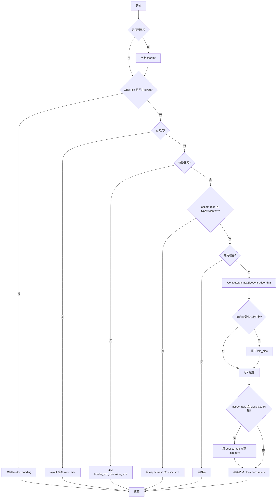

好的，下面我将详细解释 `BlockNode::ComputeMinMaxSizes` 函数的实现逻辑，并结合例子说明，最后给出流程图。

---

## 一、函数作用

`BlockNode::ComputeMinMaxSizes` 主要用于计算一个块级节点（BlockNode）在布局时的最小和最大内联尺寸（min/max inline size），即 CSS 里的 min-width/max-width。这个计算会考虑节点的样式、布局约束、子节点、百分比、aspect-ratio、缓存等多种因素。

---

## 二、参数说明

```cpp
MinMaxSizesResult BlockNode::ComputeMinMaxSizes(
    WritingMode container_writing_mode,
    const SizeType type,
    const ConstraintSpace& constraint_space,
    const MinMaxSizesFloatInput float_input) const
```

- **container_writing_mode**：容器的书写模式（横排/竖排等）。
- **type**：尺寸类型（内容尺寸/边框尺寸等）。
- **constraint_space**：布局约束空间，包含可用尺寸、百分比分辨等信息。
- **float_input**：浮动相关的输入信息。

---

## 三、核心流程与逻辑

### 1. 列表项特殊处理

如果是列表项（如 `<li>`），先更新 marker（序号/点）。

### 2. 计算 FragmentGeometry

有些路径下需要用到节点的边框、内边距等信息，延迟计算，按需获取。

### 3. Grid/Flex 特殊优化

如果当前不是在 layout 阶段，且是 Grid 或 Flex 的主轴为列方向，直接用 border+padding 作为 min/max。

**例子：**
```css
display: grid;
padding: 10px;
```
此时 min/max = 20px（左右 padding 之和）。

### 4. 正交流（Orthogonal Flow）处理

如果当前节点的书写模式与容器不同（比如容器横排，自己竖排），则需要实际 layout 一次，取 fragment 的 inline size 作为 min/max。

**例子：**
```css
.container { writing-mode: horizontal-tb; }
.child { writing-mode: vertical-rl; }
```
此时 child 的宽度要通过 layout 得到。

### 5. 依赖 block constraints 判断

如果高度等 block 方向有百分比/auto/stretch，说明 min/max 依赖 block 方向的约束。

### 6. 替换元素（Replaced Element）处理

如 ``、`<input>`，直接取 border_box_size 的 inline size。

### 7. aspect-ratio 优化

如果有 aspect-ratio 且 type==content，且 block size 已知，可以直接通过 aspect-ratio 算出 inline size。

**例子：**
```css
aspect-ratio: 2/1;
height: 100px;
```
则 min/max = 200px。

### 8. 缓存判断与使用

- 如果可以用缓存（如没有百分比 padding、没有浮动、没有脏标记等），优先用缓存。
- 如果不能用缓存，或者缓存无效，则走完整计算。

### 9. 计算 min/max

如果没有缓存，调用 `ComputeMinMaxSizesWithAlgorithm`，即用具体的布局算法（如 flex/grid/table/block）递归计算。

- 计算完后，如果有内容最小宽度限制（如 marquee、input[type=file]），则强制 min_size。
- 结果写入缓存。

### 10. aspect-ratio 的最大 block size 修正

如果 aspect-ratio 存在，但 block size 未知，还要用 aspect-ratio 修正 min/max。

### 11. 依赖 block constraints 的最终判断

如果自己或子节点依赖 block constraints，或者 aspect-ratio 依赖 block constraints，最终结果的 depends_on_block_constraints 置为 true。

---

## 四、流程图



---

## 五、举例说明

### 例1：普通块级元素

```html
<div style="padding:10px; width:100px;"></div>
```
- 不是 grid/flex，不是正交流，不是替换元素，无 aspect-ratio。
- 直接走 ComputeMinMaxSizesWithAlgorithm，min/max = 100px。

### 例2：有 aspect-ratio

```html
<div style="aspect-ratio:2/1; height:50px;"></div>
```
- aspect-ratio 存在，block size 已知，min/max = 100px。

### 例3：百分比 padding

```html
<div style="padding-left:10%;"></div>
```
- 有百分比 padding，不能用缓存，需完整计算。

### 例4：Grid/Flex 非 layout 阶段

```html
<div style="display:grid; padding:20px;"></div>
```
- 直接返回 min/max = 40px。

---

## 六、总结

`ComputeMinMaxSizes` 是 Blink 新布局引擎（LayoutNG）中用于高效、准确地计算块级元素最小/最大内联尺寸的核心函数。它充分利用缓存、特殊优化路径，并能处理复杂的 CSS 约束和布局场景。

如需更详细的代码级解读或某一分支的深入分析，欢迎继续提问！