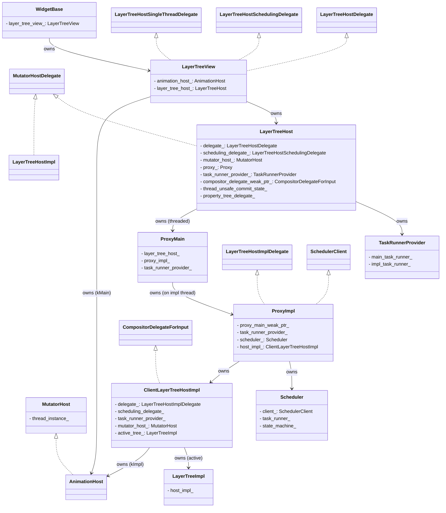

> 本文基于 Chromium 源码整理，梳理 cc 合成器关键类/实例的初始化流程。文中代码与类名以当前源码为准。

# 0. 全景：双线程流水线与各角色的位置

Chromium 的合成器（compositor，namespace `cc`）是一个**双线程**系统：

| 线程 | 别名 | 主要宿主对象 | 职责 |
|------|------|------------|------|
| 主线程 (Main) | `kMain` | `LayerTreeHost` + `ProxyMain` | 拥有主线程的 layer tree，执行 `BeginMainFrame`、commit、JS/动画驱动 |
| 合成器线程 (Impl) | `kImpl` | `LayerTreeHostImpl` + `ProxyImpl` + `Scheduler` | 拥有激活树/活动树，raster、draw、impl 侧滚动动画、提交 CompositorFrame |

两条线程通过 **commit**（主→impl 的单向数据流 `PushPropertiesTo`）和 **BeginMainFrame** 回调（impl→main 的脉冲）耦合。整套初始化的本质，就是在这两条线程上分别构造一组对象，并把它们用若干"接口（Delegate）"反向连接起来。

下面这张类图给出了核心对象及其接口关系：



## 1. 入口：`WidgetBase::InitializeCompositing`

合成器的初始化起点在 blink 侧的 `WidgetBase`。它负责拿到两个 task runner，再构造 `LayerTreeView`。

```C++
// third_party/blink/renderer/platform/widget/widget_base.cc
void WidgetBase::InitializeCompositing(
    PageScheduler& page_scheduler,
    const display::ScreenInfos& screen_infos,
    const cc::LayerTreeSettings* settings,
    base::WeakPtr<mojom::blink::FrameWidgetInputHandler> frame_widget_input_handler,
    WidgetBase* previous_widget) {
  DCHECK(!initialized_);
  widget_scheduler_ = page_scheduler.CreateWidgetScheduler(this);

  // ① 主线程合成器 task runner（注意：是“主线程上的合成器任务” runner，
  //    而不是合成器线程 runner）
  main_thread_compositor_task_runner_ =
      page_scheduler.GetAgentGroupScheduler().CompositorTaskRunner();
  main_thread_id_ = base::PlatformThread::CurrentId();

  // ② 合成器线程调度器（可能为空 → 单线程模式，仅测试用）
  auto* compositing_thread_scheduler =
      ThreadScheduler::CompositorThreadScheduler();

  if (previous_widget) {
    // 复用前一个 widget 的 LayerTreeView（跨导航/局部重建场景）
    previous_widget->DisconnectLayerTreeView(this, /*delay_release=*/false);
  } else {
    layer_tree_view_ = std::make_unique<LayerTreeView>(this, widget_scheduler_);

    // 若调用方未给 settings，则按屏幕信息生成默认设置
    std::optional<cc::LayerTreeSettings> default_settings;
    if (!settings) { /* GenerateLayerTreeSettings(...) */ }

    // ③ 执行 LayerTreeView 初始化，传入两条 runner + 光栅化 worker pool
    layer_tree_view_->Initialize(
        *settings, main_thread_compositor_task_runner_,
        compositing_thread_scheduler
            ? compositing_thread_scheduler->DefaultTaskRunner()
            : nullptr,
        cc::CategorizedWorkerPool::GetOrCreate(
            &BlinkCategorizedWorkerPoolDelegate::Get()));
  }
  // …后续：WidgetInputHandlerManager、滚动动画 timeline 等
  if (Platform::Current()->IsThreadedAnimationEnabled()) {
    scroll_animation_timeline_ = cc::AnimationTimeline::Create(/*...*/);
    AnimationHost()->AddAnimationTimeline(scroll_animation_timeline_);
  }
  initialized_ = true;
}
```

要点：
- **两个 runner 的语义不同**：`main_thread_compositor_task_runner_` 跑在主线程上，专门承载合成器在主线程的任务；合成器线程的 runner 来自 `CompositorThreadScheduler()->DefaultTaskRunner()`。是否传入非空的合成器线程 runner，决定了走 `CreateThreaded` 还是 `CreateSingleThreaded`。
- `CategorizedWorkerPool` 是光栅化工作线程池，由 blink 侧的 `BlinkCategorizedWorkerPoolDelegate` 提供回调。

## 2. `LayerTreeView`：blink 与 cc 的桥

`LayerTreeView` 是 blink 侧对 cc 合成树的视图封装。它同时实现三个 cc 接口，作为 `LayerTreeHost` 回调到 blink 的出口：

```C++
// third_party/blink/renderer/platform/widget/compositing/layer_tree_view.h
class PLATFORM_EXPORT LayerTreeView
    : public cc::LayerTreeHostDelegate,
      public cc::LayerTreeHostSingleThreadDelegate,  // 单线程模式专用
      public cc::LayerTreeHostSchedulingDelegate {
  // …
};
```

### 2.1 构造函数：创建主线程 AnimationHost

```C++
// layer_tree_view.cc
LayerTreeView::LayerTreeView(
    LayerTreeViewDelegate* delegate,
    scoped_refptr<scheduler::WidgetScheduler> scheduler)
    : widget_scheduler_(std::move(scheduler)),
      // 关键：在 blink 主线程侧创建 AnimationHost，thread_instance_ = kMain
      animation_host_(cc::AnimationHost::CreateMainInstance()),
      delegate_(delegate) {}
```

`AnimationHost::CreateMainInstance()` 内部即 `new AnimationHost(ThreadInstance::kMain)`。这个主线程实例会被注入 `LayerTreeHost`，承载主线程动画。

### 2.2 `Initialize`：组装 `InitParams` 并创建 `LayerTreeHost`

```C++
// layer_tree_view.cc
void LayerTreeView::Initialize(
    const cc::LayerTreeSettings& settings,
    scoped_refptr<base::SingleThreadTaskRunner> main_thread,
    scoped_refptr<base::SingleThreadTaskRunner> compositor_thread,
    cc::TaskGraphRunner* task_graph_runner) {
  const bool is_threaded = !!compositor_thread;

  cc::LayerTreeHost::InitParams params;
  params.client = this;                  // LayerTreeHostDelegate* （字段名仍叫 client）
  params.scheduling_delegate = this;     // LayerTreeHostSchedulingDelegate*
  params.settings = &settings;
  params.task_graph_runner = task_graph_runner;
  params.main_task_runner = std::move(main_thread);
  params.mutator_host = animation_host_.get();          // 主线程 AnimationHost
  params.dark_mode_filter = &RasterDarkModeFilterImpl::Instance();
  if (base::ThreadPoolInstance::Get()) {
    // 图像解码 worker：需要 WithBaseSyncPrimitives，因为它会同步等待 IO 线程
    params.image_worker_task_runner =
        base::ThreadPool::CreateSequencedTaskRunner(
            {base::WithBaseSyncPrimitives(), base::TaskPriority::USER_VISIBLE,
             base::TaskShutdownBehavior::CONTINUE_ON_SHUTDOWN});
  }


  if (!is_threaded)
    layer_tree_host_ = cc::LayerTreeHost::CreateSingleThreaded(this, std::move(params));
  else
    layer_tree_host_ = cc::LayerTreeHost::CreateThreaded(
        std::move(compositor_thread), std::move(params));
}
```

当前 `InitParams` 的完整字段：

```C++
// cc/trees/layer_tree_host.h
struct CC_EXPORT InitParams {
  raw_ptr<LayerTreeHostDelegate> client = nullptr;
  raw_ptr<LayerTreeHostSchedulingDelegate> scheduling_delegate = nullptr;
  raw_ptr<TaskGraphRunner> task_graph_runner = nullptr;
  raw_ptr<const LayerTreeSettings> settings = nullptr;
  scoped_refptr<base::SingleThreadTaskRunner> main_task_runner;
  raw_ptr<MutatorHost> mutator_host = nullptr;
  raw_ptr<RasterDarkModeFilter> dark_mode_filter = nullptr;
  scoped_refptr<base::SequencedTaskRunner> image_worker_task_runner;
  raw_ptr<PropertyTreeDelegate> property_tree_delegate = nullptr;  // 可空，由 LTH 自建
};
```

> 注意 `client` 这个**字段名**与它的类型 `LayerTreeHostDelegate*` 看似不一致——历史遗留的命名，读代码时按 Delegate 理解即可。

## 3. `LayerTreeHost`：主线程侧的中枢

`LayerTreeHost`（LTH）是主线程合成树的拥有者，并且**实现 `MutatorHostDelegate`**，作为主线程 `AnimationHost` 的回调对象。

### 3.1 `CreateThreaded` → 构造函数

```C++
// cc/trees/layer_tree_host.cc
std::unique_ptr<LayerTreeHost> LayerTreeHost::CreateThreaded(
    scoped_refptr<base::SingleThreadTaskRunner> impl_task_runner,
    InitParams params) {
  DCHECK(params.settings);
  auto main_task_runner = params.main_task_runner;
  auto layer_tree_host = base::WrapUnique(
      new LayerTreeHost(std::move(params), CompositorMode::THREADED));
  layer_tree_host->InitializeThreaded(std::move(main_task_runner),
                                      std::move(impl_task_runner));
  return layer_tree_host;
}

LayerTreeHost::LayerTreeHost(InitParams params, CompositorMode mode)
    : micro_benchmark_controller_(this),
      image_worker_task_runner_(std::move(params.image_worker_task_runner)),
      compositor_mode_(mode),
      ui_resource_manager_(std::make_unique<UIResourceManager>()),
      delegate_(params.client),                       // LayerTreeHostDelegate*
      scheduling_delegate_(params.scheduling_delegate),
      rendering_stats_instrumentation_(RenderingStatsInstrumentation::Create()),
      pending_commit_state_(std::make_unique<CommitState>()),
      thread_unsafe_commit_state_(params.mutator_host),   // 仅传 mutator_host
      settings_(*params.settings),
      id_(s_layer_tree_host_sequence_number.GetNext() + 1),
      task_graph_runner_(params.task_graph_runner),
      mutator_host_(params.mutator_host),             // 主线程 AnimationHost
      dark_mode_filter_(params.dark_mode_filter),
      property_tree_delegate_(params.property_tree_delegate) {
  // 默认创建 PropertyTreeDelegate（LayerTree 模式或 LayerList 模式）
  if (!property_tree_delegate_) {
    owned_property_tree_delegate_ = IsUsingLayerLists()
        ? std::make_unique<PropertyTreeLayerListDelegate>()
        : std::make_unique<PropertyTreeLayerTreeDelegate>();
    property_tree_delegate_ = owned_property_tree_delegate_.get();
  }
  property_tree_delegate_->SetLayerTreeHost(this);
}
```

构造期间建立的若干关键子对象：

| 成员 | 作用 |
|------|------|
| `ui_resource_manager_` | 管理 UI 资源（如自定义光标、select 弹层） |
| `pending_commit_state_` | 一次 commit 待提交的“主线程侧”状态快照 |
| `thread_unsafe_commit_state_` | 跨线程访问的提交状态（含 `mutator_host` 指针、root_layer 等）；之所以“unsafe”，是因为它会在主线程阻塞时被 impl 线程读取 |
| `mutator_host_` | 主线程 `AnimationHost`（`kMain`） |
| `property_tree_delegate_` | 决定 property trees 由 layer tree 还是 layer list 驱动 |

### 3.2 `InitializeThreaded` → 创建 `TaskRunnerProvider` 与 `ProxyMain`

```C++
void LayerTreeHost::InitializeThreaded(
    scoped_refptr<base::SingleThreadTaskRunner> main_task_runner,
    scoped_refptr<base::SingleThreadTaskRunner> impl_task_runner) {
  task_runner_provider_ =
      TaskRunnerProvider::Create(main_task_runner, impl_task_runner);
  auto proxy_main = std::make_unique<ProxyMain>(this, task_runner_provider_.get());
  InitializeProxy(std::move(proxy_main));
}

void LayerTreeHost::InitializeProxy(std::unique_ptr<Proxy> proxy) {
  DCHECK(task_runner_provider_);
  DCHECK(IsMainThread());

  // 把 LTH 注册为主线程 AnimationHost 的回调对象（MutatorHostDelegate）
  mutator_host_->SetMutatorHostDelegate(this);

  proxy_ = std::move(proxy);
  proxy_->Start();   // ← 跨线程初始化的真正入口
  UpdateDeferMainFrameUpdateInternal();
}
```

## 4. `TaskRunnerProvider`：线程身份的统一抽象

```C++
// cc/trees/task_runner_provider.cc
TaskRunnerProvider::TaskRunnerProvider(
    scoped_refptr<base::SingleThreadTaskRunner> main_task_runner,
    scoped_refptr<base::SingleThreadTaskRunner> impl_task_runner)
#if !DCHECK_IS_ON()
    : main_task_runner_(main_task_runner), impl_task_runner_(impl_task_runner) {}
#else
    : main_task_runner_(main_task_runner),
      impl_task_runner_(impl_task_runner),
      main_thread_id_(base::PlatformThread::CurrentId()),
      impl_thread_is_overridden_(false),
      is_main_thread_blocked_(false) {}
#endif
```

它只是把两条 runner 收拢，并提供 `MainThreadTaskRunner()` / `ImplThreadTaskRunner()` 以及一组 `IsMainThread()` / `IsImplThread()` / `IsMainThreadBlocked()` 的 `DCHECK` 工具。在 `DCHECK_IS_ON()` 构建下，它还记录主线程 id 与“主线程是否被阻塞”状态——后者正是后面 `ProxyMain::Start` 跨线程同步的前提。

## 5. `ProxyMain` 与跨线程初始化屏障

`Proxy` 是 LTH 与调度/impl 侧之间的中介。线程化模式下用的是 `ProxyMain`（主线程侧）+ `ProxyImpl`（impl 线程侧）这对组合。

```C++
// cc/trees/proxy_main.cc
ProxyMain::ProxyMain(LayerTreeHost* layer_tree_host,
                     TaskRunnerProvider* task_runner_provider)
    : layer_tree_host_(layer_tree_host),
      task_runner_provider_(task_runner_provider),
      layer_tree_host_id_(layer_tree_host->GetId()),
      max_requested_pipeline_stage_(NO_PIPELINE_STAGE),
      current_pipeline_stage_(NO_PIPELINE_STAGE),
      final_pipeline_stage_(NO_PIPELINE_STAGE),
      deferred_final_pipeline_stage_(NO_PIPELINE_STAGE),
      started_(false),
      defer_main_frame_update_(false),
      pause_rendering_(false) {
  DCHECK(task_runner_provider_);
  DCHECK(IsMainThread());
}
```

`CommitPipelineStage` 这一组字段描述了 commit 流水线的进度（`NO_PIPELINE_STAGE` → `BEGIN_MAIN_FRAME` → `COMMIT` → …），是 `ProxyMain` 调度主线程工作的核心状态。

### 5.1 `Start`：主线程阻塞，等 impl 线程完成初始化

这是整个初始化流程里**唯一的跨线程同步点**：

```C++
void ProxyMain::Start() {
  DCHECK(IsMainThread());
  DCHECK(layer_tree_host_->IsThreaded());

  {
    DebugScopedSetMainThreadBlocked main_thread_blocked(task_runner_provider_);
    CompletionEvent completion;
    ImplThreadTaskRunner()->PostTask(
        FROM_HERE, base::BindOnce(&ProxyMain::InitializeOnImplThread,
                                  base::Unretained(this), &completion,
                                  layer_tree_host_->GetId(),
                                  &layer_tree_host_->GetSettings()));
    completion.Wait();   // 阻塞主线程，直到 impl 线程构造完 ProxyImpl
  }
  started_ = true;
}
```

`DebugScopedSetMainThreadBlocked` 会把 `TaskRunnerProvider` 的 `is_main_thread_blocked_` 置位。这一点至关重要：`LayerTreeHost::CreateLayerTreeHostImpl` 是**唯一允许在 impl 线程调用的 LTH 方法**，它依赖“主线程已被阻塞”这一前提，从而可以安全地直接读取 LTH 的成员变量。

### 5.2 `InitializeOnImplThread`：构造 `ProxyImpl`

```C++
void ProxyMain::InitializeOnImplThread(CompletionEvent* completion_event,
                                       int id,
                                       const LayerTreeSettings* settings) {
  DCHECK(task_runner_provider_->IsImplThread());
  DCHECK(!proxy_impl_);
  proxy_impl_ = std::make_unique<ProxyImpl>(
      weak_factory_.GetWeakPtr(), layer_tree_host_, id, settings,
      task_runner_provider_);
  completion_event->Signal();   // 唤醒主线程
}
```

注意 `proxy_impl_` 虽然由 `ProxyMain` 持有，但它**完全活在 impl 线程**上——构造、使用、销毁都在 impl 线程，主线程只持有 `unique_ptr` 的“所有权语义”。`weak_factory_.GetWeakPtr()` 给 `ProxyImpl` 一个回指 `ProxyMain` 的弱引用，用于 impl→main 的回调。

## 6. `ProxyImpl`：impl 线程侧的编排者

`ProxyImpl` 同时实现 `LayerTreeHostImplDelegate` 与 `SchedulerClient`，是 LTHI 与 Scheduler 之间、以及 impl↔main 之间的桥梁。

```C++
// cc/trees/proxy_impl.cc
ProxyImpl::ProxyImpl(base::WeakPtr<ProxyMain> proxy_main_weak_ptr,
                     LayerTreeHost* layer_tree_host,
                     int id,
                     const LayerTreeSettings* settings,
                     TaskRunnerProvider* task_runner_provider)
    : layer_tree_host_id_(id),
      next_frame_is_newly_committed_frame_(false),
      inside_draw_(false),
      task_runner_provider_(task_runner_provider),
      // 平滑度优先级“过期通知器”：在一段延迟后把树优先级从
      // SMOOTHNESS_TAKES_PRIORITY 切回 NEW_CONTENT_TAKES_PRIORITY
      smoothness_priority_expiration_notifier_(
          task_runner_provider->ImplThreadTaskRunner(),
          base::BindRepeating(&ProxyImpl::RenewTreePriority,
                              base::Unretained(this)),
          kSmoothnessTakesPriorityExpirationDelay),
      proxy_main_weak_ptr_(proxy_main_weak_ptr) {
  DCHECK(IsImplThread());
  DCHECK(IsMainThreadBlocked());

  // ① 创建 LayerTreeHostImpl（实际为 ClientLayerTreeHostImpl，见下节）
  host_impl_ = layer_tree_host->CreateLayerTreeHostImpl(this);

  // ② 创建 Scheduler
  SchedulerSettings scheduler_settings(settings->ToSchedulerSettings());
  scheduler_settings.main_frame_before_commit_enabled = true;
  auto compositor_timing_history =
      std::make_unique<CompositorTimingHistory>(CompositorTimingHistory::RENDERER_UMA);
  scheduler_ = std::make_unique<Scheduler>(
      this, scheduler_settings, layer_tree_host_id_,
      task_runner_provider_->ImplThreadTaskRunner(),
      std::move(compositor_timing_history),
      host_impl_->compositor_frame_reporting_controller());

  DCHECK_EQ(scheduler_->visible(), host_impl_->visible());
}
```

> 注意：`ProxyImpl::host_impl_` 的真实类型是 `std::unique_ptr<ClientLayerTreeHostImpl>`——一个 `LayerTreeHostImpl` 的子类（见第 7 节）。

构造顺序很重要：先建 LTHI，再建 Scheduler，因为 Scheduler 需要引用 LTHI 拥有的 `compositor_frame_reporting_controller`。析构则严格相反（见第 9 节）。

## 7. `LayerTreeHostImpl`：impl 线程侧的中枢

### 7.1 `CreateLayerTreeHostImpl` → `CreateLayerTreeHostImplInternal`

```C++
// cc/trees/layer_tree_host.cc
std::unique_ptr<ClientLayerTreeHostImpl>
LayerTreeHost::CreateLayerTreeHostImpl(LayerTreeHostImplDelegate* delegate) {
  // 这是唯一在 impl 线程执行的 LTH 方法；主线程已阻塞，可直接读成员。
  DCHECK(IsImplThread());
  DCHECK(task_runner_provider_->IsMainThreadBlocked());
  return CreateLayerTreeHostImplInternal(
      delegate, thread_unsafe_commit_state_.mutator_host, settings_,
      task_runner_provider_.get(), dark_mode_filter_, id_, task_graph_runner_,
      image_worker_task_runner_, scheduling_delegate_,
      rendering_stats_instrumentation_.get(), compositor_delegate_weak_ptr_);
}

std::unique_ptr<ClientLayerTreeHostImpl>
LayerTreeHost::CreateLayerTreeHostImplInternal(
    LayerTreeHostImplDelegate* delegate,
    MutatorHost* mutator_host, /* … */) {
  // ① 由主线程 AnimationHost 派生出 impl 侧实例（thread_instance_ = kImpl）
  std::unique_ptr<MutatorHost> mutator_host_impl =
      mutator_host->CreateImplInstance();

  // ② 实际创建的是 ClientLayerTreeHostImpl（LayerTreeHostImpl 的渲染进程子类）
  std::unique_ptr<ClientLayerTreeHostImpl> host_impl =
      ClientLayerTreeHostImpl::Create(
          settings, delegate, task_runner_provider, rendering_stats_instrumentation,
          task_graph_runner, std::move(mutator_host_impl), dark_mode_filter, id,
          std::move(image_worker_task_runner), scheduling_delegate);

  // ③ 让 LTH 持有指向 LTHI 的弱指针，供 input 子系统使用
  compositor_delegate_weak_ptr = host_impl->AsWeakPtr();
  return host_impl;
}
```

三件事，三段意义：

1. **派生 impl 侧 AnimationHost**。`AnimationHost::CreateImplInstance()` 断言 `thread_instance_ == kMain`，然后 `new AnimationHost(ThreadInstance::kImpl)`。于是整个系统里**恰好两个 AnimationHost**：一个 `kMain`（LTH 拥有），一个 `kImpl`（LTHI 拥有）。impl 侧滚动动画（`ImplOnlyScrollAnimationCreate` 等）用的就是后者。两者在 commit 时通过 `MutatorHost::PushPropertiesTo` 单向同步。
2. **实例化 `ClientLayerTreeHostImpl`**。渲染进程里真正被实例化的不是基类 `LayerTreeHostImpl`，而是其子类 `ClientLayerTreeHostImpl`（声明于 `cc/trees/client_layer_tree_host_impl.h`）。它额外承载渲染进程特有的逻辑（如 `SetActiveURL` 关联 UKM、checkerboard 统计等）。`ProxyImpl::host_impl_` 的类型 accordingly 为 `unique_ptr<ClientLayerTreeHostImpl>`。
3. **建立 `compositor_delegate_weak_ptr_`**。`LayerTreeHost` 持有一个指向 LTHI 的 `WeakPtr<CompositorDelegateForInput>`，这样 input 子系统（`cc/input/`）就能从主线程侧定位到 impl 侧的输入处理委托对象。

### 7.2 `LayerTreeHostImpl` 构造函数

```C++
// cc/trees/layer_tree_host_impl.cc
LayerTreeHostImpl::LayerTreeHostImpl(
    const LayerTreeSettings& settings,
    LayerTreeHostImplDelegate* delegate,
    TaskRunnerProvider* task_runner_provider,
    RenderingStatsInstrumentation* rendering_stats_instrumentation,
    TaskGraphRunner* task_graph_runner,
    std::unique_ptr<MutatorHost> mutator_host,
    RasterDarkModeFilter* dark_mode_filter,
    int id,
    scoped_refptr<base::SequencedTaskRunner> image_worker_task_runner,
    LayerTreeHostSchedulingDelegate* scheduling_delegate)
    : delegate_(delegate),
      scheduling_delegate_(scheduling_delegate),
      task_runner_provider_(task_runner_provider),
      is_synchronous_single_threaded_(!task_runner_provider->HasImplThread() &&
                                      !settings_.single_thread_proxy_scheduler),
      // TileManager 在此初始化（依赖 is_synchronous_single_threaded_）
      tile_manager_(this, GetTaskRunner(), std::move(image_worker_task_runner),
                    /*scheduled_raster_task_limit*/ …, …,
                    settings.ToTileManagerSettings()),
      mutator_host_(std::move(mutator_host)),     // impl 侧 AnimationHost
      rendering_stats_instrumentation_(rendering_stats_instrumentation),
      frame_trackers_(settings.single_thread_proxy_scheduler),
      has_input_resetter_(GetTaskRunner(), /*callback*/, kHasInputResetDelay),
      contains_srgb_cache_(kContainsSrgbCacheSize) {
  // …CompositorFrameReportingController、Stub 或真实实现的选择…

  // ① 资源提供者：管理跨进程/跨线程的 GPU 资源
  resource_provider_ = std::make_unique<viz::ClientResourceProvider>(
      task_runner_provider_->MainThreadTaskRunner(),
      task_runner_provider_->HasImplThread()
          ? task_runner_provider_->ImplThreadTaskRunner()
          : task_runner_provider_->MainThreadTaskRunner(),
      base::BindRepeating(&LayerTreeHostImpl::MaybeFlushPendingWork,
                          weak_factory_.GetWeakPtr()));

  // ② 把 LTHI 注册为 impl 侧 AnimationHost 的回调对象
  DCHECK(mutator_host_);
  mutator_host_->SetMutatorHostDelegate(this);
  mutator_events_ = mutator_host_->CreateEvents();

  // ③ LTHI 始终持有一棵 active tree
  //  当前源码已无 SyncedElasticOverscroll 参数
  active_tree_ = std::make_unique<LayerTreeImpl>(
      *this, viz::BeginFrameArgs(), new SyncedScale,
      new SyncedBrowserControls, new SyncedBrowserControls);
  active_tree_->property_trees()->set_is_active(true);

  // ④ 视口与浏览器控件（顶/底栏）管理器
  viewport_ = Viewport::Create(this);
  browser_controls_offset_manager_ = BrowserControlsOffsetManager::Create(
      this, settings.top_controls_show_threshold,
      settings.top_controls_hide_threshold);

  // ⑤ 帧上报/追踪
  compositor_frame_reporting_controller_->SetFrameSorter(&frame_sorter_);
  compositor_frame_reporting_controller_->SetFrameSequenceTrackerCollection(
      &frame_trackers_);
  // …
}
```

构造期间建立的 impl 侧核心子对象一览：

| 成员 | 作用 |
|------|------|
| `tile_manager_` | 光栅化 tile 管理、调度光栅任务 |
| `resource_provider_` | `viz::ClientResourceProvider`，管理合成资源 |
| `mutator_host_` | impl 侧 `AnimationHost`（`kImpl`），承载 impl-only 滚动/自动滚动动画 |
| `mutator_events_` | 动画事件容器，用于 impl→main 回传动画事件 |
| `active_tree_` | **常驻**的活动树（`LayerTreeImpl`），LTHI 一出生就有 |
| `viewport_` | 顶视口，处理 pinch-zoom、双指等 |
| `browser_controls_offset_manager_` | 浏览器顶/底栏的显隐与偏移 |
| `compositor_frame_reporting_controller_` | 每帧延迟/上报（checkerboard、FCP、LCP 等） |
| `frame_trackers_` | `FrameSequenceTracker` 集合，按交互类型追踪帧序列 |
| `image_animation_controller_` | 图片动画（非 viz-in-viz 进程时） |

> 注意：`LayerTreeImpl` 构造不接收 `SyncedElasticOverscroll`（弹性过滚动同步已移除）。

### 7.3 `LayerTreeImpl` 构造

```C++
// cc/trees/layer_tree_impl.cc
LayerTreeImpl::LayerTreeImpl(
    LayerTreeHostImpl& host_impl,
    viz::BeginFrameArgs begin_frame_args,
    scoped_refptr<SyncedScale> page_scale_factor,
    scoped_refptr<SyncedBrowserControls> top_controls_shown_ratio,
    scoped_refptr<SyncedBrowserControls> bottom_controls_shown_ratio)
    : host_impl_(&host_impl),
      created_begin_frame_args_(begin_frame_args),
      source_frame_number_(-1),
      page_scale_factor_(page_scale_factor),
      top_controls_shown_ratio_(std::move(top_controls_shown_ratio)),
      bottom_controls_shown_ratio_(std::move(bottom_controls_shown_ratio)) {
  property_trees()->set_is_main_thread(false);  // 标记自己是 impl 侧的树
}
```

`LayerTreeImpl` 是 impl 侧的“树”抽象。LTHI 通常持有最多三棵：`active_tree_`（当前 draw）、`pending_tree_`（commit 接收、待 activate）、`recycle_tree_`（复用缓存）。`source_frame_number_` 初始为 `-1`，表示尚未接收任何 commit。

## 8. `Scheduler`：impl 线程的节拍器

```C++
// cc/scheduler/scheduler.cc
Scheduler::Scheduler(
    SchedulerClient* client,
    const SchedulerSettings& settings,
    int layer_tree_host_id,
    base::SingleThreadTaskRunner* task_runner,
    std::unique_ptr<CompositorTimingHistory> compositor_timing_history,
    CompositorFrameReportingController* compositor_frame_reporting_controller)
    : settings_(settings),
      client_(client),                         // ProxyImpl
      layer_tree_host_id_(layer_tree_host_id),
      task_runner_(task_runner),               // 合成器线程 runner
      compositor_timing_history_(std::move(compositor_timing_history)),
      compositor_frame_reporting_controller_(compositor_frame_reporting_controller),
      begin_impl_frame_tracker_(FROM_HERE) {
  // ① 根据设置/feature 选择状态机实现
  if (settings.wait_for_all_pipeline_stages_before_draw) {
    state_machine_ = std::make_unique<HeadlessSchedulerStateMachine>(settings);
  } else if (settings.using_synchronous_renderer_compositor &&
             base::FeatureList::IsEnabled(features::kWebviewSchedulerStateMachine)) {
    state_machine_ = std::make_unique<WebviewSchedulerStateMachine>(settings);
  } else if (base::FeatureList::IsEnabled(features::kSlimScheduler) &&
             !settings_.single_threaded_proxy) {
    state_machine_ = std::make_unique<SlimSchedulerStateMachine>(settings);
  } else {
    state_machine_ = std::make_unique<SchedulerStateMachine>(settings);
  }

  begin_impl_frame_deadline_timer_.SetTaskRunner(task_runner);
  wants_animate_only_begin_frames_ = true;

  ProcessScheduledActions();   // 构造结束即触发一次调度
}
```

要点：
- `client_` 是 `ProxyImpl`（`SchedulerClient`），Scheduler 通过它驱动“BeginMainFrame / commit / prepare tiles / draw”等动作。
- `task_runner_` 是合成器线程 runner，Scheduler 的所有定时器（如 `begin_impl_frame_deadline_timer_`）都跑在它上面。
- **状态机可插拔**：headless、webview（同步合成器）、slim、默认四种实现，按 `SchedulerSettings` 与 feature flag 选择。
- 构造末尾立即 `ProcessScheduledActions()`，让调度器在出生时就进入正确的初始状态。

## 9. 销毁顺序（补遗）

构造是从外到内、从主到 impl；销毁严格反向，且同样以 `CompletionEvent` 跨线程同步：

```
~LayerTreeView
  └─ ~LayerTreeHost (主线程)
       └─ proxy_->Stop()  // PostTask 到 impl 线程：
            └─ ~ProxyImpl (impl 线程)
                 ├─ scheduler_->Stop()        // 先停调度，避免在拆解中触发动作
                 ├─ host_impl_->ReleaseLayerTreeFrameSink()
                 ├─ scheduler_->TearDown()    // 清掉指向 LTHI 内 CFRC 的裸指针
                 ├─ host_impl_ = nullptr;     // LTHI 先于 Scheduler 析构
                 └─ scheduler_ = nullptr;
```

`~ProxyImpl` 里的注释点明了依赖：`Scheduler` 持有 LTHI 拥有的 `CompositorFrameReportingController` 裸指针，因此 LTHI 必须先于 Scheduler 销毁，并在中间调用 `Scheduler::TearDown()` 清空该指针。

## 10. 单线程路径的对照（补遗）

当 `LayerTreeView::Initialize` 收到空的 `compositor_thread` runner（仅 web test / 单元测试）时：

```C++
layer_tree_host_ = cc::LayerTreeHost::CreateSingleThreaded(this, std::move(params));
// → LayerTreeHost(mode=SINGLE_THREADED)
//   → InitializeSingleThreaded:
//       task_runner_provider_ = TaskRunnerProvider::Create(main, /*impl=*/nullptr);
//       InitializeProxy(SingleThreadProxy::Create(this, single_thread_delegate, …));
```

`SingleThreadProxy` 同时扮演 `ProxyMain`+`ProxyImpl` 的角色，`task_runner_provider_` 的 impl runner 为空（`HasImplThread()` 为假），`LayerTreeHostImpl` 据此把 `is_synchronous_single_threaded_` 置真，光栅任务上限设为 `size_t::max()`。这条路径不需要 `CompletionEvent` 屏障，因为根本没有第二条线程。

## 11. 完整调用时序

```
[主线程]  WidgetBase::InitializeCompositing
            └─ new LayerTreeView  →  AnimationHost::CreateMainInstance()  [kMain]
            └─ LayerTreeView::Initialize
                 └─ LayerTreeHost::CreateThreaded
                      ├─ new LayerTreeHost (设 delegate_ / mutator_host_ / property_tree_delegate_ …)
                      └─ InitializeThreaded
                           ├─ TaskRunnerProvider::Create(main, impl)
                           ├─ new ProxyMain
                           └─ InitializeProxy
                                ├─ mutator_host_->SetMutatorHostDelegate(this)
                                └─ ProxyMain::Start ──┐
                                                     │ 主线程阻塞 (CompletionEvent)
[合成器线程]                                         │
   ProxyMain::InitializeOnImplThread ◄──────────────┘
      └─ new ProxyImpl
           ├─ LayerTreeHost::CreateLayerTreeHostImpl(this)
           │    └─ CreateLayerTreeHostImplInternal
           │         ├─ mutator_host->CreateImplInstance()  → AnimationHost [kImpl]
           │         ├─ ClientLayerTreeHostImpl::Create → new LayerTreeHostImpl
           │         │     ├─ resource_provider_
           │         │     ├─ mutator_host_->SetMutatorHostDelegate(this)
           │         │     ├─ active_tree_ = new LayerTreeImpl
           │         │     ├─ viewport_ / browser_controls_offset_manager_
           │         │     └─ compositor_frame_reporting_controller_ / frame_trackers_
           │         └─ compositor_delegate_weak_ptr_ = host_impl->AsWeakPtr()
           └─ new Scheduler(this, …, impl_runner, …)  → ProcessScheduledActions()
      └─ completion.Signal() ──► 唤醒主线程
[主线程]  started_ = true
```

## 12. 关键实现要点速查

| 要点 | 说明 |
|------|------|
| `LayerTreeHost` 实现 `MutatorHostDelegate` | 作为主线程 `AnimationHost` 的回调对象 |
| `thread_unsafe_commit_state_` 构造仅接收 `mutator_host` | 跨线程提交状态，主线程阻塞时被 impl 线程读取 |
| 实际实例化 `ClientLayerTreeHostImpl` | `LayerTreeHostImpl` 的渲染进程子类，承载 UKM/checkerboard 等特有逻辑 |
| `ProxyImpl::host_impl_` 类型为 `unique_ptr<ClientLayerTreeHostImpl>` | 而非基类 `LayerTreeHostImpl` |
| `LayerTreeImpl` 构造不含 `SyncedElasticOverscroll` | 弹性过滚动同步已移除 |
| `Scheduler` 状态机四选一 | Headless / Webview / Slim / 默认，按设置与 feature 选择 |
| `property_tree_delegate_` 在 LTH 构造期建立 | 决定 property trees 由 LayerTree 还是 LayerList 驱动 |
| `compositor_delegate_weak_ptr_` 在建 LTHI 时回填 | 让主线程侧的 input 子系统能定位到 impl 侧委托 |
| `smoothness_priority_expiration_notifier_` | ProxyImpl 在延迟后把树优先级从 SMOOTHNESS 切回 NEW_CONTENT |
| 销毁严格反向 | scheduler→Stop → LTHI 释放 sink → scheduler→TearDown → LTHI 先于 scheduler 析构 |

---

**一句话总结**：cc 初始化是一条“主线程构造外壳（`WidgetBase`→`LayerTreeView`→`LayerTreeHost`→`ProxyMain`），再以一次 `CompletionEvent` 屏障跨到合成器线程构造内核（`ProxyImpl`→`LayerTreeHostImpl`+`active_tree_`→`Scheduler`）”的流水线；两条线程各自持有一个 `AnimationHost`（`kMain` / `kImpl`），通过 `MutatorHostDelegate` 反向回调宿主、并在 commit 时单向同步。掌握这条链路和其中每个 `*Delegate` 接口的回指方向，是理解后续 commit / draw / 输入派发等所有流程的前提。
