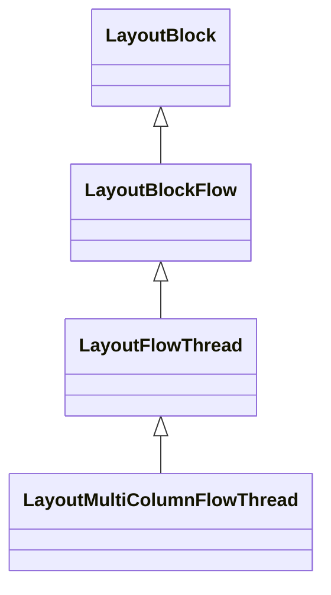

# CreateOrDestroyMultiColumnFlowThreadIfNeeded

`CreateOrDestroyMultiColumnFlowThreadIfNeeded` 是 Chromium 浏览器 Blink 渲染引擎中 `LayoutBlockFlow` 类的一个关键方法，用于处理多列布局（CSS Multi-column Layout）的创建和销毁。
```cpp
void LayoutBlockFlow::CreateOrDestroyMultiColumnFlowThreadIfNeeded(
    const ComputedStyle* old_style) {
  bool specifies_columns = StyleRef().SpecifiesColumns();

  if (MultiColumnFlowThread()) {
    if (specifies_columns != old_style->SpecifiesColumns()) {
      // If we're no longer to be multicol/paged, destroy the flow thread. Also
      // destroy it when switching between multicol and paged, since that
      // affects the column set structure (multicol containers may have
      // spanners, paged containers may not).
      MultiColumnFlowThread()->EvacuateAndDestroy();
    }
    return;
  }

  if (!specifies_columns)
    return;

  if (IsListItem()) {
    UseCounter::Count(GetDocument(), WebFeature::kMultiColAndListItem);
  }

  if (!AllowsColumns())
    return;

  // Fieldsets look for a legend special child (layoutSpecialExcludedChild()).
  // We currently only support one special child per layout object, and the
  // flow thread would make for a second one.
  // For LayoutNG, the multi-column display type will be applied to the
  // anonymous content box. Thus, the flow thread should be added to the
  // anonymous content box instead of the fieldset itself.
  if (IsFieldset()) {
    return;
  }

  // Form controls are replaced content (also when implemented as a regular
  // block), and are therefore not supposed to support multicol.
  const auto* element = DynamicTo<Element>(GetNode());
  if (element && element->IsFormControlElement())
    return;

  auto* flow_thread =
      LayoutMultiColumnFlowThread::CreateAnonymous(GetDocument(), StyleRef());
  AddChild(flow_thread);
  if (IsLayoutNGObject()) {
    // For simplicity of layout algorithm, we assume flow thread having block
    // level children only.
    // For example, we can handle them in same way:
    //   <div style="columns:3">abc<br>def<br>ghi<br></div>
    //   <div style="columns:3"><div>abc<br>def<br>ghi<br></div></div>
    flow_thread->SetChildrenInline(false);
  }

  // Check that addChild() put the flow thread as a direct child, and didn't do
  // fancy things.

  flow_thread->Populate();

  multi_column_flow_thread_ = flow_thread;
}
```
## 主要作用

这个函数负责根据元素的样式变化，动态地创建或销毁多列布局所需的流线程（flow thread）。流线程是实现多列布局的核心机制，它将内容组织成一个连续的流，然后在视觉上分割成多个列进行显示。
## 函数运行流程

1. **检查现有流线程**：首先检查当前布局对象是否已有多列流线程
```cpp
if (MultiColumnFlowThread()) {
  // 如果已有流线程，检查是否需要销毁它
}
```

2. **判断是否需要销毁现有流线程**：如果样式变化导致元素不再需要多列布局，或者从多列布局切换到分页布局（反之亦然），则销毁现有流线程
```cpp
if (specifies_columns != old_style->SpecifiesColumns()) {
  MultiColumnFlowThread()->EvacuateAndDestroy();
}
```

3. **判断是否需要创建新流线程**：如果当前没有流线程但样式指定了多列布局，可能需要创建新流线程
```cpp
if (!MultiColumnFlowThread() && specifies_columns) {
// 判断是否可以创建流线程
}
```

4. **各种情况的排除**：函数会检查多种不适合应用多列布局的情况：
   - Ruby 元素（`IsRuby()`）
   - 自定义布局元素（`StyleRef().IsDisplayLayoutCustomBox()`）
   - MathML 元素（`IsMathML()`）
   - Fieldset 元素（`IsFieldset()`）
   - 表单控件（`element->IsFormControlElement()`）

3. **创建流线程**：如果通过了所有检查，创建匿名的多列流线程
```cpp
auto* flow_thread = LayoutMultiColumnFlowThread::CreateAnonymous(GetDocument(), StyleRef());
AddChild(flow_thread);
```

4. **设置多列流线程的属性**：确保流线程的子元素都是块级元素
```cpp
if (IsLayoutNGObject()) {
  
  flow_thread->SetChildrenInline(false);
}
```

7. **填充内容**：将当前元素的子元素移动到`flow_thread` 中
```cpp
flow_thread->Populate();
```

8. **存储引用**：保存对流线程的引用，以供后续使用
```cpp
multi_column_flow_thread_ = flow_thread;
```

## 用途和意义

这个函数的核心用途在于实现 CSS 的多列布局功能，它允许：
1. **动态响应样式变化**：当元素的 `column-count`、`column-width` 等属性变化时，浏览器能够相应地调整布局
2. **内容流动和分割**：通过流线程机制，内容可以被视为一个连续的流，然后在视觉上分割成多个列
3. **处理特殊元素**：函数中包含了对特殊元素的处理逻辑，确保多列布局仅应用于适当的元素上
