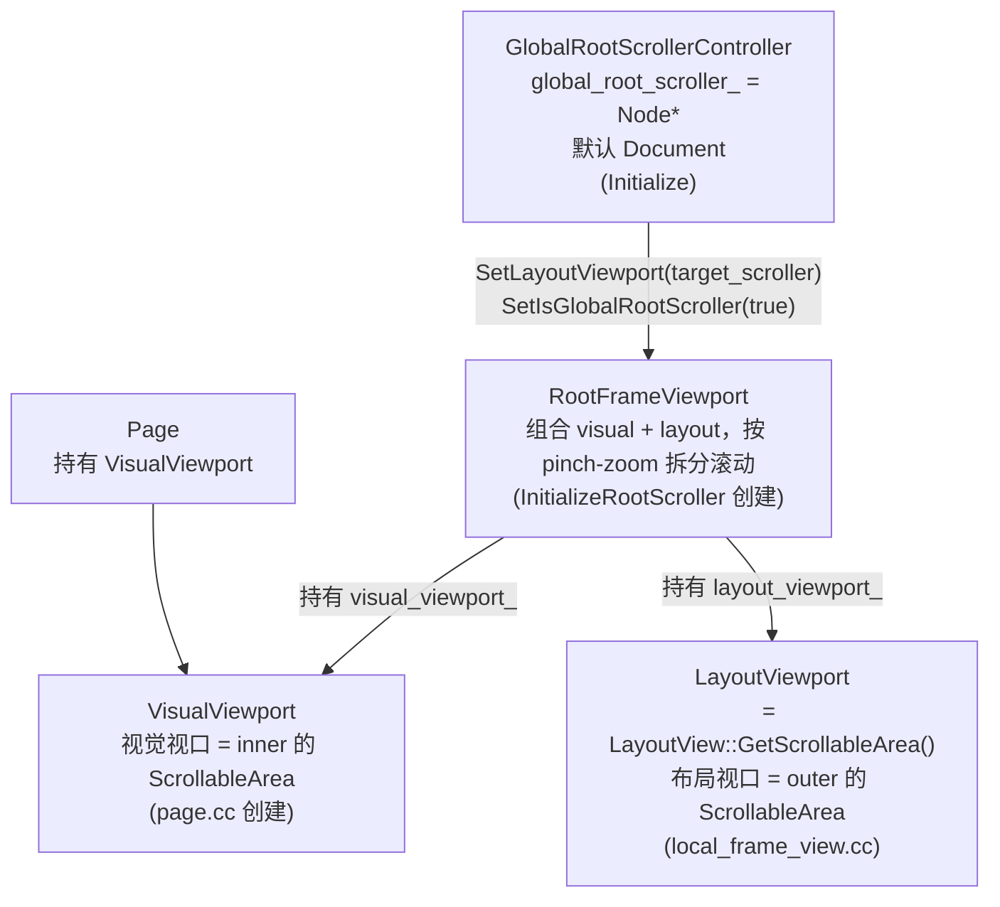
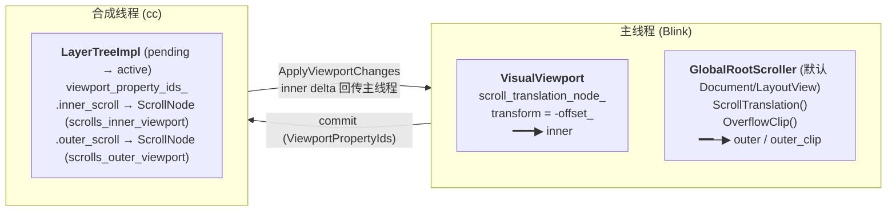

# InnerViewportScrollNode 与 OuterViewportScrollNode

`cc/trees/layer_tree_impl.cc` 里这两个函数返回两个特殊的 scroll tree 节点：

- `InnerViewportScrollNode()` —— 视觉视口（visual viewport）的滚动节点。对应 `VisualViewport` 的平移（pinch-zoom 后视觉视口在布局视口里的拖动）。
- `OuterViewportScrollNode()` —— 布局视口（layout viewport）的滚动节点。对应 `GlobalRootScroller`（默认是 Document / LayoutView，即页面主滚动）。

命名依据是**布局坐标空间里的空间包含关系**（`visual_viewport.h`）："The inner viewport is always contained in the outer viewport and can pan within it." 放大后视觉视口缩成布局视口内部的一个小窗并能在里头平移，所以 visual = inner、layout = outer。注意：平时 CSS 里说的"viewport"（`vw/vh`、`position: fixed`、`meta viewport`）指的是布局视口 = outer，这是另一套参照系，别混淆。

两个节点**只在主框架的合成树上存在**，且**同生共死**（要么都在，要么都不在）。

---

## 1. 它们是怎么存的

`LayerTreeImpl` 持有一个 `ViewportPropertyIds`（`cc/trees/viewport_property_ids.h`）：

```cpp
struct ViewportPropertyIds {
  int inner_scroll = kInvalidPropertyNodeId;  // ← inner 的 ScrollNode id
  int outer_clip   = kInvalidPropertyNodeId;
  int outer_scroll = kInvalidPropertyNodeId;  // ← outer 的 ScrollNode id
  // （另有 overscroll_elasticity_transform / page_scale_transform，与本文无关）
};
```

两个访问器只是按 id 去 scroll tree 里取节点（`layer_tree_impl.cc / 1816`）：

```cpp
const ScrollNode* LayerTreeImpl::InnerViewportScrollNode() const {
  int id = viewport_property_ids_.inner_scroll;
  if (id == kInvalidPropertyNodeId) return nullptr;
  return &property_trees()->scroll_tree().Node(id);
}
// OuterViewportScrollNode 同理，取 outer_scroll。
```

每个节点还在建树时被打上布尔标志（`scrolls_inner_viewport` / `scrolls_outer_viewport`），可脱离索引识别。

---

## 2. 创建（Blink → cc）

### 2.1 视口对象的创建与关系（入口：`LocalFrameView::InitializeRootScroller`）

在讲 inner/outer 节点之前，先理清 Blink 里几个"视口"对象是谁、怎么创建的。入口是 `LocalFrameView::InitializeRootScroller`（`local_frame_view.cc`，主框架布局后调用，可重复调用、已初始化则 no-op）：

```cpp
VisualViewport& visual_viewport = frame_->GetPage()->GetVisualViewport();
ScrollableArea* layout_viewport = LayoutViewport();   // LayoutView 的 PaintLayerScrollableArea

auto* root_frame_viewport = MakeGarbageCollected<RootFrameViewport>(
    visual_viewport, *layout_viewport);
viewport_scrollable_area_ = root_frame_viewport;

page->GlobalRootScrollerController().Initialize(*root_frame_viewport,
                                                *frame_->GetDocument());
```

四个对象及其创建/归属：

| 对象 | 是什么 | 创建/归属 |
| --- | --- | --- |
| `VisualViewport` | 视觉视口（**inner**）的 `ScrollableArea`，pinch-zoom 平移 | `Page::Page()` 创建（`page.cc`），`Page` 持有；仅最外层主框架那个 `IsActiveViewport()` |
| `LayoutViewport` | 布局视口（**outer**）的 `ScrollableArea` | `LocalFrameView::LayoutViewport()`= `LayoutView::GetScrollableArea()`（`PaintLayerScrollableArea`） |
| `RootFrameViewport` | 把上面两个组合起来的 `ScrollableArea` 装饰器，按 pinch-zoom 语义把滚动拆分到两者 | `InitializeRootScroller` 里 `MakeGarbageCollected<RootFrameViewport>(visual, layout)`，存于 `LocalFrameView::viewport_scrollable_area_` |
| `GlobalRootScroller` | 一个 `Node*`，指明"哪个元素是根滚动器" → 决定 outer 是谁 | `TopDocumentRootScrollerController::Initialize`默认设为 **Document 节点** |

关系（`root_frame_viewport.h` 注释）：`RootFrameViewport` 持有 `visual_viewport_` 和 `layout_viewport_` 两个 `ScrollableArea`，对大多数滚动 API 按 pinch-zoom 语义在两者间拆分；不适用于组合视口的 API 直接委托给 layout viewport。

GlobalRootScroller 的初始化（`top_document_root_scroller_controller.cc`）：

```cpp
void TopDocumentRootScrollerController::Initialize(
    RootFrameViewport& root_frame_viewport, Document& main_document) {
  root_frame_viewport_ = root_frame_viewport;
  // Initialize global_root_scroller_ to the default; the main document node.
  UpdateGlobalRootScroller(&main_document);   // ★ 默认 = Document
}
```

`UpdateGlobalRootScroller`做三件事：

1. `global_root_scroller_ = new_node`；
2. `root_frame_viewport_->SetLayoutViewport(*target_scroller)` —— 把 RootFrameViewport 的 layout viewport 换成该 root scroller 的 `ScrollableArea`；
3. 对新/旧对象 `SetIsGlobalRootScroller(true/false)` —— 这正是设 `kRootScroller` compositing reason、强制建 scroll 节点的地方（见 §2.2）。

所以默认情况下 `GlobalRootScroller` = Document → `LayoutView`，而 `LayoutView` 的 `ScrollableArea` 也就是 `LayoutViewport`，二者同源。当页面用 `document.setRootScroller(el)` 换根滚动器时，走 `DidChangeRootScroller` → `FindGlobalRootScroller` → `UpdateGlobalRootScroller`，把 `global_root_scroller_` 和 RootFrameViewport 的 layout viewport 一起换到那个元素。



对应到两个 cc scroll 节点：

- **inner** ← `VisualViewport` 的 scroll translation（视觉视口平移）；
- **outer** ← `GlobalRootScroller` 的 LayoutObject 的 `ScrollTranslation()`（默认 `LayoutView` = 布局视口滚动；换 root scroller 后跟着换到那个元素）。

### 2.2 Blink 决定 inner / outer 各是谁

入口在 `LocalFrameView`，仅主框架（`local_frame_view.cc`）：

```cpp
if (const auto* root_scroller =
        GetPage()->GlobalRootScrollerController().GlobalRootScroller()) {
  if (const auto* layout_object = root_scroller->GetLayoutObject()) {
    if (const auto* paint_properties =
            layout_object->FirstFragment().PaintProperties()) {
      if (paint_properties->Scroll()) {
        viewport_properties.outer_clip =
            paint_properties->OverflowClip();                  // outer 的 clip
        viewport_properties.outer_scroll_translation =
            paint_properties->ScrollTranslation();             // ★ outer
        viewport_properties.inner_scroll_translation =
            viewport.GetScrollTranslationNode();               // ★ inner
      }
    }
  }
}
```

- **inner** = `VisualViewport::GetScrollTranslationNode()`（`visual_viewport.cc`）。它的 transform 是 `-offset_`（视觉视口偏移取负），关联的 scroll 节点 `container_rect = 视觉视口尺寸`、`contents_rect = 内容尺寸`、`max_scroll_offset_affected_by_page_scale = true`。inner 不是任何 DOM 元素，是 `VisualViewport` 对象本身的滚动。
- **outer** = `GlobalRootScroller` 的 `ScrollTranslation()`。`GlobalRootScroller` 默认是 **Document 节点**（`top_document_root_scroller_controller.cc` 初始化为 `&main_document`；`EffectiveRootScroller` 默认也是 document，见 `root_scroller_controller.cc`），其 `GetLayoutObject()` 返回 `LayoutView`。若页面用 `document.setRootScroller()` 或隐式 candidate 指定了别的元素，则换成那个元素。

为什么 `LayoutView` 一定有 `Scroll()` paint property？因为 paint property tree builder 对 root scroller 强制建 scroll 节点（`paint_property_tree_builder.cc`）：

```cpp
if (direct_compositing_reasons & CompositingReason::kRootScroller) {
  return true;   // root scroller 即使 overflow 不滚动也建 scroll 节点
}
```

> 纠正一个常见误解：outer 对应的是 root scroller，默认是 Document/LayoutView，**不是** `<html>`（`document.scrollingElement`）。后者是给 JS 用的 legacy 概念，不是 cc 的视口锚点。

### 2.3 转成 cc 节点并打标志

`PaintArtifactCompositor::UpdateCompositorViewportProperties`（`paint_artifact_compositor.cc`）把上面的 paint property 转成 cc scroll 节点 id 并打包：

```cpp
CHECK_EQ(bool(properties.outer_scroll_translation),
         bool(properties.inner_scroll_translation));   // inner/outer 同生共死
...
ids.inner_scroll =
    property_tree_manager.EnsureCompositorInnerScrollAndTransformNode(*properties.inner_scroll_translation);
ids.outer_scroll =
    property_tree_manager.EnsureCompositorOuterScrollAndTransformNode(*properties.outer_scroll_translation);
layer_tree_host->RegisterViewportPropertyIds(ids);
```

`PropertyTreeManager`（`property_tree_manager.cc / 721`）在转换时打标志：

```cpp
int PropertyTreeManager::EnsureCompositorInnerScrollAndTransformNode(...) {
  int node_id = EnsureCompositorScrollAndTransformNode(scroll_translation);
  scroll_tree_.MutableNode(node_id).scrolls_inner_viewport = true;   // ★
  return node_id;
}
// outer 版本同理，设 scrolls_outer_viewport = true。
```

最后 `RegisterViewportPropertyIds` → `LayerTreeImpl::SetViewportPropertyIds` 存进 `viewport_property_ids_`。

---

## 3. 同步

### 3.1 commit 写入

`ViewportPropertyIds` 通过 commit state 带到合成线程。`LayerTreeImpl` 在两处接收并调用 `SetViewportPropertyIds`（`layer_tree_impl.cc`）：

- `UpdateDisplayTreeForCommitState`初始化 pending tree；
- `PushPropertiesTo`从 pending 推到 active tree。

```cpp
void LayerTreeImpl::SetViewportPropertyIds(const ViewportPropertyIds& ids) {
  viewport_property_ids_ = ids;
  DCHECK(ids.inner_scroll != kInvalidPropertyNodeId ||
         (ids.outer_scroll == kInvalidPropertyNodeId &&
          ids.outer_clip == kInvalidPropertyNodeId));   // outer 存在 ⇒ inner 存在
  if (auto* inner_scroll = InnerViewportScrollNode()) {
    if (auto* inner_scroll_layer = LayerByElementId(inner_scroll->element_id))
      inner_scroll_layer->set_is_inner_viewport_scroll_layer();
  }
}
```

### 3.2 滚动偏移在合成线程内更新 + 跨树同步

合成线程上滚动发生时，`DidUpdateScrollOffset`（`layer_tree_impl.cc`）把新的 scroll offset 落到对应 transform 节点。对视口节点有两个额外动作：

- **跨树同步**：active tree 更新后，递归把同一 `element_id` 的更新作用到 pending / recycle tree，保持三树一致。
- **视口滚动条几何刷新**：当节点是 inner 或 outer 时，走 `UpdateViewportScrollbarGeometries()`（而非普通节点的 `UpdateScrollbarGeometries`），因为视口滚动条依赖 inner+outer 合并偏移。

```cpp
if (scroll_node == InnerViewportScrollNode() ||
    scroll_node == OuterViewportScrollNode()) {
  UpdateViewportScrollbarGeometries();
} else {
  UpdateScrollbarGeometries(*scroll_node);
}
```

### 3.3 合成线程 → 主线程回传

合成线程上的视口滚动/缩放需要回传主线程，在 commit 时消费（`layer_tree_host.cc`）：

```cpp
int inner_scroll_id = pending_commit_state()->viewport_property_ids.inner_scroll;
if (inner_scroll_id != kInvalidPropertyNodeId) {
  const ScrollNode& inner_scroll = pt->scroll_tree().Node(inner_scroll_id);
  UpdateScrollOffsetFromImpl(inner_scroll.element_id, inner_viewport_scroll_delta, ...);
}
client_->ApplyViewportChanges({inner_viewport_scroll_delta, ...});
```

主要回传的是 **inner** 的 delta（外加 page scale / 弹性，与本文无关），交给 client（`WebViewImpl` 等）同步 `VisualViewport` 状态、触发事件。outer 的滚动通常在合成线程上完全实现，不一定走主线程。

---

## 4. 作用

| 用途 | 位置 | 说明 |
| --- | --- | --- |
| 视口滚动路由 / 链式滚动 | `layer_tree_host_impl.cc` | 取 inner/outer 的 transform\_id 做 sticky、fixed 滚动链 |
| 总滚动量 | `layer_tree_impl.cc` `TotalScrollOffset` | inner + outer 偏移相加，作为对外合并视口滚动量 |
| 总最大滚动量 | `layer_tree_impl.cc` `TotalMaxScrollOffset` | inner + outer 的 MaxScrollOffset 相加 |
| 视口滚动条几何 | `layer_tree_impl.cc` | 视口滚动条用 `TotalScrollOffset`；inner container bounds 在 device 空间需除以 page scale；滚动尺寸由 outer 决定 |
| tickmark 可见性 | `layer_tree_impl.cc` | 以 outer 的 element id 找滚动条 controller |
| 可滚动视口尺寸 | `layer_tree_impl.cc` `ScrollableViewportSize` | inner 的 container\_bounds 除以 page scale |
| 根滚动层设备边界 | `layer_tree_impl.cc` | 用 outer 的 transform\_id 把 bounds 映射到屏幕 |
| 当前是否在滚视口 | `layer_tree_impl.cc` 等多处 | 指针相等比较 `== InnerViewportScrollNode()` / `== OuterViewportScrollNode()` |
| 视口锚定 | `layer_tree_impl.cc` `ViewportAnchor` | 同时持有 inner/outer，resize/缩放时保持锚点不跳 |

---

## 5. 流程图



---

## 6. 速查表

| 节点 | 源 paint property | 默认对应对象 | 标志位 |
| --- | --- | --- | --- |
| `InnerViewportScrollNode` | `VisualViewport::GetScrollTranslationNode()` | `VisualViewport`（非 DOM，平移 = `-offset_`） | `scrolls_inner_viewport` |
| `OuterViewportScrollNode` | `GlobalRootScroller->ScrollTranslation()` | 默认 Document → `LayoutView`（布局视口/页面主滚动） | `scrolls_outer_viewport` |
| `OuterViewportClipNode` | root scroller 的 `OverflowClip()` | root scroller 的 overflow clip | — |

**不变量**：只在主框架存在；inner/outer 同生共死；outer clip 存在 ⇒ inner 存在；root scroller 必有 scroll 节点。
