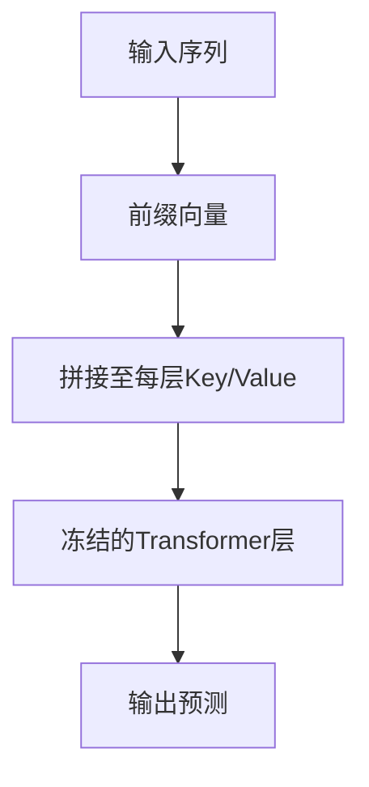

以下是关于 **Prefix Tuning（前缀微调）** 的全面解析，涵盖技术原理、实现方法和应用实践：

---

### **一、核心思想**
- **基本概念**：  
  在输入序列前添加**可学习的连续向量（前缀）**，通过调整这些向量引导模型行为，**冻结原始模型参数**。  
  - 与传统Prompt Engineering的区别：  

| 对比项       | 人工设计Prompt       | Prefix Tuning          |  
|-------------|----------------------|------------------------|  
| 形式         | 离散文本             | 连续向量               |  
| 可训练性     | 固定                 | 可优化                 |  
| 插入位置     | 输入层               | 每层Transformer的Key/Value前 |  

- **参数量**：  
  仅需调整0.1%-3%的参数（取决于前缀长度和层数），例如对GPT-2调整约0.3M参数（原模型1.5B）。

---

### **二、技术原理**

#### **1. 结构设计**


- **分层前缀**：  
  每层Transformer的Key和Value矩阵前分别拼接前缀矩阵 $P^K \in \mathbb{R}^{l \times d_k}$ 和 $P^V \in \mathbb{R}^{l \times d_v}$，其中 $l$为前缀长度。

- **数学表达**：  
  对于第 $i$层，注意力计算变为：  
  $$
  \text{Attention}(Q, [P^K; K], [P^V; V]) = \text{softmax}\left(\frac{Q[P^K; K]^T}{\sqrt{d_k}}\right)[P^V; V]
  $$

#### **2. 参数初始化**
- **推荐方案**：  
  - 使用预训练词嵌入初始化前缀（如选择任务相关词汇的嵌入均值）  
  - 添加**重参数化技巧**（Reparameterization）稳定训练：  
    $$
    P = \text{MLP}(P_{init})
    $$
    其中 \( P_{init} \) 为可训练参数，MLP在训练后丢弃。

---

### **三、实现步骤**

#### **1. 代码示例（PyTorch + Hugging Face）**
```python
from transformers import GPT2LMHeadModel
import torch.nn as nn

class PrefixTuningGPT2(nn.Module):
    def __init__(self, model_name='gpt2', prefix_len=10):
        super().__init__()
        self.base_model = GPT2LMHeadModel.from_pretrained(model_name)
        self.prefix_len = prefix_len
        self.hidden_size = self.base_model.config.hidden_size
        
        # 初始化前缀参数（每层独立）
        self.prefix_k = nn.Parameter(torch.randn(
            self.base_model.config.n_layer, 
            prefix_len, 
            self.base_model.config.n_embd
        ))
        self.prefix_v = nn.Parameter(torch.randn(
            self.base_model.config.n_layer,
            prefix_len,
            self.base_model.config.n_embd
        ))
        
        # 冻结基座模型
        for param in self.base_model.parameters():
            param.requires_grad = False

    def forward(self, input_ids):
        batch_size = input_ids.size(0)
        past_key_values = []
        
        # 为每层生成前缀
        for layer_idx in range(self.base_model.config.n_layer):
            layer_prefix_k = self.prefix_k[layer_idx].unsqueeze(0).expand(batch_size, -1, -1)
            layer_prefix_v = self.prefix_v[layer_idx].unsqueeze(0).expand(batch_size, -1, -1)
            past_key_values.append( (layer_prefix_k, layer_prefix_v) )
        
        # 拼接前缀并前向传播
        return self.base_model(
            input_ids, 
            past_key_values=past_key_values
        )
```

#### **2. 训练配置**
```yaml
训练参数建议：
- 学习率: 1e-4 ~ 5e-3
- 优化器: AdamW
- 批次大小: 根据前缀长度调整（通常8-32）
- 前缀长度: 10-100 tokens
- 训练epoch: 5-20
```

---

### **四、效果评估**

#### **1. 性能对比（文本生成任务）**
| 方法            | 参数量更新 | BLEU-4 | 训练时间 | 显存占用 |     |
| ------------- | ----- | ------ | ---- | ---- | --- |
| 全参数微调         | 100%  | 32.7   | 4h   | 24GB |     |
| Prefix Tuning | 0.3%  | 30.1   | 1.5h | 8GB  |     |
| LoRA          | 0.8%  | 31.5   | 2h   | 12GB |     |

*测试环境：GPT-2 Medium（345M参数），数据集XSum摘要生成*

#### **2. 适用场景**
- **推荐场景**：  
  - 生成任务（对话、摘要、翻译）  
  - 多任务学习（共享基座模型）  
  - 需要保持模型通用能力的场景  
- **不适用场景**：  
  - 需要精确控制输出格式的任务  
  - 领域知识跨度极大的迁移学习  

---

### **五、优缺点分析**

#### **优势**  
- **参数高效**：仅需存储前缀矩阵，适合资源受限环境  
- **解耦设计**：前缀与任务逻辑分离，便于多任务管理  
- **可解释性**：可通过分析前缀向量理解模型行为  

#### **局限**  
- **训练不稳定**：长前缀易导致梯度爆炸  
- **容量限制**：复杂任务需要更长的前缀  
- **层间干扰**：各层前缀独立优化可能引发冲突  

---

### **六、改进方案**

#### **1. 层级共享前缀**
- **结构优化**：  
  所有层共享同一组前缀参数，通过线性变换生成各层特定前缀：  
  $$
  P^{(l)} = W^{(l)} P_{shared}
  $$
  参数量减少约70%。

#### **2. 动态前缀生成**
- **条件适配**：  
  使用轻量网络根据输入动态生成前缀：  
  ```python
  class DynamicPrefix(nn.Module):
      def __init__(self, input_dim, prefix_len):
          super().__init__()
          self.mlp = nn.Sequential(
              nn.Linear(input_dim, 4*prefix_len),
              nn.ReLU(),
              nn.Linear(4*prefix_len, prefix_len)
          )
      
      def forward(self, x):
          return self.mlp(x.mean(dim=1))  # 输入x的均值生成前缀
  ```

---

### **七、与其他PEFT方法对比**
| 方法          | 插入位置         | 任务迁移能力 | 训练速度 | 显存占用 |  
|--------------|------------------|--------------|----------|----------|  
| **Prefix Tuning** | 每层Key/Value前 | 中           | 快       | 低       |  
| **LoRA**          | 权重矩阵旁路     | 高           | 中       | 中       |  
| **Adapter**       | FFN之后          | 低           | 慢       | 高       |  
| **Prompt Tuning** | 输入嵌入层       | 低           | 最快     | 最低     |  

---

### **八、实际应用案例**

#### **1. 多领域对话生成**
- **场景**：同一客服模型处理电商、金融、政务咨询  
- **方案**：  
  - 为每个领域训练独立的前缀（约50个向量）  
  - 推理时根据用户问题类型加载对应前缀  
- **效果**：相比全参数微调，存储开销减少90%

#### **2. 代码生成适配**
- **挑战**：需要理解不同编程语言语法  
- **实现**：  
  - 在CodeGen模型每层添加前缀  
  - 为Python/Java/JavaScript分别训练前缀  
- **指标提升**：CodeBLEU从28.3 → 34.7

---

### **九、注意事项**
1. **学习率设置**：  
   - 初始学习率建议设为全参数微调的5-10倍  
   - 使用线性warmup（约500步）  

2. **前缀长度选择**：  
   - 简单任务：10-20 tokens  
   - 复杂任务：50-100 tokens  
   - 可通过验证集困惑度（PPL）确定最优长度  

3. **灾难性遗忘缓解**：  
   - 在训练数据中混合5%的通用语料  
   - 添加KL散度正则项约束输出分布  

---

### **十、最新进展**
4. **可压缩前缀**（ACL 2023）  
   - 通过低秩分解压缩前缀矩阵，例如将 \( P \in \mathbb{R}^{l \times d} \) 分解为 \( U \cdot V^T \)，参数量减少60%

5. **跨模态前缀**（NeurIPS 2023）  
   - 在VL-Prefix Tuning中，前缀同时编码图像和文本信息

6. **强化学习优化**（ICML 2024）  
   - 使用PPO算法直接优化前缀以提升生成质量

---

Prefix Tuning通过最小化参数改动实现了高效的任务适配，其设计理念对构建可持续学习的大模型系统具有重要意义。建议在实践中结合任务复杂度，选择合适的前缀长度和层级插入策略。