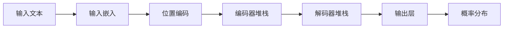
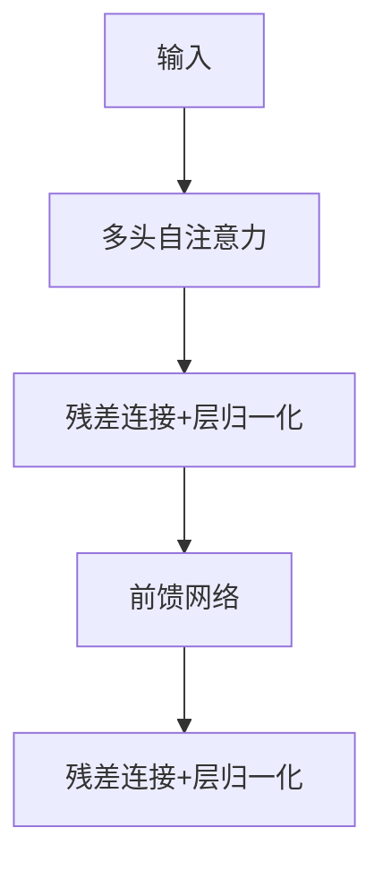

以下是大型语言模型（如GPT、LLaMA等）的基本结构解析，以Transformer架构为核心，分层说明各组件的作用与协作机制：

---

### **一、整体架构概览**


---

### **二、核心组件详解**

#### **1. 输入处理层**
- **分词器（Tokenizer）**：
  - 将文本转换为模型可理解的离散符号
  - 常用方法：Byte-Pair Encoding（BPE）、WordPiece
  - 示例：`"ChatGPT"` → `["Chat", "G", "PT"]`

- **嵌入层（Embedding）**：
  - 将token映射为稠密向量（维度d_model=512~12288）
  - 公式：$E ∈ R^{|V|×d_{model}}$（|V|=词表大小）

- **位置编码（Positional Encoding）**：
  - 注入序列顺序信息，解决Transformer的非时序性问题
  - 实现方式：
    ```python
    # 正弦函数编码（原始Transformer）
    pos = position
    i = dimension_index
    PE(pos, 2i) = sin(pos / 10000^(2i/d_model))
    PE(pos, 2i+1) = cos(pos / 10000^(2i/d_model))
    
    # 可学习位置编码（如BERT）
    self.position_embeddings = nn.Embedding(max_seq_len, d_model)
    ```

---

#### **2. Transformer编码器（Encoder）**


- **多头自注意力（Multi-Head Self-Attention）**：
  - 核心公式：
    $$
    \text{Attention}(Q,K,V) = \text{softmax}(\frac{QK^T}{\sqrt{d_k}})V
    $$
  - 并行计算多个注意力头（典型8-128头）

- **前馈网络（FFN）**：
  - 两层全连接+激活函数：
    $$
    \text{FFN}(x) = \text{GeLU}(xW_1 + b_1)W_2 + b_2
    $$
  - 扩展维度：d_model → 4d_model → d_model

- **残差连接 & 层归一化**：
  - 防止梯度消失，稳定训练：
    $$
    x_{out} = \text{LayerNorm}(x + \text{Sublayer}(x))
    $$

---

#### **3. Transformer解码器（Decoder）**
- **与编码器的差异**：
  - 包含**掩码自注意力**（防止未来信息泄露）
  - 增加**交叉注意力**层（连接编码器输出）

- **工作流程**：
  1. 掩码多头自注意力 → 残差连接+层归一化
  2. 交叉多头注意力（Q来自解码器，K/V来自编码器）
  3. 前馈网络 → 残差连接+层归一化

---

#### **4. 输出层**
- **线性投影**：
  - 将隐状态映射回词表空间：$h ∈ R^{d_{model}} → logits ∈ R^{|V|}$
  
- **概率生成**：
  - Softmax归一化：
    $$
    P(w_i|context) = \frac{\exp(z_i)}{\sum_{j=1}^{|V|}\exp(z_j)}
    $$
  
- **解码策略**：

  | 方法          | 特点                     | 适用场景           |
  |---------------|-------------------------|-------------------|
  | 贪心搜索      | 选最高概率词             | 快速生成          |
  | Beam Search   | 保留多个候选序列         | 文本翻译          |
  | 温度采样      | 控制随机性（T∈(0,1]）    | 创意写作          |
  | Top-p采样     | 动态选择概率累积阈值     | 平衡多样与合理    |

---

### **三、典型架构变体**
| 类型                | 代表模型       | 结构特点                          | 适用任务          |
|---------------------|---------------|-----------------------------------|------------------|
| 仅编码器            | BERT, RoBERTa | 多层双向注意力                    | 文本分类/问答    |
| 仅解码器            | GPT系列       | 自回归生成+掩码注意力             | 文本生成         |
| 编码器-解码器       | T5, BART      | 完整Transformer架构               | 翻译/摘要        |
| 稀疏混合专家（MoE） | Switch Transformer | 动态路由激活专家模块          | 超大规模模型     |

---

### **四、关键技术设计**

#### **1. 缩放原则**
- **模型深度**：通常12-128层
- **宽度扩展**：d_model与头数同步增加（如GPT-3：d_model=12288, 96头）
- **计算分配**：注意力与FFN的计算比例约1:2

#### **2. 高效计算优化**
- **Flash Attention**：通过分块计算降低显存占用
- **稀疏注意力**：限制每个token的关注范围
- **混合精度训练**：FP16/FP32混合使用

---

### **五、参数规模演进**
| 模型         | 参数量    | 层数 | 注意力头数 | 训练数据量    |
|--------------|----------|------|------------|---------------|
| GPT-1 (2018) | 117M     | 12   | 12         | 约1B tokens   |
| GPT-3 (2020) | 175B     | 96   | 96         | 300B tokens   |
| LLaMA-2 (2023)| 70B      | 80   | 64         | 2T tokens     |
| GPT-4 (2023) | ~1.8T*   | 120+ | 128+       | 13T tokens+   |

---

### **六、代码结构示例（简化版Transformer）**
```python
class TransformerBlock(nn.Module):
    def __init__(self, d_model, n_heads):
        super().__init__()
        self.attention = MultiHeadAttention(d_model, n_heads)
        self.norm1 = nn.LayerNorm(d_model)
        self.ffn = nn.Sequential(
            nn.Linear(d_model, 4*d_model),
            nn.GELU(),
            nn.Linear(4*d_model, d_model)
        )
        self.norm2 = nn.LayerNorm(d_model)

    def forward(self, x):
        # 自注意力子层
        attn_out = self.attention(x)
        x = self.norm1(x + attn_out)
        
        # 前馈子层
        ffn_out = self.ffn(x)
        return self.norm2(x + ffn_out)
```

---

### **七、最新发展方向**
1. **模块化设计**：
   - 混合专家系统（MoE）：GPT-4采用16个专家组，动态路由输入
   - 可插拔适配器：实现多任务共享基座模型

2. **3D并行训练**：
   - 数据并行 + 流水线并行 + 张量并行
   - 使用Megatron-LM、DeepSpeed等框架

3. **多模态扩展**：
   - 视觉Transformer（ViT）：处理图像输入
   - 跨模态注意力：如Flamingo模型的图像-文本交互

理解这些结构原理，是进行模型优化（如修改注意力头数）、故障诊断（如梯度异常分析）和二次开发（添加新模块）的基础。实际工业级实现还需考虑分布式训练、量化推理等工程优化。