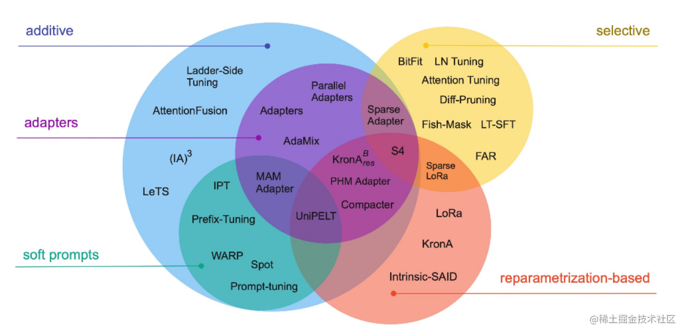
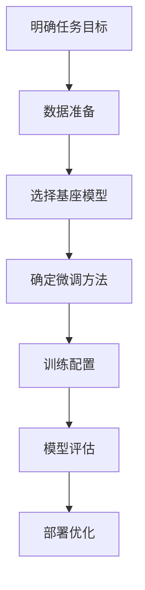

微调（Fine-Tunine）是在预训练大模型的基础上，针对特定任务或场景进行小范围的调整优化。它的目标是在不需要重新训练整个大模型的前提下，通过调整部分参数或特定模块，实现模型对具体任务的快速适配。
[大模型相关技术原理以及实战经验（大模型工程化、大模型应用落地）](https://github.com/liguodongiot/llm-action/tree/main)
# 全参数微调
调整模型的所有参数，适用于数据量大的情况，但计算资源消耗高。由于大语言模型参数规模变得越来越大，这使得在消费级硬件上进行全量微调变得不可行。

# 参数高效微调

微调少量或额外的模型参数，固定大部分预训练模型（LLM）参数，从而大大降低了计算和存储成本，同时，也能实现与全量参数微调相当的性能。参数高效微调方法甚至在某些情况下比全量微调效果更好，可以更好地泛化到域外场景。
高效微调技术可以粗略分为以下三大类：增加额外参数（A）、选取一部分参数更新（S）、引入重参数化（R）。而在增加额外参数这类方法中，又主要分为类适配器（Adapter-like）方法和软提示（Soft prompts）两个小类。


常见的参数高效微调技术有BitFit、Prefix Tuning、Prompt Tuning、P-Tuning、Adapter Tuning、LoRA等，后续文章将对一些主流的参数高效微调方法进行讲解

以下是几种主流的参数高效微调（Parameter-Efficient Fine-Tuning, PEFT）方法的简要介绍：
## 常见参数高效微调技术
- [大模型参数高效微调技术原理综述（一）-背景、参数高效微调简介](https://zhuanlan.zhihu.com/p/635152813)
- [大模型参数高效微调技术原理综述（二）-BitFit、Prefix Tuning、Prompt Tuning](https://zhuanlan.zhihu.com/p/635686756)
- [大模型参数高效微调技术原理综述（三）-P-Tuning、P-Tuning v2](https://zhuanlan.zhihu.com/p/635848732)
- [大模型参数高效微调技术原理综述（四）-Adapter Tuning及其变体](https://zhuanlan.zhihu.com/p/636038478)
- [大模型参数高效微调技术原理综述（五）-LoRA、AdaLoRA、QLoRA](https://zhuanlan.zhihu.com/p/636215898)
- [大模型参数高效微调技术原理综述（六）-MAM Adapter、UniPELT](https://zhuanlan.zhihu.com/p/636362246)
- [大模型参数高效微调技术原理综述（七）-最佳实践、总结](https://zhuanlan.zhihu.com/p/649755252)
### **1. BitFit（Bias-term Fine-Tuning）**
- **原理**：仅微调模型中的**偏置参数**（bias terms），冻结其他所有权重参数。
- **特点**：
  - 计算成本极低，仅需训练约0.1%的参数量。
  - 适用于简单任务或资源受限场景。
  - 在部分任务中表现接近全量微调。
- **适用场景**：轻量级适配任务，如文本分类、情感分析。
### **2. Prefix Tuning**
- **原理**：在输入序列前添加**可训练的前缀向量**（prefix tokens），通过调整这些向量引导模型输出。
  - 前缀向量是连续的（非真实token），通过梯度优化学习。
  - 通常应用于Transformer的每一层。
- **特点**：
  - 参数高效（仅调整约0.1%-1%的参数量）。
  - 适合生成任务（如对话、摘要）。
- **改进**：与离散的Prompt不同，Prefix是连续可学习的向量，优化更稳定。
### **3. Prompt Tuning**
- **原理**：在输入序列前添加**可学习的提示向量**（soft prompts），通过调整这些向量适配任务。
  - 仅作用于输入层，不涉及模型内部结构。
  - 提示向量的长度和参数可调。
- **特点**：
  - 参数量极低（通常为0.01%-0.1%）。
  - 对模型规模敏感，大模型（如百亿参数）效果更佳。
- **适用场景**：文本生成、分类任务。

### **4. P-Tuning（Prompt Tuning的升级版）**
- **原理**：引入**连续可学习的提示向量**，并通过小型神经网络（如LSTM或MLP）生成更复杂的提示。
  - 解决传统离散提示（hard prompt）难以优化的问题。
- **特点**：
  - 优化更稳定，支持复杂任务（如知识推理）。
  - 相比普通Prompt Tuning，效果更优。
- **适用场景**：需要复杂提示结构的任务（如问答、逻辑推理）。

### **5. Adapter Tuning**
- **原理**：在Transformer层的**前馈网络（FFN）后插入小型适配器模块**（Adapter）。
  - Adapter通常包含降维（down-projection）和升维（up-projection）的全连接层。
  - 仅训练Adapter参数，冻结原模型参数。
- **特点**：
  - 适配器参数量小（约1%-5%），适合逐层适配。
  - 可能略微增加推理延迟（需串行计算适配器）。
- **适用场景**：多任务学习、多语言适配。

### **6. LoRA（Low-Rank Adaptation）**
- **原理**：通过**低秩分解**近似权重更新，在原始权重矩阵旁添加低秩矩阵（如ΔW = A·B，A和B为低秩矩阵）。
  - 仅训练低秩矩阵参数，冻结原模型权重。
  - 训练后将低秩矩阵合并回原模型，**推理时无额外计算**。
- **特点**：
  - 参数量小（通常为0.5%-2%），计算高效。
  - 几乎不增加推理延迟，适合大规模模型（如GPT-3、LLaMA）。
- **适用场景**：生成任务、大规模模型微调。


| 方法            | 核心思想                     | 参数量占比 | 计算成本 | 适用场景               | 优点                          | 缺点                     |
|-----------------|----------------------------|------------|----------|------------------------|-------------------------------|--------------------------|
| **BitFit**      | 仅微调偏置参数               | ~0.1%      | 极低      | 简单分类任务           | 极简实现，资源友好             | 任务适配能力有限         |
| **Prefix Tuning**| 添加可学习前缀向量           | 0.1%-1%    | 中等      | 生成任务               | 效果接近全量微调               | 优化难度较高             |
| **Prompt Tuning**| 学习输入层提示向量           | 0.01%-0.1% | 低        | 生成/分类任务          | 参数极少，适合大模型           | 依赖模型规模             |
| **P-Tuning**    | 通过神经网络生成连续提示       | 0.1%-1%    | 中等      | 复杂推理任务           | 提示优化更灵活                 | 实现复杂度较高           |
| **Adapter**     | 插入小型适配器模块           | 1%-5%      | 中等      | 多任务/多语言场景      | 模块化设计，易于扩展           | 可能增加推理延迟         |
| **LoRA**        | 低秩分解近似权重更新         | 0.5%-2%    | 低        | 大规模模型微调         | 高效且无推理开销               | 需设计低秩结构           |
# 微调流程


## Lora微调

**LoRA**(Low-Rank Adaptation)是一种高效的大模型**PEFT**微调技术，它是通过在预训练模型的关键层（如全连接层和自注意力层）之间添加低秩矩阵来完成微调。这些低秩矩阵的引入使得模型能够适应新的任务，而无需改变原有的大量参数。由于低秩矩阵的参数数量远小于原有层的参数数量，这就大大减少了需要训练的参数总数。
更多细节参考
* [深入浅出Lora](https://zhuanlan.zhihu.com/p/650197598)
* [低配机器也能微调大模型？手把手教你实战技巧！](https://mp.weixin.qq.com/s?__biz=MzA3NzE0MjAwMg==&mid=2452715024&idx=1&sn=4917ef9937647cd9bdb6d266d2f33620&chksm=89dcca5eb8513662d3f2d5e9ca366b10b12630f70b464c405139b3f72b738ec9bf29b3295f3e#rd)
* [基于 Qwen2 大模型微调技术详细教程（LoRA 参数高效微调和 SwanLab 可视化监控）](https://www.cnblogs.com/obullxl/p/18312594/NTopic2024071801)
* [从零开始手写微调代码：如何用本地deepseek模型在自己构建的数据集进行微调](https://mp.weixin.qq.com/s?__biz=MzU0NDkyMzg3Mg==&mid=2247483835&idx=1&sn=2e010f62f98ccde903ba81262e252bdb&chksm=fa5b6d53e3d525992829812cc4ea7653251cdb564b0752af69e54de098397380fc4c1143aacf#rd)
* [DeepSeek大模型微调，家教式全流程实战指南！](https://mp.weixin.qq.com/s?__biz=MzU3Nzc0MzE3MA==&mid=2247484640&idx=1&sn=ea0605378dc056460379c8bedcfa773f&chksm=fc12b7922060120563085c0111b74b6555d91887ebf365bf8d3db1ae1a2d91fe0cd6b018b923#rd)
* [手把手教学，DeepSeek-R1微调全流程拆解](https://www.cnblogs.com/shanren/p/18707513)
* [大语言模型常用微调与基于SFT微调DeepSeek R1指南](https://www.ewbang.com/community/article/details/1000168010.html)

### DeepSeek

#### 加载模型

```python
from transformers import AutoModelForCausalLM, AutoTokenizer, BitsAndBytesConfig
from peft import LoraConfig, get_peft_model

model_name = "deepseek-ai/deepseek-llm-7b-base"
# Configure 4-bit quantization
# 使用 4 位量化使大型模型与有限的 GPU 内存兼容：
bnb_config = BitsAndBytesConfig(
    load_in_4bit=True,
    bnb_4bit_compute_dtype=torch.float16  # Use float16 for faster computation
)
# Load tokenizer and model
tokenizer = AutoTokenizer.from_pretrained(model_name)
model = AutoModelForCausalLM.from_pretrained(
    model_name, 
    quantization_config=bnb_config, 
    device_map="auto"
)
```

#### 加载数据集

使用 IMDB 数据集对 DeepSeek LLM 进行情绪分类微调，加载和预处理数据集，并将数据集拆分为训练集和测试集

```python

# 加载数据集
dataset = load_dataset("imdb")

def tokenize_function(examples):
    inputs = tokenizer(
        examples["text"], 
        truncation=True, 
        padding="max_length", 
        max_length=512
    )
    inputs["labels"] = inputs["input_ids"].copy()
    return inputs

# 预处理数据集
tokenized_datasets = dataset.map(tokenize_function, batched=True)

# 将数据集拆分为训练集和测试集
small_train_dataset = tokenized_datasets["train"].shuffle(seed=42).select(range(500))
small_test_dataset = tokenized_datasets["test"].shuffle(seed=42).select(range(100))
# Print a sample tokenized entry
print("Tokenized Sample:")
print(small_train_dataset[0])

```

#### 配置Lora
```python
# Apply LoRA for memory-efficient fine-tuning
lora_config = LoraConfig(
    r=8,  # Low-rank adaptation size
    lora_alpha=32,
    target_modules=["q_proj", "v_proj"],  # Apply LoRA to attention layers
    lora_dropout=0.05,
    bias="none"
)
model = get_peft_model(model, lora_config)
model.print_trainable_parameters()
```

#### 设置训练参数
```python
from transformers import TrainingArguments, Trainer

training_args = TrainingArguments(
    output_dir="./results",
    evaluation_strategy="epoch",
    learning_rate=3e-4,  # Lower learning rate for LoRA fine-tuning
    per_device_train_batch_size=1,  # Reduce batch size for memory efficiency
    gradient_accumulation_steps=8,  # Simulate larger batch size
    num_train_epochs=0.5,
    weight_decay=0.01,
    save_strategy="epoch",
    logging_dir="./logs",
    logging_steps=50,
    fp16=True,  # Mixed precision training
)
```

#### 初始化训练机器并微调试
```python
trainer = Trainer(
    model=model,
    args=training_args,
    train_dataset=small_train_dataset,
    eval_dataset=small_test_dataset,
)
print("🚀 训练器初始化完成")

print("🚀 开始微调")
trainer.train()


trainer.save_model("./my_deepseek")
tokenizer.save_pretrained("./my_deepseek")
print("模型已保存到 ./my_deepseek")
```

### Qwen2
#### 加载预训练模型和分词器(确认基座模型)

```python
# 模型路径
TARGET_MODEL = ''

# 确认设备
device = torch.device("cuda" if torch.cuda.is_available() else "cpu")

# 配置8bit量化，可以进一步减少对设备性能的消耗。
quantization_config = BitsAndBytesConfig(
    load_in_8bit=True,
    llm_int8_threshold=6.0,
)

# 加载分词机器
tokenizer = AutoTokenizer.from_pretrained(TARGET_MODEL)
tokenizer.padding_side = 'right'
tokenizer.pad_token = tokenizer.eos_token  # 添加这一行，设置 pad_token

# 加载模型
model = AutoModelForCausalLM.from_pretrained(
    TARGET_MODEL,
    quantization_config=quantization_config,
    device_map=device_map
)
```

#### 加载数据集(数据准备)

```python
# 加载数据集
DATASET_NAME = ''
dataset = load_dataset(DATASET_NAME, trust_remote_code=True)
```

如果数据集中没有验证集，需要手动划分
```python
# 检查是否有验证集，若没有则手动划分
if 'validation' not in dataset:
    # 这是 datasets 库中的一个方法，用于将数据集划分为训练集和测试集。
    # test_size=0.1：表示将数据集的 10% 分配给测试集（test），剩下的 90% 作为训练集（train）
    # shuffle = True：   表示在划分之前对数据进行随机打乱，以确保数据分布的随机性。
    # 设置随机种子，确保每次运行代码时划分结果的一致性。
    split_dataset  = dataset["train"].train_test_split(test_size=0.1, shuffle=True, seed=42)
    dataset["train"] = split_dataset ["train"]
    # 将重新划分后的测试集 dataset["test"] 重命名为验证集 dataset["validation"]，以便在后续代码中明确区分训练集和验证集的用途。
    dataset["validation"] = split_dataset ["test"]
```

#### 配置Lora(确认微调方法)

至关重要的一步
```python
# 创建LoRA配置
config = LoraConfig(
    task_type=TaskType.CAUSAL_LM,
    target_modules=["q_proj", "k_proj", "v_proj", "o_proj", "gate_proj", "up_proj", "down_proj"],
    inference_mode=False,  # 训练模式
    r=8,  # Lora 秩
    lora_alpha=32,  # Lora alaph，具体作用参见 Lora 原理
    lora_dropout=0.1,  # Dropout 比例
)
 
# 将LoRA应用于模型
model = get_peft_model(model, config)
 
```

#### 训练配置
```python
# 创建微调参数
args = TrainingArguments(
    output_dir=os.path.join(BASE_DIR, 'output', 'Qwen2-0.5B'),
    per_device_train_batch_size=4,
    gradient_accumulation_steps=4,
    logging_steps=10,
    num_train_epochs=2,
    save_steps=100,
    learning_rate=1e-4,
    save_on_each_node=True,
    gradient_checkpointing=True,
    report_to="none",
)

# 用于记录训练过程指标，训练结束后
plot_callback = PlotLossCallback()
# 创建训练器械
trainer = Trainer(
    model=model,
    train_dataset=tokenized_dataset["train"],
    eval_dataset=tokenized_dataset["validation"],
    peft_config=config,
    tokenizer=tokenizer,
    args=training_args,
    data_collator=data_collator,
    callbacks=[plot_callback]
)
# 开始训练
trainer.train()
# 保存 LoRA 权重
model.save_pretrained("./fine_tuned_model")

```


