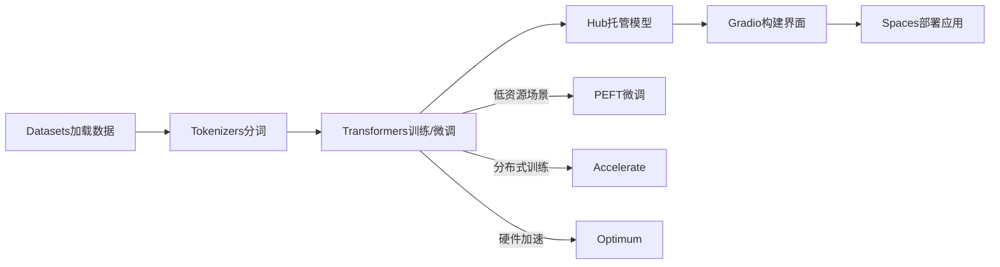

微调（Fine-Tunine）是在预训练大模型的基础上，针对特定任务或场景进行小范围的调整优化。它的目标是在不需要重新训练整个大模型的前提下，通过调整部分参数或特定模块，实现模型对具体任务的快速适配。
[大模型相关技术原理以及实战经验（大模型工程化、大模型应用落地）](https://github.com/liguodongiot/llm-action/tree/main)
# 全参数微调
调整模型的所有参数，适用于数据量大的情况，但计算资源消耗高。由于大语言模型参数规模变得越来越大，这使得在消费级硬件上进行全量微调变得不可行。

# 参数高效微调

微调少量或额外的模型参数，固定大部分预训练模型（LLM）参数，从而大大降低了计算和存储成本，同时，也能实现与全量参数微调相当的性能。参数高效微调方法甚至在某些情况下比全量微调效果更好，可以更好地泛化到域外场景。
高效微调技术可以粗略分为以下三大类：增加额外参数（A）、选取一部分参数更新（S）、引入重参数化（R）。而在增加额外参数这类方法中，又主要分为类适配器（Adapter-like）方法和软提示（Soft prompts）两个小类。


常见的参数高效微调技术有BitFit、Prefix Tuning、Prompt Tuning、P-Tuning、Adapter Tuning、LoRA等，后续文章将对一些主流的参数高效微调方法进行讲解

以下是几种主流的参数高效微调（Parameter-Efficient Fine-Tuning, PEFT）方法的简要介绍：
## 常见参数高效微调技术
- [大模型参数高效微调技术原理综述（一）-背景、参数高效微调简介](https://zhuanlan.zhihu.com/p/635152813)
- [大模型参数高效微调技术原理综述（二）-BitFit、Prefix Tuning、Prompt Tuning](https://zhuanlan.zhihu.com/p/635686756)
- [大模型参数高效微调技术原理综述（三）-P-Tuning、P-Tuning v2](https://zhuanlan.zhihu.com/p/635848732)
- [大模型参数高效微调技术原理综述（四）-Adapter Tuning及其变体](https://zhuanlan.zhihu.com/p/636038478)
- [大模型参数高效微调技术原理综述（五）-LoRA、AdaLoRA、QLoRA](https://zhuanlan.zhihu.com/p/636215898)
- [大模型参数高效微调技术原理综述（六）-MAM Adapter、UniPELT](https://zhuanlan.zhihu.com/p/636362246)
- [大模型参数高效微调技术原理综述（七）-最佳实践、总结](https://zhuanlan.zhihu.com/p/649755252)
### **1. BitFit（Bias-term Fine-Tuning）**
- **原理**：仅微调模型中的**偏置参数**（bias terms），冻结其他所有权重参数。
- **特点**：
  - 计算成本极低，仅需训练约0.1%的参数量。
  - 适用于简单任务或资源受限场景。
  - 在部分任务中表现接近全量微调。
- **适用场景**：轻量级适配任务，如文本分类、情感分析。
### **2. Prefix Tuning**
- **原理**：在输入序列前添加**可训练的前缀向量**（prefix tokens），通过调整这些向量引导模型输出。
  - 前缀向量是连续的（非真实token），通过梯度优化学习。
  - 通常应用于Transformer的每一层。
- **特点**：
  - 参数高效（仅调整约0.1%-1%的参数量）。
  - 适合生成任务（如对话、摘要）。
- **改进**：与离散的Prompt不同，Prefix是连续可学习的向量，优化更稳定。
### **3. Prompt Tuning**
- **原理**：在输入序列前添加**可学习的提示向量**（soft prompts），通过调整这些向量适配任务。
  - 仅作用于输入层，不涉及模型内部结构。
  - 提示向量的长度和参数可调。
- **特点**：
  - 参数量极低（通常为0.01%-0.1%）。
  - 对模型规模敏感，大模型（如百亿参数）效果更佳。
- **适用场景**：文本生成、分类任务。

### **4. P-Tuning（Prompt Tuning的升级版）**
- **原理**：引入**连续可学习的提示向量**，并通过小型神经网络（如LSTM或MLP）生成更复杂的提示。
  - 解决传统离散提示（hard prompt）难以优化的问题。
- **特点**：
  - 优化更稳定，支持复杂任务（如知识推理）。
  - 相比普通Prompt Tuning，效果更优。
- **适用场景**：需要复杂提示结构的任务（如问答、逻辑推理）。

### **5. Adapter Tuning**
- **原理**：在Transformer层的**前馈网络（FFN）后插入小型适配器模块**（Adapter）。
  - Adapter通常包含降维（down-projection）和升维（up-projection）的全连接层。
  - 仅训练Adapter参数，冻结原模型参数。
- **特点**：
  - 适配器参数量小（约1%-5%），适合逐层适配。
  - 可能略微增加推理延迟（需串行计算适配器）。
- **适用场景**：多任务学习、多语言适配。

### **6. LoRA（Low-Rank Adaptation）**
- **原理**：通过**低秩分解**近似权重更新，在原始权重矩阵旁添加低秩矩阵（如ΔW = A·B，A和B为低秩矩阵）。
  - 仅训练低秩矩阵参数，冻结原模型权重。
  - 训练后将低秩矩阵合并回原模型，**推理时无额外计算**。
- **特点**：
  - 参数量小（通常为0.5%-2%），计算高效。
  - 几乎不增加推理延迟，适合大规模模型（如GPT-3、LLaMA）。
- **适用场景**：生成任务、大规模模型微调。


| 方法                | 核心思想         | 参数量占比      | 计算成本 | 适用场景      | 优点         | 缺点       |
| ----------------- | ------------ | ---------- | ---- | --------- | ---------- | -------- |
| **BitFit**        | 仅微调偏置参数      | ~0.1%      | 极低   | 简单分类任务    | 极简实现，资源友好  | 任务适配能力有限 |
| **Prefix Tuning** | 添加可学习前缀向量    | 0.1%-1%    | 中等   | 生成任务      | 效果接近全量微调   | 优化难度较高   |
| **Prompt Tuning** | 学习输入层提示向量    | 0.01%-0.1% | 低    | 生成/分类任务   | 参数极少，适合大模型 | 依赖模型规模   |
| **P-Tuning**      | 通过神经网络生成连续提示 | 0.1%-1%    | 中等   | 复杂推理任务    | 提示优化更灵活    | 实现复杂度较高  |
| **Adapter**       | 插入小型适配器模块    | 1%-5%      | 中等   | 多任务/多语言场景 | 模块化设计，易于扩展 | 可能增加推理延迟 |
| **LoRA**          | 低秩分解近似权重更新   | 0.5%-2%    | 低    | 大规模模型微调   | 高效且无推理开销   | 需设计低秩结构  |
|                   |              |            |      |           |            |          |
## 微调流程


# 常见的微调框架
## Hugging Face
Hugging Face 生态是一个覆盖 NLP、CV、语音等多领域的开源工具链，提供从数据管理、模型训练、微调、评估到部署的全流程支持。**官网**： https://huggingface.co/docs
### 主要组件
####  Transformers 库
- **定位**：NLP/CV/语音模型的**核心库**，支持预训练模型加载、微调与推理。  
- **核心功能**：  
  - **模型支持**：超 20 万公开模型（BERT、GPT、ViT、Whisper 等），支持 PyTorch、TensorFlow、JAX 框架。  
  - **统一接口**：通过 `AutoModel`、`AutoTokenizer` 自动匹配模型架构。  
  ```python
  from transformers import AutoModelForSequenceClassification, AutoTokenizer
  model = AutoModelForSequenceClassification.from_pretrained("bert-base-uncased")
  tokenizer = AutoTokenizer.from_pretrained("bert-base-uncased")
  ```
  - **训练工具**：`Trainer` 类封装训练流程，支持分布式训练、混合精度等。  
- **适用场景**：文本分类、生成、翻译、图像分类等任务。
#### Datasets 库
- **定位**：高效管理、预处理和共享数据集。  
- **核心功能**：  
  - **数据集仓库**：提供 3 万+公开数据集（如 GLUE、SQuAD、COCO）。  
  - **流式加载**：支持超大数据集（如 Common Crawl）的磁盘映射加载，避免内存溢出。  
  ```python
  from datasets import load_dataset
  dataset = load_dataset("glue", "mrpc", split="train", streaming=True)  # 流式加载
  ```
  - **数据预处理**：与 Tokenizers 库无缝集成，支持并行处理。  
- **优势**：标准化数据格式（Arrow），兼容 Pandas/Numpy。

#### PEFT（Parameter-Efficient Fine-Tuning
- **定位**：**参数高效微调**工具，降低大模型训练成本。  
- **支持方法**：LoRA、Prefix Tuning、Adapters、Prompt Tuning 等。  
- **示例**（LoRA 微调）：  
  ```python
  from peft import LoraConfig, get_peft_model
  config = LoraConfig(r=8, target_modules=["query", "value"])
  model = get_peft_model(model, config)  # 原始模型的 0.1% 参数被训练
  ```
- **优势**：显存占用减少 50%~90%，适合低资源场景。

#### Tokenizers 库
- **定位**：高性能文本分词工具，支持 100+语言。  
- **核心功能**：  
  - **预置分词器**：BPE、WordPiece、SentencePiece 等算法。  
  - **自定义分词器**：从零训练或扩展现有分词器。  
  ```python
  from tokenizers import BertWordPieceTokenizer
  tokenizer = BertWordPieceTokenizer()
  tokenizer.train(files=["text.txt"], vocab_size=30522)
  tokenizer.save("custom-tokenizer.json")
  ```
- **优势**：Rust 后端加速，比原生 Python 快 10 倍。


#### Hugging Face Hub
- **定位**：模型、数据集和应用的**协作平台**（类似 GitHub for ML）。  
- **核心功能**：  
  - **模型托管**：用户可上传/下载模型（含版本控制）。  
  - **数据集托管**：支持公开或私有数据集存储。  
  - **Spaces**：一键部署 ML 应用（如 Gradio/Streamlit 应用）。  
  - **社区互动**：模型评测、讨论、分叉（Fork）功能。  
- **示例**：  
  ```python
  # 上传模型到 Hub
  model.push_to_hub("my-bert-finetuned")
  # 加载社区模型
  model = AutoModel.from_pretrained("username/my-bert-finetuned")
  ```


#### Accelerate 库
- **定位**：**简化分布式训练**，支持多 GPU/TPU 训练。  
- **核心功能**：  
  - **统一训练接口**：自动处理设备分发、混合精度、梯度累积。  
  - **兼容性**：支持 PyTorch、Transformers、自定义训练循环。  
  ```python
  from accelerate import Accelerator
  accelerator = Accelerator()
  model, optimizer, dataloader = accelerator.prepare(model, optimizer, dataloader)
  ```
- **适用场景**：单机多卡或多机训练，无需修改大量代码。


#### Gradio
- **定位**：快速构建 ML 模型**交互式演示界面**。  
- **核心功能**：  
  - **预置组件**：文本框、图像上传、实时可视化等。  
  - **一键部署**：可托管到 Hugging Face Spaces。  
  ```python
  import gradio as gr
  def classify(text):
      return model(text)  # 调用模型推理
  gr.Interface(fn=classify, inputs="text", outputs="label").launch()
  ```
- **适用场景**：模型演示、用户测试、原型验证。

#### Optimum
- **定位**：**硬件加速推理**工具，支持 ONNX、TensorRT、OpenVINO 等。  
- **核心功能**：  
  - **模型导出**：将 Transformers 模型转换为优化格式。  
  - **加速推理**：与硬件厂商（Intel、NVIDIA）深度集成。  
  ```python
  from optimum.onnxruntime import ORTModelForSequenceClassification
  model = ORTModelForSequenceClassification.from_pretrained("bert-base-uncased")
  ```
- **优势**：推理速度提升 2-5 倍，延迟降低。

#### Autotrain
- **定位**：**自动化模型训练**，无需编写代码。  
- **支持任务**：文本分类、生成、图像分类、表格数据等。  
- **使用方式**：  
  ```bash
  # 命令行启动训练
  autotrain llm --model meta-llama/Llama-3-8b --data_path my_data.json
  ```
- **适用场景**：快速基线模型训练，非技术用户友好。

#### 其他工具
- **Model Cards**：标准化模型文档模板，记录模型用途、偏差、训练数据等。  
- **Evaluate**：统一评估指标库（如准确率、BLEU、ROUGE）。  
- **Diffusers**：扩散模型（Stable Diffusion）训练与推理库。  
- **TRL**（Transformer Reinforcement Learning）：支持 RLHF（人类反馈强化学习）。  

### **生态协作流程图**  



### **优势总结**  
1. **全流程覆盖**：从数据到部署，工具链无缝衔接。  
2. **社区驱动**：开源协作，模型、数据集共享便捷。  
3. **灵活性**：支持从代码级定制到无代码自动化（Autotrain）。  
4. **性能优化**：Tokenizers（Rust）、Optimum（硬件加速）等底层优化。  


### **使用建议**  
- **快速原型开发**：Transformers + Datasets + Gradio。  
- **低资源微调**：PEFT + Accelerate。  
- **工业级部署**：Optimum + ONNX/TensorRT。  
- **协作与分享**：Hub + Spaces。  


### 示例
```python
from transformers import AutoModelForCausalLM, AutoTokenizer

# 加载模型
model = AutoModelForCausalLM.from_pretrained("meta-llama/Llama-2-7b")


tokenizer = AutoTokenizer.from_pretrained("meta-llama/Llama-2-7b")


from peft import LoraConfig, get_peft_model

# 设置微调方法
lora_config = LoraConfig(
    r=8,  # 低秩矩阵的秩
    target_modules=["q_proj", "v_proj"],  # 目标模块（如LLaMA的注意力层）
)
model = get_peft_model(model, lora_config)

# 设置训练参数
training_args = TrainingArguments(
    output_dir="output",
    per_device_train_batch_size=4,
    fp16=True,  # 混合精度训练
    gradient_accumulation_steps=2,
)

# 训练
trainer = Trainer(
    model=model,
    args=training_args,
    train_dataset=dataset,
)
trainer.train()
```

## DeepSeed
DeepSpeed 是由 Microsoft 开发的开源深度学习优化库，专注于 ​**大规模模型的高效训练与推理**。其核心价值在于解决千亿级参数模型的显存占用、计算效率和分布式扩展问题。与Hugging Face生态的深度整合（如通过`Trainer`直接调用），使得开发者能在易用性与性能之间取得平衡。 **官网** https://www.deepspeed.ai/
### 核心优势
#### 显存优化能力（ZeRO 技术)
- **支持千亿级模型训练**：  
  - **ZeRO-Offload**：将优化器状态、梯度、参数卸载到 CPU 或 NVMe，显存占用降低 **10 倍以上**。  
  - **ZeRO-Infinity**：支持万亿参数模型训练（如 [BLOOM-176B](https://huggingface.co/bigscience/bloom)）。  
- **对比 Hugging Face 原生训练**：  
  - Hugging Face `Trainer` 依赖 PyTorch 原生显存管理，全量微调 70B 模型需数百 GB 显存，而 DeepSpeed ZeRO-3 + Offload 可在单机 8*A100（80GB） 上完成。

#### 分布式训练效率
- **3D 并行策略**：  
  - **数据并行** + **模型并行**（张量/流水线并行）的混合策略，支持超大规模分布式训练。  
  - Hugging Face 仅支持基础数据并行（需结合 `accelerate` 库扩展）。  
- **通信优化**：  
  - **梯度压缩**（1-bit Adam）减少通信量，**异步流水线**减少 GPU 空闲时间。  
  - 在 100Gbps InfiniBand 集群中，DeepSpeed 吞吐量比原生 PyTorch 高 **2-3 倍**。

#### 硬件资源利用率
- **混合精度与量化**：  
  - 支持 FP16/BF16/INT8 训练，相比 Hugging Face 的 `fp16=True` 选项，DeepSpeed 的混合精度实现更高效（显存节省 + 速度提升）。  
- **CPU/NVMe 卸载**：  
  - 允许将部分计算卸载到 CPU 或 SSD，突破 GPU 显存限制。

#### 大规模全量微调
- **适用场景**：  
  - DeepSpeed 专为 **全量微调（Full Fine-Tuning）** 设计，而 Hugging Face 更依赖 PEFT（如 LoRA）应对显存瓶颈。  
  - 对于需要更新全部参数的场景（如领域自适应），DeepSpeed 是更优选择。

### 和Hugging Face对比
| **特性**    | **DeepSpeed**                | **Hugging Face Transformers** |
| --------- | ---------------------------- | ----------------------------- |
| **核心目标**  | 超大规模模型的高效训练                  | 快速模型实验与轻量级微调                  |
| **显存优化**  | ZeRO 分片 + Offload（支持 1T+ 参数） | 依赖 PEFT（LoRA 等）或基础混合精度        |
| **分布式训练** | 原生支持 3D 并行（数据/模型/流水线）        | 需结合 `accelerate` 实现基础数据并行     |
| **硬件要求**  | 多 GPU/CPU/NVMe 扩展            | 单卡或少量 GPU 即可运行                |
| **适用场景**  | 全量微调 10B+ 模型、工业级训练集群         | 7B 以下模型微调、快速原型开发              |
| **代码复杂度** | 高（需配置 JSON 文件和分布式参数）         | 低（几行代码调用 `Trainer`）           |
| **典型用户**  | 企业级大模型团队、超算中心                | 研究者、初创公司、个人开发者                |
|           |                              |                               |
和Hugging Face 并非二选一，而是 ​**协同使用**​ 以兼顾易用性与性能
```python

from transformers import Trainer, TrainingArguments

# 启用 DeepSpeed 配置
training_args = TrainingArguments(
    output_dir="output",
    deepspeed="ds_config.json",  # DeepSpeed 配置文件
    per_device_train_batch_size=4,
    fp16=True,
)

# 标准 Hugging Face 训练流程
trainer = Trainer(
    model=model,
    args=training_args,
    train_dataset=dataset,
)
trainer.train()
```

## LLaMA Factory

**Llama Factory** 是一个专注于 **LLaMA 系列模型**（包括 LLaMA、Alpaca、Chinese-LLaMA 等）高效微调的开源框架，旨在简化大语言模型在指令跟随、领域适应等场景下的定制化训练流程。其核心目标是降低大模型微调的技术门槛，提升训练效率。

- **项目地址**：[https://github.com/hiyouga/LLaMA-Factory](https://github.com/hiyouga/LLaMA-Factory)  
- **核心开发者**：社区驱动的开源项目，主要维护者为国内开发者团队。  

---

### 核心功能
#### 模型支持
- **全系 LLaMA 兼容**：支持 LLaMA-1/2、Alpaca、Vicuna、Chinese-LLaMA 等变体，**已支持deepseek。**  
- **扩展模型**：可适配其他类 LLaMA 架构模型（如 OpenLLM、Baichuan、Qwen，DeepSeek 等）。  

#### 参数高效微调（PEFT）
- **主流方法集成**：  
  - **LoRA**：低秩矩阵分解，训练参数量减少 90% 以上。  
  - **QLoRA**：4-bit 量化 + LoRA，单卡（24GB）可微调 13B 模型。  
  - **Prefix Tuning**：学习可训练的前缀向量。  
  - **Adapter**：插入轻量级适配模块。  
- **灵活配置**：通过 YAML 文件或命令行参数选择微调策略。  

#### 训练优化
- **分布式训练**：支持 ZeRO（DeepSpeed 集成）、数据并行、模型并行。  
- **显存优化**：梯度检查点（Gradient Checkpointing）、混合精度训练（FP16/BF16）。  
- **硬件适配**：支持消费级 GPU（如 RTX 3090）和多卡集群训练。  

#### 数据与任务支持
- **预置数据集**：  
  - 指令数据集（Alpaca-GPT4、ShareGPT）、对话数据集（MultiWOZ）、领域数据（医疗、法律）。  
  - 支持自定义数据集（JSON/CSV 格式）。  
- **任务类型**：  
  - 文本生成、对话生成、问答、文本分类。  

#### 工具链集成
- **Hugging Face 生态**：无缝对接 Transformers、Datasets、PEFT 等库。  
- **推理部署**：导出 LoRA 权重与基础模型合并，支持 ONNX/TensorRT 加速。  


### 技术优势 
####  高效性 
- **资源占用低**：QLoRA 微调 7B 模型仅需 10GB 显存（RTX 3080）。  
- **训练速度快**：通过 DeepSpeed ZeRO-2 优化，吞吐量比原生 PyTorch 高 2-3 倍。  

#### 易用性
- **统一接口**：提供命令行工具和配置文件，无需编写复杂训练代码。  
  ```bash
  # 示例：使用 LoRA 微调 LLaMA-7B
  python src/train_bash.py \
    --model_name_or_path meta-llama/Llama-2-7b-hf \
    --dataset alpaca_gpt4_zh \
    --lora_rank 8 \
    --per_device_train_batch_size 2 \
    --gradient_accumulation_steps 4
  ```
- **可视化监控**：集成 TensorBoard 和 WandB 日志记录。  

#### 灵活性
- **模块化设计**：可替换数据预处理、模型架构、训练策略模块。  
- **多阶段训练**：支持预训练（Pretrain）→ 指令微调（SFT）→ 强化学习（RLHF）全流程。   


###  与同类框架对比 
| **框架**                | **核心优势**                  | **适用场景**      |     |
| --------------------- | ------------------------- | ------------- | --- |
| **Llama Factory**     | 专精 LLaMA 系列，轻量化、易配置，有中文文档 | 中小规模指令微调、领域适配 |     |
| **Hugging Face PEFT** | 通用 PEFT 方法支持，生态完善         | 多模型架构的轻量微调    |     |
| **DeepSpeed**         | 超大规模全量微调，显存优化             | 千亿级模型工业级训练    |     |

### 快速入门
#### 环境安装
```bash
git clone https://github.com/hiyouga/LLaMA-Factory.git
cd LLaMA-Factory
pip install -r requirements.txt
```

#### 数据准备
- 使用预置数据集或按格式准备自定义数据：  
  ```json
  // data/custom_dataset.json
  [{"instruction": "...", "input": "...", "output": "..."}]
  ```

#### 启动训练
```bash
# 单卡 QLoRA 微调
python src/train_bash.py \
  --model_name_or_path meta-llama/Llama-2-7b-hf \
  --dataset custom_dataset \
  --quantization_bit 4 \
  --lora_rank 8 \
  --output_dir outputs
```

#### 模型合并与推理
```python
from transformers import AutoModelForCausalLM
from peft import PeftModel

base_model = AutoModelForCausalLM.from_pretrained("meta-llama/Llama-2-7b-hf")
model = PeftModel.from_pretrained(base_model, "outputs/checkpoint-1000")
model = model.merge_and_unload()  # 合并 LoRA 权重
model.save_pretrained("merged_model")
```


### 项目生态与社区
- **活跃社区**：GitHub 2k+ Stars，持续更新新模型（如 LLaMA-3、DeepSeek）支持。  
- **企业应用**：已用于教育、客服、内容生成等领域的模型定制。  


### **总结**  
**Llama Factory** 是 LLaMA 系列模型轻量级微调的首选工具，尤其适合：  
- **资源有限**：消费级 GPU 微调 7B-13B 模型。  
- **快速迭代**：通过预置数据集和配置模板简化实验流程。  
- **中文优化**：针对中文指令数据提供专项支持。  

对于需要全量微调千亿级模型或复杂分布式训练的团队，建议结合 **DeepSpeed** 或 **Colossal-AI** 使用。

# HuggingFace微调

## Lora微调

**LoRA**(Low-Rank Adaptation)是一种高效的大模型**PEFT**微调技术，它是通过在预训练模型的关键层（如全连接层和自注意力层）之间添加低秩矩阵来完成微调。这些低秩矩阵的引入使得模型能够适应新的任务，而无需改变原有的大量参数。由于低秩矩阵的参数数量远小于原有层的参数数量，这就大大减少了需要训练的参数总数。
更多细节参考
* [深入浅出Lora](https://zhuanlan.zhihu.com/p/650197598)
* [低配机器也能微调大模型？手把手教你实战技巧！](https://mp.weixin.qq.com/s?__biz=MzA3NzE0MjAwMg==&mid=2452715024&idx=1&sn=4917ef9937647cd9bdb6d266d2f33620&chksm=89dcca5eb8513662d3f2d5e9ca366b10b12630f70b464c405139b3f72b738ec9bf29b3295f3e#rd)
* [基于 Qwen2 大模型微调技术详细教程（LoRA 参数高效微调和 SwanLab 可视化监控）](https://www.cnblogs.com/obullxl/p/18312594/NTopic2024071801)
* [从零开始手写微调代码：如何用本地deepseek模型在自己构建的数据集进行微调](https://mp.weixin.qq.com/s?__biz=MzU0NDkyMzg3Mg==&mid=2247483835&idx=1&sn=2e010f62f98ccde903ba81262e252bdb&chksm=fa5b6d53e3d525992829812cc4ea7653251cdb564b0752af69e54de098397380fc4c1143aacf#rd)
* [DeepSeek大模型微调，家教式全流程实战指南！](https://mp.weixin.qq.com/s?__biz=MzU3Nzc0MzE3MA==&mid=2247484640&idx=1&sn=ea0605378dc056460379c8bedcfa773f&chksm=fc12b7922060120563085c0111b74b6555d91887ebf365bf8d3db1ae1a2d91fe0cd6b018b923#rd)
* [手把手教学，DeepSeek-R1微调全流程拆解](https://www.cnblogs.com/shanren/p/18707513)
* [大语言模型常用微调与基于SFT微调DeepSeek R1指南](https://www.ewbang.com/community/article/details/1000168010.html)

### DeepSeek

#### 加载模型

```python
from transformers import AutoModelForCausalLM, AutoTokenizer, BitsAndBytesConfig
from peft import LoraConfig, get_peft_model

model_name = "deepseek-ai/deepseek-llm-7b-base"
# Configure 4-bit quantization
# 使用 4 位量化使大型模型与有限的 GPU 内存兼容：
bnb_config = BitsAndBytesConfig(
    load_in_4bit=True,
    bnb_4bit_compute_dtype=torch.float16  # Use float16 for faster computation
)
# Load tokenizer and model
tokenizer = AutoTokenizer.from_pretrained(model_name)
model = AutoModelForCausalLM.from_pretrained(
    model_name, 
    quantization_config=bnb_config, 
    device_map="auto"
)
```

#### 加载数据集

使用 IMDB 数据集对 DeepSeek LLM 进行情绪分类微调，加载和预处理数据集，并将数据集拆分为训练集和测试集

```python

# 加载数据集
dataset = load_dataset("imdb")

def tokenize_function(examples):
    inputs = tokenizer(
        examples["text"], 
        truncation=True, 
        padding="max_length", 
        max_length=512
    )
    inputs["labels"] = inputs["input_ids"].copy()
    return inputs

# 预处理数据集
tokenized_datasets = dataset.map(tokenize_function, batched=True)

# 将数据集拆分为训练集和测试集
small_train_dataset = tokenized_datasets["train"].shuffle(seed=42).select(range(500))
small_test_dataset = tokenized_datasets["test"].shuffle(seed=42).select(range(100))
# Print a sample tokenized entry
print("Tokenized Sample:")
print(small_train_dataset[0])

```

#### 配置Lora
```python
# Apply LoRA for memory-efficient fine-tuning
lora_config = LoraConfig(
    r=8,  # Low-rank adaptation size
    lora_alpha=32,
    target_modules=["q_proj", "v_proj"],  # Apply LoRA to attention layers
    lora_dropout=0.05,
    bias="none"
)
model = get_peft_model(model, lora_config)
model.print_trainable_parameters()
```

#### 设置训练参数
```python
from transformers import TrainingArguments, Trainer

training_args = TrainingArguments(
    output_dir="./results",
    evaluation_strategy="epoch",
    learning_rate=3e-4,  # Lower learning rate for LoRA fine-tuning
    per_device_train_batch_size=1,  # Reduce batch size for memory efficiency
    gradient_accumulation_steps=8,  # Simulate larger batch size
    num_train_epochs=0.5,
    weight_decay=0.01,
    save_strategy="epoch",
    logging_dir="./logs",
    logging_steps=50,
    fp16=True,  # Mixed precision training
)
```

#### 初始化训练机器并微调试
```python
trainer = Trainer(
    model=model,
    args=training_args,
    train_dataset=small_train_dataset,
    eval_dataset=small_test_dataset,
)
print("🚀 训练器初始化完成")

print("🚀 开始微调")
trainer.train()


trainer.save_model("./my_deepseek")
tokenizer.save_pretrained("./my_deepseek")
print("模型已保存到 ./my_deepseek")
```

### Qwen2
#### 加载预训练模型和分词器(确认基座模型)

```python
# 模型路径
TARGET_MODEL = ''

# 确认设备
device = torch.device("cuda" if torch.cuda.is_available() else "cpu")

# 配置8bit量化，可以进一步减少对设备性能的消耗。
quantization_config = BitsAndBytesConfig(
    load_in_8bit=True,
    llm_int8_threshold=6.0,
)

# 加载分词机器
tokenizer = AutoTokenizer.from_pretrained(TARGET_MODEL)
tokenizer.padding_side = 'right'
tokenizer.pad_token = tokenizer.eos_token  # 添加这一行，设置 pad_token

# 加载模型
model = AutoModelForCausalLM.from_pretrained(
    TARGET_MODEL,
    quantization_config=quantization_config,
    device_map=device_map
)
```

#### 加载数据集(数据准备)

```python
# 加载数据集
DATASET_NAME = ''
dataset = load_dataset(DATASET_NAME, trust_remote_code=True)
```

如果数据集中没有验证集，需要手动划分
```python
# 检查是否有验证集，若没有则手动划分
if 'validation' not in dataset:
    # 这是 datasets 库中的一个方法，用于将数据集划分为训练集和测试集。
    # test_size=0.1：表示将数据集的 10% 分配给测试集（test），剩下的 90% 作为训练集（train）
    # shuffle = True：   表示在划分之前对数据进行随机打乱，以确保数据分布的随机性。
    # 设置随机种子，确保每次运行代码时划分结果的一致性。
    split_dataset  = dataset["train"].train_test_split(test_size=0.1, shuffle=True, seed=42)
    dataset["train"] = split_dataset ["train"]
    # 将重新划分后的测试集 dataset["test"] 重命名为验证集 dataset["validation"]，以便在后续代码中明确区分训练集和验证集的用途。
    dataset["validation"] = split_dataset ["test"]
```

#### 配置Lora(确认微调方法)

至关重要的一步
```python
# 创建LoRA配置
config = LoraConfig(
    task_type=TaskType.CAUSAL_LM,
    target_modules=["q_proj", "k_proj", "v_proj", "o_proj", "gate_proj", "up_proj", "down_proj"],
    inference_mode=False,  # 训练模式
    r=8,  # Lora 秩
    lora_alpha=32,  # Lora alaph，具体作用参见 Lora 原理
    lora_dropout=0.1,  # Dropout 比例
)
 
# 将LoRA应用于模型
model = get_peft_model(model, config)
 
```

#### 训练配置
```python
# 创建微调参数
args = TrainingArguments(
    output_dir=os.path.join(BASE_DIR, 'output', 'Qwen2-0.5B'),
    per_device_train_batch_size=4,
    gradient_accumulation_steps=4,
    logging_steps=10,
    num_train_epochs=2,
    save_steps=100,
    learning_rate=1e-4,
    save_on_each_node=True,
    gradient_checkpointing=True,
    report_to="none",
)

# 用于记录训练过程指标，训练结束后
plot_callback = PlotLossCallback()
# 创建训练器械
trainer = Trainer(
    model=model,
    train_dataset=tokenized_dataset["train"],
    eval_dataset=tokenized_dataset["validation"],
    peft_config=config,
    tokenizer=tokenizer,
    args=training_args,
    data_collator=data_collator,
    callbacks=[plot_callback]
)
# 开始训练
trainer.train()
# 保存 LoRA 权重
model.save_pretrained("./fine_tuned_model")

```


