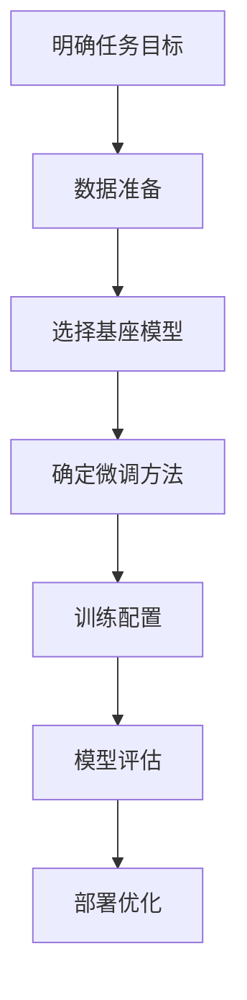
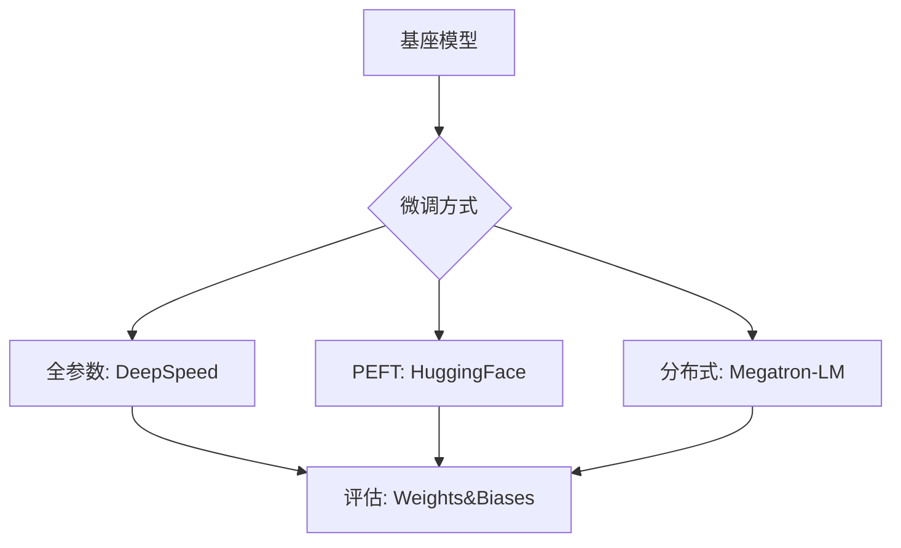

以下是针对大模型微调的详细步骤指南，结合不同场景的优化策略和最新技术实践：

---

### **一、微调全流程框架**


---

### **二、关键步骤详解**

#### **1. 数据准备（成败关键）**
- **数据要求**：
  - **规模**：至少500-1000条高质量样本（复杂任务需10k+）
  - **格式**：与基座模型预训练格式对齐（如Alpaca指令模板）
  
- **领域增强技巧**：
  ```python
  # 数据增强示例：利用大模型生成合成数据
  from transformers import pipeline
  generator = pipeline('text-generation', model='gpt-3.5-turbo')
  
  def augment_data(seed_data):
      prompt = f"基于以下内容生成相似表述：\n{seed_data}"
      return generator(prompt, max_length=200)[0]['generated_text']
  ```

- **数据质量检查**：
  - 使用[CleanLab](https://github.com/cleanlab/cleanlab)自动检测标注噪声
  - 计算困惑度（PPL）筛选异常样本

---

#### **2. 基座模型选择策略**
| 模型类型    | 适用场景        | 硬件要求          | 推荐模型                      |
| ------- | ----------- | ------------- | ------------------------- |
| 7B参数模型  | 单卡微调（24G显存） | RTX 3090/4090 | LLaMA-2-7B, Qwen-7B       |
| 13B参数模型 | 多卡微调        | 2*A100 40G    | ChatGLM3-6B, Baichuan-13B |
| 百亿级模型   | 企业级服务       | 8*A100 80G集群  | DeepSeek-R1, Yi-34B       |

---

#### **3. 微调方法选择**
**对比主流方法**：

| 方法            | 参数量更新  | 显存消耗 | 训练速度 | 效果保持 |
| ------------- | ------ | ---- | ---- | ---- |
| 全参数微调         | 100%   | 高    | 慢    | 优    |
| LoRA          | 0.1-1% | 低    | 快    | 良    |
| Adapter       | 3-5%   | 中    | 中    | 中    |
| Prompt Tuning | 0.01%  | 极低   | 最快   | 一般   |

**推荐组合方案**：
- **低成本场景**：LoRA + 8bit量化 + 梯度检查点
- **高性能需求**：全参数微调 + ZeRO-3 + FlashAttention

---

#### **4. 训练配置模板（以LLaMA-2为例）**
```yaml
# config.yaml
train:
  batch_size: 8
  learning_rate: 2e-5
  max_seq_length: 2048
  num_epochs: 5
  optimizer: adamw_torch
  lr_scheduler: cosine_with_warmup
  
lora:
  r: 8
  lora_alpha: 32
  target_modules: ["q_proj", "v_proj"]
  
quantization:
  load_in_4bit: true
  bnb_4bit_compute_dtype: float16
```

---

#### **5. 实战代码示例**
```python
from peft import LoraConfig, get_peft_model
from transformers import AutoModelForCausalLM, TrainingArguments

# 加载基座模型
model = AutoModelForCausalLM.from_pretrained("meta-llama/Llama-2-7b-hf")

# 配置LoRA
peft_config = LoraConfig(
    r=8,
    lora_alpha=32,
    target_modules=["q_proj", "v_proj"],
    lora_dropout=0.1,
    bias="none"
)
model = get_peft_model(model, peft_config)

# 训练参数
training_args = TrainingArguments(
    output_dir="./results",
    per_device_train_batch_size=4,
    gradient_accumulation_steps=2,
    learning_rate=2e-5,
    num_train_epochs=3,
    fp16=True,
    logging_steps=10,
    optim="paged_adamw_8bit"
)

# 开始训练
trainer = Trainer(
    model=model,
    args=training_args,
    train_dataset=train_dataset,
    data_collator=DataCollatorForSeq2Seq(...)
)
trainer.train()
```

---

### **三、性能优化技巧**

#### **1. 显存压缩技术**
- **4bit量化**：使用`bitsandbytes`库
  ```python
  model = AutoModelForCausalLM.from_pretrained(
      "bigscience/bloom-1b7",
      load_in_4bit=True,
      bnb_4bit_quant_type="nf4"
  )
  ```
- **梯度检查点**：减少30%显存占用
  ```python
  model.gradient_checkpointing_enable()
  ```

#### **2. 训练加速方案**
- **Flash Attention**：提速2-3倍
  ```bash
  pip install flash-attn --no-build-isolation
  ```
- **混合精度训练**：
  ```python
  training_args = TrainingArguments(fp16=True, bf16=False)
  ```

---

### **四、常见问题解决方案**

#### **1. 灾难性遗忘**
- **解决方案**：
  - 保留5%的原始预训练数据混合训练
  - 使用弹性权重巩固（EWC）算法
  ```python
  from transformers import Trainer
  class EWCTrainer(Trainer):
      def compute_loss(self, model, inputs, return_outputs=False):
          # 添加EWC正则项
          outputs = model(**inputs)
          loss = outputs.loss + lambda * elastic_weight_penalty
          return (loss, outputs) if return_outputs else loss
  ```

#### **2. 过拟合处理**
- **早停策略**：当验证集loss连续3个epoch不下降时停止
- **数据增强**：使用回译、同义词替换等方法扩展数据

---

### **五、评估与部署**

#### **1. 评估指标选择**
| 任务类型       | 主要指标                  | 辅助指标               |
|--------------|-------------------------|-----------------------|
| 文本生成      | BLEU-4, ROUGE-L         | 人工评分（Coherence） |
| 分类任务      | F1-score                | AUC-ROC               |
| 问答系统      | Exact Match (EM)        | BERTScore             |

#### **2. 部署优化**
- **模型合并**（LoRA专用）：
  ```python
  model = model.merge_and_unload()
  ```
- **ONNX导出**：
  ```bash
  optimum-cli export onnx --model path/to/model onnx_output/
  ```
- **推理加速**：
  ```python
  from vllm import LLM
  llm = LLM(model="facebook/opt-125m", tensor_parallel_size=2)
  print(llm.generate("Hello world!"))
  ```

---

### **六、典型应用案例**

#### **1. 金融领域知识问答**
- **数据构建**：
  - 使用FinQA数据集
  - 注入企业内部的财报解析规则
- **微调方案**：
  - LoRA (r=64) + 领域持续预训练
  - 添加金融实体识别辅助任务

#### **2. 医疗报告生成**
- **隐私保护**：
  - 使用PEFT方法避免存储完整模型
  - 联邦学习框架部署
- **效果提升**：
  - 结合医学知识图谱（UMLS）进行约束解码

---

### **资源推荐**
1. **工具库**：
   - Hugging Face Transformers
   - PEFT（参数高效微调库）

| 工具          | 优势                     | 适用场景              |
|---------------|-------------------------|---------------------|
| DeepSpeed     | ZeRO优化                 | 大规模全参数微调      |
| Colossal-AI   | 异构计算支持             | 昇腾/英伟达混合环境   |
| Axolotl       | 一站式微调框架           | 快速实验迭代          |

2. **实践指南**：
   - 《大规模语言模型微调技术白皮书》（阿里云）
   - "Parameter-Efficient Transfer Learning for NLP"（ICML 2023）

---

通过系统化实施上述方案，可在保持基座模型通用能力的同时，快速适配垂直领域需求。建议从小规模实验开始（如使用QLoRA+单卡），逐步扩展到生产级部署。