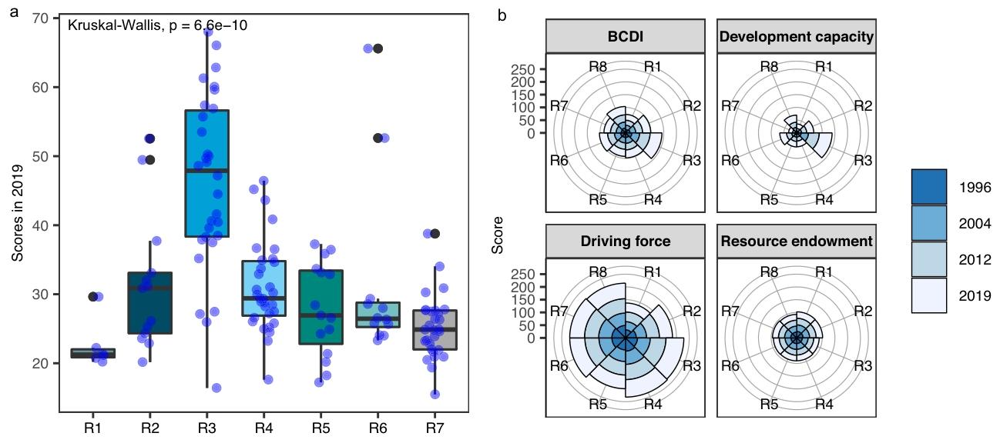

# 通过国际合作可持续发展全球蓝碳，以缓解气候变化并获取经济效益

**摘要**：蓝碳是指红树林、盐沼和海草等植被丰富的沿海生态系统中的碳储存。由于其在缓解气候变化和促进地方福祉方面的作用，蓝碳正受到全球关注。然而，目前尚未对蓝碳的长期时空可持续发展状况进行全球评估，全球范围内蓝碳生态系统、缓解气候变化的驱动因素以及促进发展能力的社会经济干预措施之间的关系仍不明确。在此，我们构建了蓝碳发展指数（BCDI），该指数由驱动力、资源禀赋和发展能力三个子系统组成，用于评估136个沿海国家连续24年的蓝碳可持续发展水平，并探究子系统之间的关系。我们进一步提出了一种合作模式，以探讨全球蓝碳合作的可行性，并量化具体国家的利益分配。结果显示，在过去二十年中，BCDI得分呈上升趋势，但区域表现存在差异，同时我们发现发展能力与蓝碳资源禀赋之间存在正相关关系。基于全球合作的情景模拟，我们发现与“一切照旧”（Business-As-Usual，BAU）情景相比，在“全球深度合作”（Global Deep Cooperation，GDC）情景下，沿海国家到2030年可提高全球平均BCDI得分，每年增加296万吨的碳固存，并创造1.3634亿美元的经济效益。

## 一、引言
红树林、盐沼和海草构成的蓝碳生态系统，其碳储存效率比陆地森林更高。蓝碳生态系统虽仅覆盖0.2%的海洋面积，却占海洋沉积物碳埋藏量的50%。作为缓解气候变化不可或缺的基于自然的解决方案，蓝碳生态系统在全球范围内受到越来越多的关注。联合国教育、科学及文化组织政府间海洋学委员会（IOC-UNESCO）、国际自然保护联盟（IUCN）和保护国际（CI）联合发起了蓝碳倡议（BCI）。随后，2013年发布的《2006年IPCC国家温室气体清单指南补编：湿地》将蓝碳逐步正式纳入应对气候变化的解决方案之中。据估计，2017年全球沿海湿地的碳储量在10447 - 25066百万吨之间。除了碳埋藏和储存功能外，蓝碳生态系统还能提供多种生态服务，如污染净化、减轻沿海灾害以及提供重要的育苗栖息地。

目前，相关研究主要集中在蓝碳汇和碳储存方面，部分研究探索了蓝碳的社会经济学和治理问题，例如减少损失的管理策略，以及通过碳社会成本评估蓝碳财富。然而，蓝碳的可持续发展水平现状仍不明确，全球范围内蓝碳生态系统、缓解气候变化的驱动力以及促进发展能力的社会经济干预措施之间的关系也有待厘清。这些信息对于推动全球蓝碳生态系统的保护与恢复，以及沿海地区的可持续发展至关重要。

在此，我们分析全球沿海国家蓝碳的长期可持续发展水平，并采用全球合作模式共同应对全球气候变化挑战，增强蓝碳与社会之间的协同效应。本研究旨在构建一个整合了驱动力、资源禀赋和发展能力三个子系统的蓝碳发展指数（BCDI，图1），以评估136个沿海国家蓝碳的长期可持续发展水平，并探究子系统之间的相互关系。BCDI的可持续发展水平反映了在全球气候变化和人类活动影响下，蓝碳生态系统的保护与恢复情况，以及社会经济干预措施发展蓝碳的能力和成效。此外，我们通过合作模式研究全球合作增加蓝碳固存和经济效益的可行性。研究结果描绘了蓝碳的时空可持续发展状况，并提供了通过合作实现生态和经济效益的策略，为未来的政策制定和国际合作提供指导。

<b>图1 蓝碳发展指数（BCDI）框架由三个子系统组成：驱动力、资源禀赋和发展能力</b>。驱动力子系统描述了由自然和人为因素构成的驱动因素，这些因素对缓解气候变化有着正面或负面的影响（注释82、83），包括碳排放、人口数量以及气候变化安全性等；资源禀赋描述了蓝碳生态系统的生态与环境状况，涵盖生态系统（红树林、盐沼和海草床）的分布、生态系统健康程度以及碳固存情况；发展能力代表了治理、金融工具、海洋技术和海洋保护管理等社会经济干预措施对蓝碳发展的支持能力。 

## 二、研究结果
### 2.1 过去二十年得分上升
BCDI得分从1996年的20.26增长到2019年的32.55，增幅达60.69%（图2）。在24年的时间里，驱动力子系统得分上升了23.86%，这表明刺激缓解气候变化和蓝碳可持续发展的力量不断增强，主要得益于能源结构的优化和碳排放强度的降低。发展能力得分从8.59显著提升至27.36，这得益于海洋治理、经济实力、技术以及海洋保护等方面的全面进步。而资源禀赋则呈现缓慢下降趋势，得分从23.23降至22.57，主要原因是分布面积减少和生态系统健康状况下降。2011年至2013年间，全球红树林面积减少了87,695.07公顷，生态系统健康评分也有所降低。在纳入研究的国家中，1996 - 2019年，只有23.53%的国家维持或提高了其资源禀赋得分。有趣的是，尽管子系统得分存在差异，但总体BCDI却稳步上升。我们还绘制了指标数据的箱线图（补充信息图S1）来分析原始数据的分布，发现发展能力和资源禀赋子系统中大多数指标的数据呈现明显的两极分化，导致大多数国家的数值较低。

<b>图2 1996年至2019年蓝碳发展指数得分</b>。a全球蓝碳发展指数（BCDI）及三个子系统的得分。得分越高，表明BCDI及各子系统的表现越好。b 1996年、2004年、2012年和2019年各国的BCDI得分。空白底图来源于公开的全球行政区划数据库（https://gadm.org/ ）。c 2019年得分最高的国家以及1996年至2019年进步最大的国家。 

在过去二十年中，许多国家的BCDI得分取得了显著进步（图2）。美洲、亚洲和欧洲的大多数国家BCDI得分都有明显提高，而非洲国家的提升幅度较小。2019年，美国在所有国家中排名第一，主要得益于其在发展能力子系统中获得了相当高的分数。此外，英国、澳大利亚、德国、芬兰、荷兰、法国、西班牙、丹麦、瑞典、加拿大和日本等国的BCDI得分也相对较高。1996 - 2019年，各国BCDI得分的大幅提升（图2c）主要归因于其在发展能力和驱动力子系统中的良好表现。然而，中国BCDI得分的增长主要得益于发展能力子系统的快速发展（补充信息图S2）。此外，在我们的分析中，一些国家的BCDI得分一直较低，如安哥拉、海地、利比亚、波斯尼亚和黑塞哥维那、索马里、阿尔及利亚、巴林等。这些国家大多位于非洲和亚洲地区，在三个子系统中的得分均较低，存在海洋保护和管理不足、蓝碳生态系统有限以及面临严重气候变化挑战等问题。

### 2.2 地区差异
世界各地的BCDI及子系统得分存在差异（图3）。欧洲和北美（ENA）以及大洋洲的BCDI得分高于其他地区，而其他五个地区的得分普遍低于全球平均水平。各地区的BCDI等级存在显著差异（Kruskal-Wallis检验，P < 0.001；图3）。2012年之前，东亚和东南亚（ESA）的得分远低于大洋洲，之后其得分显著上升并逐渐接近大洋洲。据推测，这一现象的触发因素是发展能力子系统的改善。中亚和南亚（CSA）以及东亚和东南亚（ESA）拥有丰富的蓝碳资源基础。尽管中亚和南亚的蓝碳资源禀赋看似丰富，但其驱动力和发展能力子系统发展不足。东亚和东南亚在驱动力子系统方面的表现也相对较差。此外，大洋洲地区在三个子系统中的表现较为均衡，是所有地区中最平衡的。欧洲和北美在发展能力方面得分最高，这得益于其完善的管理机制和充足的资金保障。对于拉丁美洲和加勒比地区（LAC）以及撒哈拉以南非洲国家而言，发展能力是制约BCDI表现的因素，因此有必要加强社会干预以支持蓝碳发展。

<b>图3 不同地区之间的差异</b>。a 2019年不同地区蓝碳发展指数（BCDI）得分的箱线图以及Kruskal-Wallis检验结果。各地区之间存在显著差异（Kruskal-Wallis检验，P值;ltf0.001）。箱线图中间显示的是中位数，下限和上限分别代表第一四分位数和第三四分位数。上下须从界限延伸到最大值或最小值，但不超过四分位距（第一和第三四分位数之间的距离）的1.5倍。各地区的样本量分别为：R1（n=6），R2（n=13），R3（n=30），R4（n=31），R5（n=15），R6（n=12），R7（n=29）。b 1996年至2019年不同地区的BCDI及各子系统得分。R1代表中亚和南亚，R2代表东亚和东南亚，R3代表欧洲和北美洲，R4代表拉丁美洲和加勒比地区，R5代表北非和西亚，R6代表大洋洲，R7代表撒哈拉以南非洲，R8代表全球平均水平。地区划分基于联合国的区域分组。 （https://unstats.un.org/sdgs/indicators/regional-groups）

### 2.3 发展能力与资源禀赋的关系
我们的研究揭示，136个国家的发展能力与资源禀赋之间存在显著的正相关关系（P < 0.001，补充信息图S3），这表明海洋管理和保护较好的国家在蓝碳生态系统中获得了更高的资源禀赋。发展能力得分较高的国家，往往具备更好的环境管理、更多的海洋资金投入，以及更先进的蓝碳生态系统保护和恢复科学技术。近期研究表明，日益加强的保护措施减少了人为因素导致的红树林损失，并且在过去十年中，经济增长对红树林的影响已从负面影响转变为促进其扩张。目前，全球在海洋政策支持、管理和保护方面的力度不断加大，这对蓝碳生态系统产生了积极影响。

### 2.4 全球合作增强碳固存和经济效益
我们设定了三种情景，以揭示全球合作对2030年碳固存和BCDI得分的影响：“一切照旧”（BAU）情景、“全球合作”（GC）情景和“全球深度合作”（GDC）情景。在合作情景下，发展能力得分较高的国家可以帮助得分较低的国家管理和恢复蓝碳生态系统，从而增加年度碳固存。结果显示，在GC情景下，全球有望在2019年的基础上增加139万吨的碳固存（图4），与BAU情景（107万吨）相比提高了29.56%。GDC情景下的年度碳固存增长潜力更大，达到296万吨，与BAU情景相比提高了177.12%。此外，我们发现，在GDC情景下，全球可产生1.3634亿美元的经济效益。

合作能够使发展中国家和发达国家实现双赢。发达国家可以扩大减排规模，进一步履行缓解气候变化的责任；发展中国家则有机会提升蓝碳资源禀赋，改善海洋管理和海洋技术。根据我们的研究结果，在GC和GDC情景下，发展中国家的BCDI得分分别可提高17.50%和125.28%。

合作情景下碳固存的增加主要来自发展中国家。在BAU和GC情景下，沙特阿拉伯、几内亚、也门、澳大利亚、尼日利亚、巴布亚新几内亚和菲律宾的碳固存增加量可能最大。值得注意的是，在GDC情景下，美国、印度尼西亚和马来西亚的碳固存可大幅提高（图4）。在BAU和GC情景下，印度尼西亚和马来西亚的蓝碳固存遭受严重损失，但在GDC情景下得到显著增强。另一方面，美国发展能力得分较高，能够为其他国家提供支持，在GDC情景下比GC情景下增加14.637万吨的蓝碳固存。尽管发达国家的碳固存增加量低于发展中国家，但其从合作中获得的收益相当可观。在GDC情景下，发达国家凭借其发展能力优势可获得更多蓝碳，相比GC情景增加了23.60%。

<b>图4 合作情景下的碳固存增量与蓝碳发展指数（BCDI）分析</b>。a 在国家层面上，2030年三种情景相较于2019年的碳固存增量分配情况。空白底图来源于公开的全球行政区划数据库（https://gadm.org/ ）。b 全球、发达国家和发展中国家的碳固存增量分配以及BCDI得分情况。 

## 三、讨论
本研究通过构建蓝碳发展指数（BCDI），阐述了全球和国家层面蓝碳的时空发展状况，并探究了社会经济因素与蓝碳之间的关系。我们的分析表明，BCDI总体呈上升趋势，但不同地区表现各异，且与发展能力相关的社会经济干预措施与蓝碳生态系统的资源禀赋之间存在显著正相关。因此，本研究提出的全球合作模式为加强地方海洋管理、促进蓝碳生态系统的保护和恢复提供了可行途径。

我们观察到BCDI呈上升趋势，这是三个子系统共同作用的结果，其中发展能力的影响最为显著。发展能力得分的提高表明政策制定和保护管理朝着更好的方向转变，有助于蓝碳的可持续发展。发展能力得分的增长幅度超过了蓝碳生态系统资源禀赋得分的下降幅度，从而使BCDI总体呈上升趋势。资源禀赋呈下降趋势，主要是由于人类活动和极端天气事件，导致沿海蓝碳生态系统的空间分布萎缩和生态系统健康状况恶化。例如，水产养殖、农业、人类定居和填海造地等活动导致一些发展中国家，尤其是东南亚的农业国家，蓝碳生态系统减少。然而，海洋管理和保护有潜力积极提升蓝碳生态系统的资源禀赋，并且已经在努力应对蓝碳生态系统的恶化。事实上，由于意识提高、保护措施改善和恢复工作加强，目前蓝碳生态系统的下降趋势已经放缓。如果持续采取并加强对蓝碳生态系统的保护措施，就有可能稳定甚至扭转资源禀赋的下降趋势，使其未来有望恢复。例如，中国在上世纪因海洋产业发展导致红树林大量损失后，通过红树林恢复和保护成功扭转了这一趋势。

我们还发现不同地区的蓝碳可持续发展水平存在差异，而可行的国际合作可以缓解这种差异。例如，亚洲是一个资源禀赋较强的地区，但面临较大的碳减排压力且发展能力较弱。经济薄弱、海洋保护区覆盖不足以及海洋政策和管理的缺陷，是亚洲国家提高蓝碳可持续发展水平的主要障碍。目前，亚洲一些农业国家的蓝碳生态系统正面临严重破坏和损失。拉丁美洲和加勒比地区以及撒哈拉以南非洲的发展能力也相对较低。

亚洲、拉丁美洲和加勒比地区以及撒哈拉以南非洲的国家可以积极参与蓝碳项目，通过与发达国家合作提升自身发展能力。它们还可以增加国家自主贡献（NDCs），并通过蓝碳交易促进经济发展。欧洲和北美以及大洋洲的国家可以通过合作帮助其他国家。同时，提供援助的国家可以扩大其国际影响力并获得额外的蓝碳利益，从而实现双方的双赢。在GDC情景下，全球共产生1.3634亿美元的蓝碳经济效益，而相应成本为8279万美元（补充信息图S4）。作为一个新兴领域，目前已经有一些蓝碳合作项目正在开展，如保护国际（CI）和国际自然保护联盟（IUCN）发起的蓝碳倡议、澳大利亚发起的国际蓝碳伙伴关系，中国也发布了与东南亚国家的蓝碳合作计划。这些经验为将蓝碳合作扩展到全球范围、促进蓝碳更好地可持续发展奠定了基础。

促进蓝碳的整体可持续发展水平还能带来协同效益，有助于当地沿海社区的社会福祉和生计改善。蓝碳生态系统在保护沿海地区免受洪水和热带风暴侵袭、支持渔业的长期发展方面发挥着关键作用。此外，蓝碳生态系统还能提供诸如钓鱼、游泳、日光浴、划船、观鸟和潜水等休闲娱乐机会，提升当地居民的整体生活质量。保护和恢复蓝碳生态系统可以增强当地应对气候变化的能力，并与联合国的多个可持续发展目标相一致。地方政府可以采取积极措施，如实施保护和恢复措施、鼓励国际蓝碳交易，以及与国际组织和其他国家建立管理和技术交流机制。国际组织应完善全球合作平台，为有需要的地方政府提供有针对性的资金和技术支持。通过合作提高社区居民的意识也至关重要，鼓励他们通过控制农业、渔业等活动减少对蓝碳的破坏。

未来，一旦有了地方层面的数据，将BCDI系统扩展和应用到地方层面也很重要，这将为地方政府和社区实施更有效的社会经济干预措施提供支持，以提高地方和国家层面的蓝碳可持续发展水平。通过纳入地方层面的数据，研究人员可以更准确地确定BCDI表现优劣的原因，从而促进地方管理实践，更有效地推动蓝碳合作。为了在未来研究中在地方层面实施BCDI框架，可能需要对当前的BCDI指标体系进行调整。首先，我们应细化指标，并纳入更多可在地方层面监测的具体指标，如地方蓝碳项目、地方财政能力和地方蓝碳植被物种。其次，必须考虑当地居民和社区对蓝碳管理的社会影响和反应，例如对他们生计的影响、他们对蓝碳的认知以及他们参与政策制定的情况。

目前，管理和社会方面正成为蓝碳科学的重要主题，国家和地方层面也提出了蓝碳倡议。为了促进蓝碳管理，必须在国家和地方层面明确界定清晰且可衡量的目标。一个有效的管理框架应考虑区域生计，并整合治理、金融和技术等多个维度。此外，还需要一个明确的利益共享机制，以确保蓝碳利益的公平分配，同时应整合生态系统服务。

我们承认，由于使用了来自不同来源和文献的各类全球数据集，我们的指标和模型设置存在一定的不确定性。我们采用了邻近插值法来填补部分地区的缺失数据，随着数据集准确性的提高，这一点可以得到改进。此外，虽然我们关注蓝碳生态系统的碳汇功能，但也需要关注其其他生态系统服务。然而，由于全球缺乏国家层面的数据，本研究的指标体系未考虑生态系统服务。未来，一旦有了国家层面的数据，可将风暴防护、栖息地提供和污染吸收等额外的生态系统服务纳入指标体系。我们还必须注意到，蓝碳并非唯一基于自然的解决方案，还有森林、泥炭地和草原等其他方案。实现《巴黎协定》的目标需要综合运用基于自然的解决方案以及其他方法，如能源结构优化、建立碳交易市场和扩大碳捕获与封存。

## 四、研究方法
### 4.1 指标体系
基于现有的红树林、盐沼和海草分布的全球数据集，我们确定了136个拥有蓝碳生态系统分布的国家。然后构建了一个指标体系，用于评估全球各国蓝碳的可持续发展水平。我们基于驱动力、资源禀赋和发展能力三个子系统（图1）建立了BCDI指标体系框架，该指标体系包含18个指标（补充信息表S1）。

### 4.2 综合评估
通过对每个指标进行加权计算，得到每个国家和地区的综合得分。我们采用主成分分析（PCA）方法来确定指标的权重（补充信息表S1）。主成分分析是一种经典的多元统计方法，用于对无监督的高维数据进行降维，同时尽可能保留原始信息。PCA可以通过对加权协方差矩阵进行对角化来实现，从而得到每个指标的相关权重。通过主成分分析得到的权重基于数据的客观变化特征，能够明确子系统的独特性并减少共线性，确保一个子系统不易被另一个子系统替代。

子系统得分的计算方法如下：

$$I_{k}=\frac{1}{w_{k}} \sum_{j=1}^{n} w_{j}^{*} y_{i, j}$$

其中 $I_{k}$ 是子系统得分， $k$ 代表驱动力、资源禀赋和发展能力， $w_{j}$ 是指标权重， $y_{i, j}$ 是标准化值。每个指标的权重 $w_{j}$ 是通过对三个子系统所有指标的PCA权重矩阵进行归一化得到的。 $w_{k}$ 是子系统的权重，即该子系统中所有指标 $w_{j}$ 之和。

BCDI得分的计算方法如下：
$$I_{BC}=\sum_{j=1}^{n} w_{k}^{*} I_{k}$$
 
其中 $I_{BC}$ 代表BCDI得分， $w_{k}$ 是不同子系统的权重。 $I_{k}$ 和 $I_{BC}$ 的取值范围是0到1，数值越高表示表现越好。每年所有国家的平均得分被视为全球得分。

为了获得具有可比性的指标，我们对指标数据进行了标准化处理，确保指标值在0到100之间。正向指标和负向指标的标准化方式略有不同。这种对所有年份和地区的数据标准化处理，有助于全面评估指标在时间和空间上的变化。对于正向指标：
$$y_{i, j}=\frac{x_{i, j}-x_{j, lower }}{x_{j, upper }-x_{j, lower }} × 100$$
 
对于负向指标：
$$y_{i, j}=\frac{x_{j, upper }-x_{i, j}}{x_{j, upper }-x_{j, lower }} × 100$$
其中 $x_{i, j}$ 代表第 $i$ 年第 $j$ 个指标的值， $y_{i, j}$ 是标准化值， $x_{j,upper }$ 是第 $j$ 个指标的上限， $x_{j, lower }$ 是第 $i$ 个指标的下限。对于上限和下限，我们将所有国家和年份数据中处于2.5%分位数和97.5%分位数的数据点分别设为下限和上限。通过选择这样一个数值范围的上下限，能够避免可能会扭曲结果和分析的异常值的影响。这种确定上下限的方法在众多文章和报告中，如研究论文、可持续发展目标报告以及经济合作与发展组织手册中，被广泛用于对指标表现进行排名。

### 4.3 线性混合模型
我们利用线性混合模型研究蓝碳生态系统面积与三个子系统之间的关系，从而大致预测未来面积的变化。我们比较了多个模型的赤池信息准则（AIC），并选择自变量为发展能力得分的模型（详细内容见补充信息）。
$$Rate =\beta_{0}+\beta_{1} \ln x_{1}+(1 | nation )$$
其中 $Rate$ 指未来4年蓝碳面积的增长率， $x_{1}$ 是发展能力得分， $\beta_{0}$ 是截距参数， $\beta_{1}$ 是固定效应参数。考虑到不同国家之间可能存在较大差异，我们将国家作为随机效应变量。然后，我们可以估算碳固存量：
$$Carbon _{j}= Area ^{\left(1+ Rate _{j-4}\right) *} CRate$$
其中 $Carbon_{j}$ 指第 $j$ 年的碳固存量， $Area$ 指基准年的蓝碳生态系统面积， $Rate$ 指前4年蓝碳面积的增长率（由线性混合模型得出）， $CRate$ 代表不同国家的平均碳固存率（来自指标Y5）。

为了探究模型的效果，我们进行了一些验证。通过比较观测值和模拟值，我们发现两组值都分布在直线附近，斜率为1。此外，残差图显示残差分布接近零且无规律，这表明残差与自变量的值无关。QQ图也验证了残差的正态分布，大部分残差聚集在直线上（详细内容见补充信息）。

### 4.4 合作建模与情景设定
为了研究全球BCDI未来的变化以及全球合作的可行性，我们设定了三种情景进行分析：“一切照旧”（BAU）情景、“全球合作”（GC）情景和“全球深度合作”（GDC）情景。在BAU情景中，我们应用Holt线性趋势模型对100多个国家的各子系统得分进行拟合和预测。

GC和GDC情景是在BAU情景的基础上设定的，假设全球拥有蓝碳资源的国家联合开展合作。在这种合作模式下，发展能力子系统表现较好的国家可以帮助得分较低的国家。我们建立了一个基础合作模型，根据三种方法在国家层面分配碳固存的合作收益：等额剩余分配法（Equal surplus division value method）、不可分摊成本等额分配法（Equal allocation of non - separable costs method）和可分成本剩余收益法（separable cost remaining benefit method），并选择最合适的方法。在合作过程中，每个成员获得的收益都大于其单独发展时的收益。为了定量设定合作情景，我们采用并优化了Zhao等人提出的方法，为合作成员分配不同的技术水平。选取指标的连续分位数点作为不同合作强度下能够实现的状态。随后，基于综合评估模型中合作博弈的全球福利最大化理念，我们进行成本效益分析，以确定具有局部最优解的情景。在完成成本效益分析和情景选择后，我们对选定的情景进行详细分析。

Holt线性趋势模型：指数平滑法通过对过去数据进行加权来预测未来数据的变化。Holt线性趋势模型是对简单指数平滑模型的扩展，用于预测包含趋势的数据，它由一个预测方程和两个平滑方程组成：
$$l_{t}=\alpha x_{t}+(1-\alpha)\left(l_{t-1}+b_{t-1}\right)$$
$$b_{t}=\beta\left(l_{t}-l_{t-1}\right)+(1-\beta) b_{t-1}$$
$$\hat{x}_{t+h}=l_{t}+h b_{t}, h=1,2,3 ...$$
其中 $t$ 是当前时期， $h$ 是预测步长。 $x_{t}$ 是时期 $t$ 的观测值， $\hat{x}_{t}$ 是时期 $t$ 的预测值， $b_{t}$ 是预测趋势。 $\alpha$ 是水平平滑参数, $\beta$ 是趋势平滑参数。

可分成本剩余收益法（SCRB）：
$$b_{i}=m_{i}+\frac{r_{i}}{\sum_{i \in U} r_{i}}\left[v(U)-\sum_{i \in U} m_{i}\right]$$
$$m_{i}=v(U)-v(U / i)$$
$$r_{i}=m_{i}-v(\{i\})$$

等额剩余分配法（ESD）：
$$b_{i}=v(\{i\})+\frac{1}{n}\left[v(U)-\sum_{i \in U} v(\{j\})\right]$$

不可分摊成本等额分配法（EANC）：
$$b_{i}=m_{i}+\frac{1}{n}\left[v(U)-\sum_{i \in U} m_{i}\right]$$
其中 $m_{i}$ 是成员 $i$ 的可分收益， $r_{i}$ 是剩余收益， $b_{i}$ 表示最终的收益分配， $U$ 表示由 $n$ 个成员组成的联盟， $v(U / i)$ 是不包含成员 $i$ 的联盟收益， $v(U)$ 代表大联盟的价值， $v(\{i\})$ 是非合作情况下成员的价值。

### 4.5 合作的经济效益与成本计算
我们采用Bertram等人以及Ricke等人提出的国家层面碳社会成本（CSCC）框架，来评估合作情景下的经济效益和成本。收益指的是合作情景与“一切照旧”（BAU）情景相比，重新分配的碳固存价值；成本指的是合作情景与BAU情景相比，在国家境内增加碳固存所产生的费用。
$$benefit =CSCC^{*}\left( Carbon _{coop allocation }- Carbon _{BAU }\right)$$
$$cost =CSCC^{*}\left( Carbon _{coop }- Carbon _{BAU }\right)$$
其中 $CSCC$ 是国家层面的碳社会成本， $Carbon_{coop}$ 代表合作情景下国家境内的碳固存量， $Carbon_{coop allocation}$ 是国家重新分配的碳固存量, $Carbon_{BAU}$ 是BAU情景下的碳固存量。

### 4.6 数据来源
碳排放数据来自全球碳地图集（Global Carbon Atlas），世界能源统计评论（Statistical Review of World Energy）提供了清洁能源占比信息。我们从Eckstein等人的研究中获取气候变化风险数据，从世界银行获取人口密度、国内生产总值（GDP）和人均GDP数据。环境科学的科学指数（Sci Index of Environment Science）来自SCImago，腐败感知指数（Corruption Perceptions Index）来自透明国际（Transparency International）。我们从“保护地球”（Protected Planet）估算海洋保护区（MPA）及其管理有效性数据。红树林、盐沼和海草的面积数据来自相关文献。生态系统健康数据收集自Halpern等人的研究，各国的平均碳固存率是根据蓝碳生态系统面积和碳埋藏率计算得出的。各国对承诺协议（如《京都议定书》和《巴黎协定》）的加入情况是通过相关获取信息计算得出的，碳交易市场的建设状况则来自国际碳行动伙伴组织（International Carbon Action Partnership，https://icapcarbonaction.com/en/ets）。对于任何缺失值，我们使用附近年份的数据进行插值处理。

### 4.7 报告总结
有关研究设计的更多信息，可在与本文相关的《自然》投资组合报告总结中获取。

### 4.8 数据可用性
本研究的所有基础数据来源均在补充信息中提供。其他所有数据可应相应作者的要求提供。

### 4.9 代码可用性
本文进行分析所使用的所有计算机代码，可应相应作者的要求提供。

